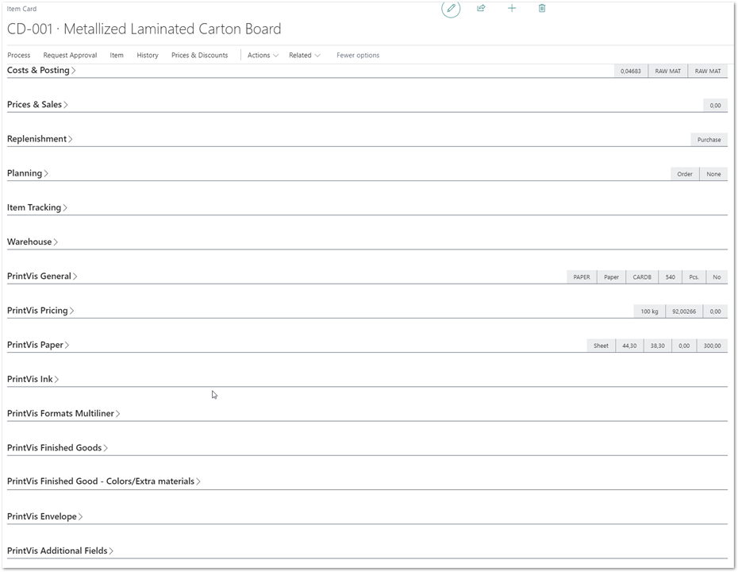
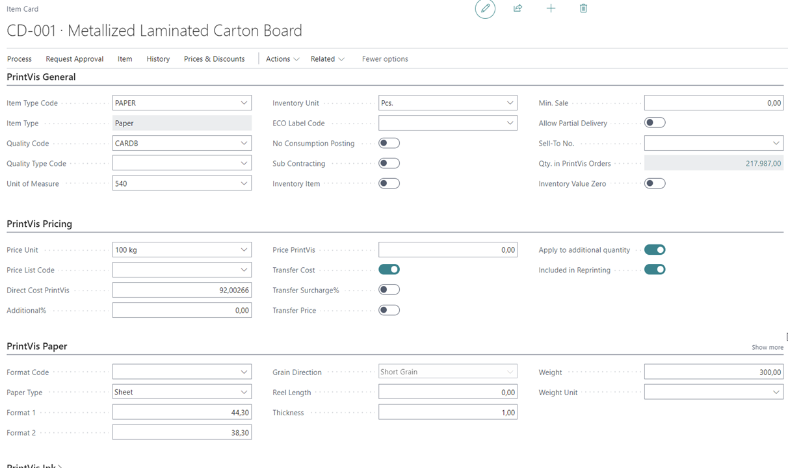
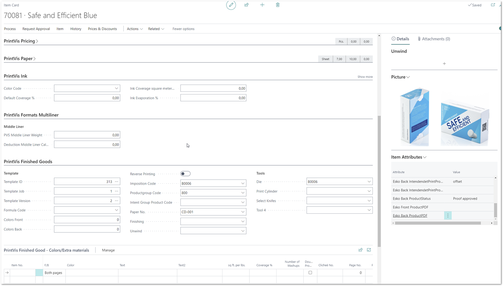
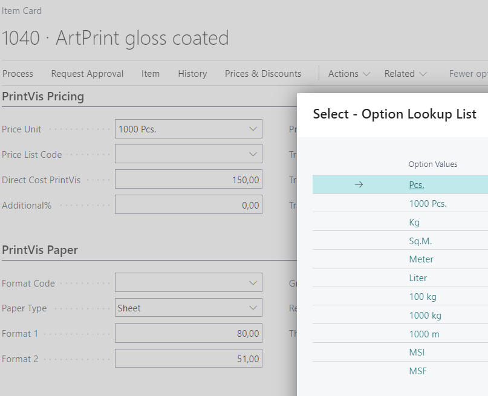
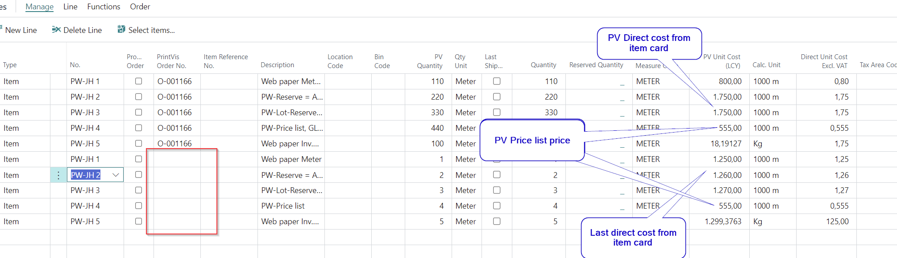
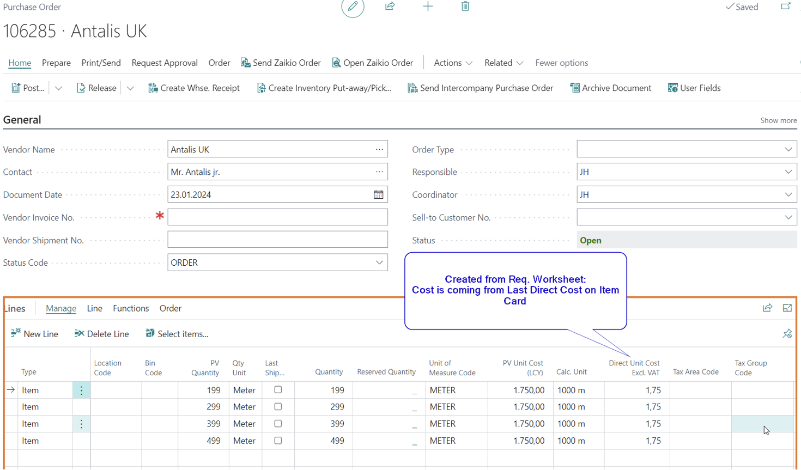
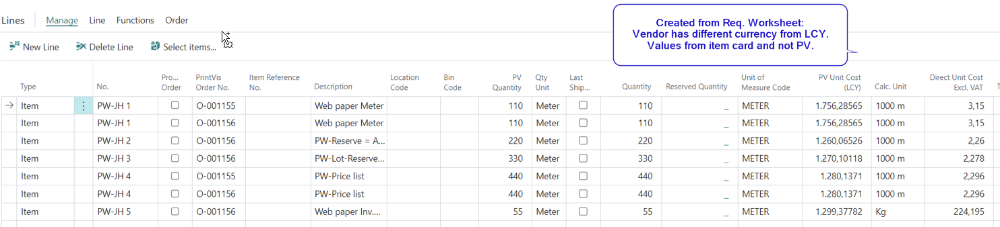
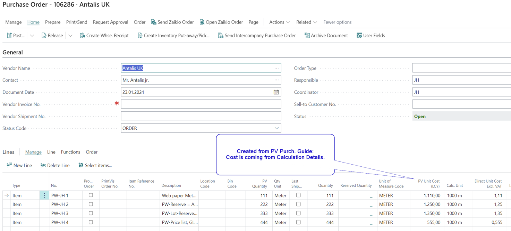
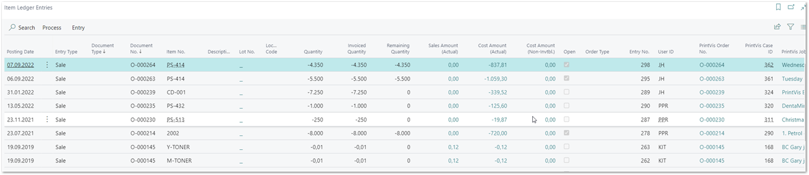
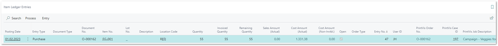

# Items, Purchase, Reservation, Inventory - Touchpoints between Business Central and PrintVis

## Introduction

Raw Materials in PrintVis

Estimates and production orders in PrintVis require raw material as part of the production process for any product. These are typically:

###### Paper, Cardboard, or Other Print Substrates
- These are the raw materials a print process is printed on (text, pictures, etc.).  
- In special cases, there could also be other materials like polypropylene in the form of plastic granulate for extrusion processes to build the print substrate for the printing process.

######  Ink or Toner
- Material being printed on the print substrate.

######  Plates
- Required for offset, flexo, or other presses that are not digital presses.

######  External Production / Subcontracting Work
- PrintVis uses an item as a dummy for purchasing and invoicing.  
- No inventory quantity/valuation/tracking.

######  Finished Good Items
- In cases where production involves recurring products (labels, flexible packaging, folding cartons), it is sometimes required to put a finished product in stock.  
- For commercial print or make-to-order production, finished good (FG) items are not required.  
- PrintVis can ship and invoice without any Business Central items.

## Item Card

PrintVis has added fields to the Items table 27 (no. range 6010000..6011999)  and group them on PrintVis tabs on Item Card page 30 and others.

These fields are required to specify:

- Print Substrate parameters

	- With/Length/Weight

	- PrintVis price unit

	- Per 1000pcs, per Kg, per 100 kg, etc.

- The PrintVis Inventory and Price Unit are used for the following: PrintVis can handle a unit conversion for the pricing based on the parameters for e.g. paper that has a weight/area, length and width. This means when the base unit of measure is PCS, PrintVis can handle a price per 100kg (lbs) or 1000kg (lbs) or 1000sqm (sqft and converts this properly to the cost for BC. It is very common in the print industry e.g. to count paper in SHEETS (PVS =Pcs.) and the vendor provides a price in a weight unit.

	- PrintVis Inventory Unit

		- This translates the BC Base Unit of Measure (which can by any code in any language) into a PVS unit like pcs, meter, square meters etc.

	- PrintVis Price Unit
		-This is the price unit in relation to the PVS inventory unit by using the PVS parameters for conversion.

- Ink Parameters

- Settings for templates of Finished Good Items

	- Carrier for a template - not need for SKU (no Inventory.)
	- Can be replaced with PrintVis Products
	- Placeholder item for subcontracting costs
	- Case ID, Version, and Job are all necessary fields to point the Finished Good Item to a specific template case.

Example of an item card with PrintVis tabs:

## Item Costing on PrintVis Calculations and Job Costing

PrintVis is typically using the actual unit cost for the calculation and Job Costing. The price is calculated typically with an overhead and profit setup in PrintVis (Additional Rates setup), that the pricing structure provided a differentiation between:

- Direct cost

- Overhead (total cost = cost + overhead)

- Profit (sales price = total cost + profit)

## Purchasing

### Requisition worksheet

PrintVis added functionality that the "Calculate Plan" report for the Business Central Requisition Worksheet of Business Central to include PrintVis Material Requirements in the calculation.

If the following Reordering Policies are set, the Requisition Worksheet will include material needed according to the PrintVis Material Requirements.

- Order
	-Every PrintVis Material Requirement line will create a Requisition Worksheet line with the PrintVis Order No. / ID attached.

- Lot-for-Lot
	- A total quantity for the given time range will create 1 Requisition Worksheet line per Item.

### PrintVis Purchase Guide

PrintVis provides 2 functions:

1. Create Business Central Purchase Quotes/Orders
 	 - It is possible to create the purchase documents directly from the PrintVis Material Requirements. The purchase quantity and unit cost is taken from the PrintVis Calculation Details
	- This is often used for special order materials and subcontracting work

2. Create Business Central Requisition Worksheet lines
	- It is possible to create Requisition Worksheet lines directly from the PrintVis Material Requirements. The purchase quantity from the PrintVis calculation details.

### Purchase Quote / Order

PrintVis has Case ID information and quantity/price conversions added to Purchase Lines. Is it very common to handle print substrate prices in different units than the inventory quantity. The price unit can be calculated from parameters like size, weight per area etc. that are covered by the PrintVis fields, that are added to the item table.

PrintVis price units:

### PrintVis impact on BC Purchase Orders

PrintVis is trying to keep our footprint inside the Business Central purchasing functionality as small as possible. This will allow Business Central standard changes to have less of an impact on PrintVis users. There are 2 topics where PrintVis is acting still:

- PrintVis Price Unit is different from price unit from item card.
	- PrintVis will display values in PV Quantity  and PV Unit Cost fields converted from the values in the BC fields.

- PrintVis Price List is assigned to the item card.
	- Unit cost will be taken from the PrintVis price list always. This functionality is required because PrintVis provides a price list import from for e.g. paper vendors where paper might be stored and counted in sheets (pcs.) but the cost and price is per 100kg. This is very common in the print industry and PrintVis is able to handle/convert this based on parameters in PrintVis Fields on the item card.

#### PrintVis interaction when creating purchase orders/lines

There are 3 major possibilities to create purchase lines:

- Manual creation of purchase lines

- Purchase lines created from the Business Central Requisition Worksheet

- Purchase lines created by the PrintVis Purchase Guide

#### Manual creation of purchase lines

##### Manually created without a PrintVis order assigned
This line will act as BC standard. When entering quantities into the PV Quantity or PV Unit cost fields, the quantity and unit cost is transferred and converted if necessary depending on PV price unit on item card.

Manual creation of purchase lines but a PV price list is assigned to an item card.

Values from the price list will be used on purchase lines: PV Unit cost = PV price list cost that is converted into the BC Direct Unit Cost.

The reason for that is, many print companies having price lists for print substrates provided by their vendors where, e.g. quantities and quantity breaks are in pcs. or sheets, but the price is per 100kg. This cannot be handled by BC.

##### Manually created with a PV order assigned

This line will act as BC standard regarding pricing etc. but the PrintVis fields are active and showing quantities and Units based on PV item card fields.

### Purchase lines created from the Business Central Requisition Worksheet

Here it depends on the reordering policy on the item card.

#### Reordering policy <> Order

This line will act as BC standard and all PV code is disabled. PV fields like "PV Quantity" etc. don't have function and keeps default values.

#### Reordering policy = Order

If this line is created from PrintVis Material requirements, a PV Order No. is assigned. This line will act as BC standard regarding pricing etc. but the PrintVis fields are active and showing quantities and Units based on PV item card fields.

Example:

### Purchase lines created by the PrintVis Purchase Guide

The purchase lines contain a PrintVis Order No. and the PrintVis Quantity and Unit Cost is transferred from the Calculation Details to the purchase line. Then these fields are transferred/converted to the related BC fields.

Example:

## Reservations

PrintVis can create Business Central Reservations based on Reservation settings on the Item Card. Reservation will be created either manually if items are existing on stock or when receiving purchase lines.

## Item Consumption

If items are required for production in PrintVis, they can be posted to PrintVis Job Costing and creates related Item Ledger Entries of type "Sale". A specific G/L posting setup is required for that. Please see the G/L posting setup article.

Every PrintVis Job Costing Entry is connected to the related Item Ledger Entry and item cost adjusting could adjust the job costing entry.

Finished Good Items

Finished Good Items are standard Business Central Items with some specific PrintVis settings.

Settings for templates of Finished Good Items
- Carrier for a template no need for SKU (no Inventory.)
- Will be replaced in the upcoming release with PrintVis Products

Finished Good Items can be put on stock for inventory management. The item value can be set up on the Pinterest qualities.

In case no inventory is required the PrintVis Products can be used as template and data carrierer for re-runs, and no iztem card is required.

### PrintVis Release Finished Goods function

PrintVis provides a function to create inventory for items that has been produced in apprentice order. For the posting, a standard Business Central item journal is being used. This is typically, not used from “Make-to-Order” companies.

Item Unit Cost can be created from:

- PrintVis Estimated Cost

- Job Costing Cost

- Item Cost

- Zero

An item ledger entry of type “Purchase” is being created.

Example for an item ledger entry created from PrintVis Release Finished Goods:

Please note: Item cost is not being adjusted if costing in PrintVis is changing.

### PrintVis Shipments "Put On Stock" function

PrintVis is also able to create inventory in the moment of a shipment. This is because the system is able to create Sales Orders and Posted Sales Shipments in the background, which requires inventory for shipment.

