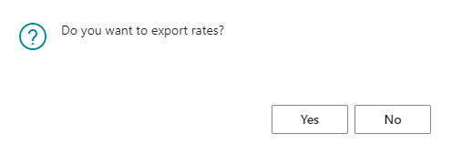

# Cost Center Setup / Configuration / Rates / Groups

## Summary
A Cost Center is characterized as a machine, function, workplace, or person with a fixed-hour rate. Here, once and for all, you must enter all known and fixed values which are weighed in relation to the properties of the specific Cost Center. These are: resources, speeds, material consumption, slack, prices, variable profit, operations, etc. This secures the Cost Center as a uniform basis for administrative procedures, whereas variables must be entered in the operations-only, such as number, size, job, etc.

The Cost Center is a central part of PrintVis and is very important to the use of the following functions:

- Calculation
- Planning (indirectly via Capacity Units)
- Job Costing
- Statistics

In order for these four functions to work correctly, all Cost Centers are attached to one department and one capacity unit.

There are four principal elements which constitute a Cost Center. Before you are able to use a Cost Center in the system you must be aware of the setup and configuration of the individual elements.

---

## Cost Centers
To edit the PrintVis Cost Centers search for `PrintVis Cost Centers`.

### Create a Cost Center

#### Create a Cost Center from Reference Company (PrintVis Assisted Setup)

There are two options to import data from a reference environment:

1. **Add Cost Center**
    - Reads the cost center data for one configuration (you can pick what you need) and creates Calculation Units on the fly 1:1 for each configuration.
    - This is the default option when importing from the PrintVis machine database as part of the PrintVis Assisted Setup.

2. **Add Cost Center and All Configurations**
    - Imports all Cost Center Configurations from a cost center with all existing Calculation Units.
    - Codes and descriptions for all entries are updated accordingly, making it possible to import a cost center more than once (duplicate it).
    - If codes/descriptions become too long, they will be truncated automatically.
    - This option is especially useful for customers maintaining their machinery in a "master" environment.
    - The web service must point to the "master" environment.

The system uses the reference company from the PrintVis General Setup:

If the web service is pointing to a cloud environment as a reference environment, it is required to use OAuth2 authentication. 

This section in the PrintVis General Setup must be used to configure authentication.

---

#### Copy Cost Center
Action on Cost Center list and Cost Center Card.

- Enter a new **CODE**, a new **Name**, and a new **List of Unit Names**, then select which configurations to copy.

- Choose what should be kept or copied.

- **Price Lists, Scrap Tables, Speed Tables, Planning Unit, and Capacity Unit** can be either:
  - 'Copy existing' - The system copies information from the original Cost Center and assigns a new Unit Code.
  - 'Re-use existing' - Uses already existing data in the new Cost Center.

---

#### Export/Import Cost Center
Actions on the Cost Center list.

##### Export Cost Center
- The `Export Cost Center` action creates an XML `.txt` file.
- During export, a couple of dialogs appear:
  1. The system asks for the standard unit used within the Cost Center.

  2. It asks whether rates should be exported or not.

- Once the user confirms, the `.txt` file is downloaded to the user's PC.

##### Import Cost Center
- The `Import Cost Center` action asks for the XML `.txt` file to be uploaded.

- A dialog appears displaying information about the Cost Center to be imported, requiring user input:

  1. Enter the **Department** the Cost Center should be associated with.
  2. The system lists missing item numbers in the Cost Center setup.
     - The user can either remove the missing item numbers or keep them.
  3. A dialog appears allowing the user to change the operation text being imported.

Once confirmed, the system imports the full setup of the Cost Center, including connected **Calculation Units** and **Capacity Units**.

### Cost Center Card Page

The Cost Center card is where you store the basic information for each Cost Center, Machine, Workplace, or "dummy" that might be needed for a costing structure. Linked to the Cost Center are subsequent configurations, operations, hourly rates, etc.

The Cost Center card contains 4 major sections:

- **General**
- **Shop Floor**
- **Manufacturing Integration/CIM**
- **Factbox**

#### FastTab General

| **Field**                     | **Description** |
|--------------------------------|---------------|
| **Code** | Enter a code for this machine. If there are many cost centers, it might be useful to choose a numbering range as code. Example ranges:  1000...1999 for Preproduction Cost Centers  2000...2999 for Artwork Cost Centers  3000...3999 for Sheet-related Cost Centers (e.g., Plating)  4000...4999 for Digital Presses  5000...5999 for Conventional Presses  This helps identify Cost Center types and allows space for future additions. |
| **Name** | Enter a name/description for this Cost Center. |
| **Type** | Select the type of Cost Center:  - **Place/Person**  - **Machine**  - **Mixed Configuration** (a special machine type where machine type fields can vary per configuration). |
| **Department** | Select from the existing departments. |
| **Machine Type** | Select the machine type that best matches the machine's process. If a machine functions as both a press and a finishing machine, use "Mixed Configuration" and create multiple configurations. |
| **Imaging** | Select Imaging if the machine type is PrePress. |
| **Printing Machine** | Select the printing machine type that is closest. |
| **Finishing** | Select the finishing type that is closest. Options:  - **Sheets**: Calculation units assigned to a sheet, Formula 420 calculates net quantity from printing sheets.  - **Signatures**: Calculation units assigned to a sheet, Formula 420 calculates net quantity from finishing sheets (printing sheets x signatures).  - **Items**: Formula 420 calculates net quantity from job quantity. |
| **Shipment** | Select the shipment type that is closest. |
| **Capacity Unit** | Select from the Capacity Units. Usually, the Cost Center and Capacity Unit codes should be the same. |
| **Fixed Asset No.** | If using the BC Fixed Assets module, select the Fixed Asset number. |
| **Default Unit of Measure, Time** | Choose a standard time unit of measure from the Unit of Measure table. This links calculation operations with job costing (UoM). |
| **Synchronization** | (Field description not provided). |
| **Sorting Order** | By default, Cost Centers are sorted by Code. If another sorting is needed, enter a sorting number here. |
| **Live Feed URL** | Enter a URL for a camera live feed to display on the Cost Center monitor list card. |
| **Blocked** | If the Cost Center is no longer in use but is referenced in calculations, do not delete it—block it instead. |

#### FastTab Shop Floor

| **Field** | **Description** |
|-----------|---------------|
| **Job Cost. Journal Build, Material** | Determines material attachment levels:  - **Cost Center**: Materials linked to the selected costing center.  - **Capacity**: Materials linked to the capacity unit of the costing center.  - **Department**: Materials linked to the department of the costing center.  - **All**: All materials. |
| **Job Cost. Journal Build, Labor/Hours** | Determines time recording levels:  - **Cost Center**: Includes all time operations linked to the selected costing center.  - **Capacity**: Includes all time operations linked to the capacity unit.  - **Department**: Includes all time operations linked to the department.  - **All**: Includes all recorded time operations. |
| **Job Cost. Journal Build, Details** | Determines registration options for the user:  - **All**: Includes all estimated lines and costing center lines.  - **Direct**: Includes estimated lines and lines directly on the unit of measure.  - **Estimated**: Only includes estimated operations/items.  - **Draft Template**: Uses a predefined job costing template.  - **Nothing**: Blocks access to job costing.  - **Draft Template + Estimating**: Includes template + estimated lines.  - **Draft Template + Material**: Includes template + material lines. |
| **Auto Populate Estimation Values** | Select whether all calculated values should be applied (Yes/No). |
| **Populate Hours** | If Auto Populate is Yes, select included hours:  - **All**  - **Matching Planning Unit**  - **Matching Sheet**  - **Nothing** |
| **Populate Material** | If Auto Populate is Yes, select included materials:  - **All**  - **Matching Planning Unit**  - **Matching Sheet**  - **Nothing** |
| **Job Costing Journal Template** | Select the template to create job costing registration lines. |
| **Principle - Hours** | (Deprecated) Determines time posting behavior:  - **Unit of Measure**  - **Disable manual input hours**  - **Enable manual input hours** |
| **Shop Floor Posting** | Determines how shop floor time is posted:  - **Real-time**: Posts upon stopping or approval.  - **Post Worksheet upon Approval**: Posts after shift-end approval.  - **Move Worksheet for Approval**: Transfers to a department manager for approval. |
| **Min. Auto Time** | Not in use. |
| **Location Code** | Default location for consumption postings when "Location = Cost Center" is set. |
| **Bin Code** | Default bin code for consumption postings when "Location = Cost Center" is set. |
| **Purchase Location** | Determines default location for requisitions:  - **Cost Center**: Uses cost center location.  - **Vendor**: Uses vendor card location. |
| **Hide in Electronic Job Ticket** | Hides the cost center from electronic job tickets (e.g., sales department time registrations). |
| **Activate Auto Timer** | Not in use. |
| **Shop Floor Custom Trigger Report Stop** | Specifies the report for scanning stop files in hot folders for this cost center. |
| **Exclude from Cost Center Monitor List** | Excludes the cost center from the monitor list. |
| **Monitor Yellow Warning Pct.** | Percentage (e.g., 95) at which the operation turns yellow when actual time exceeds planned time. |
| **Monitor Red Warning Pct.** | Percentage (e.g., 105) at which the operation turns red when actual time exceeds planned time. |
| **Shop Floor Buttons** | Allows hiding buttons in the job page of the shop floor worker role center. |
| **Output Options** | Allows hiding output declaration options irrelevant to the work center. |
| **Allow Production Label Printing** | Enables production tracking options for this cost center on the shop floor. |
| **Shop Floor Production Zone** | Default production release zone (not linked to BC warehousing). |
| **Shop Floor Production Storage** | Default production release storage location (not linked to BC warehousing). |

#### Shop Floor Production Plan Tile Setup

Set up what information will be displayed on the production plan tiles.

This setup is only in use if the PrintVis User Setup field "Shop Floor - Production Plan" is set to "Tiles".

| **Field**                | **Description** |
|--------------------------|----------------|
| **Field Caption**        | Caption of the field. |
| **Sorting Sequence**     | Sorting sequence to display the fields. |
| **Show Field**           | Enable if this field should be visible. |
| **Font Size**            | Enter a font size if the default font size should be changed. |
| **Style**                | Show the information with a style (e.g., bold, colors, italic, etc.). |
| **Formatting Mask**      | Enter a formatting mask for how the information should be displayed.   Variable **"%1"** represents the field value.   Example: `"Qty.: %1"` → `"Qty.: 25,000"` |
| **Value Format Code**    | Use Microsoft Dynamics formatting to present the value.   Examples:   - **`<YYYY>. <MM>. <DD>`** for dates   - **`<Integer Thousand>`** to eliminate decimals and apply thousands separator based on regional settings. |

Setup Example

Result

#### Shop Floor Job Ticket Tile Setup

Unit of Measure Setup

Set up the PrintVis Units of Measure for Time Registration (UoM Type labor) by selecting the type as displayed below.

- **Top Tile Border Style**: The color on the top of the tile can be selected.
- **Indirect = Yes**: These will be displayed as tiles on the Shop Floor Production Plan page because no job needs to be selected for those time registrations.
- **Indirect = No**: These will be displayed as tiles on the Shop Floor Job Ticket page because those time registrations are job/order related.

Extra Work Setup
Set up the PrintVis Extra Work for Time Registration by selecting the Reference Code as displayed below.

- **Top Tile Border Style**: The color on the top of the tile can be selected.
- The lines will be displayed as tiles on the Shop Floor Job Ticket page and can be used in combination with the UoM Tiles to set parts of the production time as unplanned, whereas the Waste Code gives the reason for this unplanned time.

Result on Shop Floor Job Ticket Page

This section outlines the appearance of the tiles on the Shop Floor Job Ticket page after setup.

---

#### FastTab Manufacturing Integration/CIM
This tab is used in combination with a Manufacturing Integration/CIM/JDF setup and might not be visible. Here, you can set up the relation to Manufacturing Integration/CIM devices and how counters information is handled.

---

#### Factbox Cost Center Picture

This factbox is used to add an image of the cost center. The image is used within the process flow diagram and on the tile list-view of the cost center monitor list.

## Configuration

Via the Configuration card, calculation master data attached to a Cost Center is created and maintained. In the configuration, you define operations and their calculation methods, attachment to a Scrap table, machine configurations, system formulas, operations, hourly rates, etc.

Every Cost Center contains at least one configuration, which, as the default setting, is the basic configuration of the Cost Center. Most Cost Centers only contain this one configuration, but there are other cases where it is necessary to create more configurations for a Cost Center. Mainly, if you want to be able to choose both a Basic configuration and one or more additional configurations.

Additional configurations are typically used for a rotary printing machine where you may attach a cutting unit, or a stitching machine where addressing may be chosen as an additional configuration.

You may also want to be able to choose between different basic configurations. This is typically if you have a 4-5 color printing machine but want to make "political" calculations on 1 and 2 colored prints. This means the machine must calculate with other hourly rates, rather than by 4-5 colored prints.

---

### Configuration Main Menu Tab

| **Field**                | **Description** |
|--------------------------|-----------------|
| **Rates**                | Opens the Rates page for this specific Configuration. More details are provided later in this article. |
| **All Rates**            | Opens the Rates page for all rates that are associated with all Configurations for the specific cost center. |
| **Copy from Configuration** | When clicking this function, all Configurations entered into the system will appear. This allows the user to select a Configuration to copy into the open Configuration. |
| **Create Capacity Unit** | Use this function to create a Capacity Unit that generates information from the Configuration into the created Capacity Unit. If a Capacity Unit already exists when trying to click "Create Capacity Unit," an error message will appear.  |
| **Create Calculation Unit** | Use this function to create a Calculation Unit that generates information from the Configuration into the created Calculation Unit. If a Calculation Unit already exists when trying to click "Create Calculation Unit," a message will appear to determine if the user would like to proceed with creating another Calculation Unit.  |
| **Calculation Units**    | Opens the PrintVis Calculation Units list with respect to the Calculation Unit(s) that have the Configuration attached to the Calculation Units. |
| **Scrap Table**          | Opens the Scrap Table that is attached to the Configuration. |
| **Tool Usage**           | Opens the PrintVis Machine Tool Group Usage list that automatically filters to the Cost Center Code and Cost Center Configuration that is open. |

### General

The **General** tab is used to set up the configuration's basic parameters. In this section, you can select the machine, finishing types, and more. This is especially important when the Cost Center's "Machine Type" field is set to **Mixed Configuration**.

### Operations

The table in the **Operations** FastTab must contain all operations for the selected configuration. An operation is characterized by the fact that the calculated time often forms the basis for pricing the operation.

However, in some cases, you may choose to attach a **price list** to an operation and perform **Cost** and/or **Sales** price calculations based on the criteria established in the price list.

 Example Setup:

Machine

If a Cost Center is a printing machine, the **Machine** tab must be filled. Depending on the choice in the **Printing machine** field on the Cost center, the fields available for setting up machine parameters will vary based on the **Printing Machine Type**.

#### Printing Machine Type Sheet Fed

| **Field**                       | **Description**                                                                                                                                                                                                                             |
|----------------------------------|---------------------------------------------------------------------------------------------------------------------------------------------------------------------------------------------------------------------------------------------|
| **Max. Printing Format Depth**   | Enter the maximum printed sheet format depth in the Configuration field. This helps ensure that the selected machine can print on the selected sheet, e.g., dividing a 72 x 102 sheet for a semi-format machine. The units are based on PV Standard Units. |
| **Max. Printing Format Width**   | Enter the maximum printed sheet format width in the Configuration field.                                                                                                                                                                     |
| **Max. Number of Colors**       | Enter the number of color works of the machine in this field.                                                                                                                                                                                 |
| **Colors Front**                 | Used only for Perfection printing. This number helps calculate the required blind plates for some machines.                                                                                                                                   |
| **Colors Back**                  | Used only for Perfection printing. This number helps calculate the required blind plates for some machines.                                                                                                                                   |
| **Varnish Work**                 | Select this field if the printing machine also has a separate varnish work in addition to the indicated number of color works.                                                                                                               |
| **Gripper Edge**                 | Enter the gripper margin which the machine needs to grip the sheet.                                                                                                                                                                           |
| **Pull**                         | Enter the pull margin (how much the machine needs on the side(s) to grip the sheet).                                                                                                                                                            |
| **Pull Side**                    | Select whether the above pull margin is to be on the Left, Right, or Both sides.                                                                                                                                                              |
| **Strip**                        | Enter (in centimeters) how large a part of the sheet must be reserved for the strip.                                                                                                                                                           |
| **Perfection printing**          | Select if the machine is to make Perfection printing. Must be linked to the **Colors Front** and **Colors Back** fields.                                                                                                                      |
| **Calculate from**               | Select how the program calculates the quantity:  
  - **States no. of copies**: Most common; calculates based on the finished quantity.
  - **Copies per roll**: Rare; calculates based on the number of paper reels.                                                                                                           |
| **More Items pr. imposition**    | Choose how the program places more items on the sheet if the user inserts more items on the same sheet. Options:  
  - **Standard**: Printed sheet is split horizontally.
  - **Vertical**: Items placed in vertical divisions.
  - **Successively**: Especially for label printing, prints more variants in the same process.                                           |
| **Runs per Sheet/Web**          | Calculates the number of necessary runs in a printing process based on the machine's color capacity.                                                                                                                                             |
| **Max. format exceeded**         | Defines the machine's response if a sheet is larger than the printing machine's capacity:  
  - **Blank**: No reaction, suggests sheet division.
  - **Warning**: Gives a warning, splits the sheet.
  - **Stop**: Gives a warning, and does not allow insertion.                                                                              |
| **Trimming the sheet/web**      | Choose the principle for cutting paper if it is too large for the machine:  
  - **Equal split**: Splits the sheet down the middle.
  - **Cut to maxformat**: Cuts to the machine's max format.
  - **Use the whole sheet/web**: Optimizes the entire inventory sheet.                                                                          |
| **Cutting distance**            | Enter (in centimeters) the cutting distance between items on the sheet.                                                                                                                                                                      |

#### Printing Machine Type Web Fed and Continuous Fed

| **Field**                       | **Description**                                                                                                                                                                                                                             |
|----------------------------------|---------------------------------------------------------------------------------------------------------------------------------------------------------------------------------------------------------------------------------------------|
| **Cut Off**                      | The optimal height that determines the "length" of the web printing area. You may choose different cylinders with different diameters, creating basic configurations, such as 24" or 25".                                                    |
| **Max. Reel Width**              | Enter the configuration maximum capacity of reel width in this field.                                                                                                                                                                        |
| **Min. Reel Width**              | Enter the configuration minimum capacity of reel width in this field.                                                                                                                                                                        |
| **Synchronous Reels**            | Enter the number of synchronous reels that may be used.                                                                                                                                                                                      |
| **Min. Grammage/weight**         | Enter the minimum grammage/weight the machine can process.                                                                                                                                                                                   |
| **Max. Grammage/weight**         | Enter the maximum grammage/weight the machine can process.                                                                                                                                                                                   |
| **Gripper Edge**                 | The area where the product cannot be printed on the front of the print area. This sometimes occurs even if it is not defined as a gripper.                                                                                                   |
| **Side Margin Value**            | The area where the product cannot be printed on the left/right of the print area.                                                                                                                                                             |
| **Margin Side**                  | Select if the **Side Margin Value** should apply to the left, right, or both sides of the printing area.                                                                                                                                      |
| **Strip**                        | The area where the product cannot be printed at the end of the sheet. Typically, this is the area for the color bar/strip.                                                                                                                  |
| **Plate no.**                    | Enter the Item no. of plates used at this machine.                                                                                                                                                                                            |

 Printing Machine Type Continuous Fed

| **Field**                       | **Description**                                                                                                                                                                                                                             |
|----------------------------------|---------------------------------------------------------------------------------------------------------------------------------------------------------------------------------------------------------------------------------------------|
| **Operations per length**       | Enter the operation per length. (Length = 1 meter, Operation = one pass — this means one action forth and back).                                                                                                                             |

### Planning
This tab only has one field where, by a look-up in the field, you select which Capacity Unit you want to use in connection with production planning. You may select a different Capacity Unit from the one selected on the Cost Center.

### Calculation
Via this tab, enter the formula which is to form the basis of the total calculation next to each of the available functions.

As a default, PrintVis contains built-in calculation rules for the functions displayed and thus also calculation formulas, which are able to calculate the ordinary matters in connection with printing and finishing machines. You should only replace the system formulas with user-defined formulas or other system formulas, if you want to change these calculation rules.

If you need to enter or change a formula, we recommend checking the setup for an equal type of machine.

If, for example, you want a specific calculation of Quantity per stroke for a stitching machine or a book alley, you may enter a specific formula in this field.

If you have changed the formula selection on this tab, you will go through the selection with troubleshooting in the setup if the machine does not calculate as you expected.

Apart from the fixed calculations in the processes which are shown on this tab, three open formula fields are shown where you may enter formulas which may calculate simultaneously with this process. These formulas may be combined with the other formulas which are inserted in the calculation, and which refer to the result in the process. This could be byproducts of the printing process.

### JDF
Fields on this tab are data for JDF files which this machine shall be able to receive and send.

The Auto Color fields are useful without any JDF to preset the ink selection for the press that is selected on a job item in a calculation. It is recommended to set the four process inks here if these are the major colors, so they don't need to be entered manually after each press selection on a job item.

 Example setup:

Result after a press (within a List of Units) was selected:

### Info
In this tab, information fields display who has created, and perhaps edited, the configuration and when it was done. Then, the fields display which department the configuration belongs to.

You may also give the Configuration an External Description. This is used if the configuration is applied to customer-related prints.

By selecting the Hide in Shop Floor field, you may choose that the selected configuration is not to be presented in connection with Shop Floor time recording.

## Cost Center Rates
Via this window, the hourly rates for a Configuration or for an individual operation on the Configuration are created and maintained. These hourly rates actually enable the calculation of Cost prices, Total costs, and Sales prices of all the company's time operations.

You can access "different" Rates from the Configuration Card:

 Calculation of the "Sales" Price /h:
Price = Direct Cost (=Variable + Labor Cost) + Overhead (=> Direct Cost + Overhead = Total Cost) + Profit

| **Field**               | **Description**                                                                                                                                                       |
|-------------------------|-----------------------------------------------------------------------------------------------------------------------------------------------------------------------|
| **Rate type**           | By a look-up in the field, choose between Fixed rate and Surcharge rate. If you select Fixed rate, the operations are calculated precisely on the basis of the hourly rate which matches the set-up parameters. this rate type is used most extensively. If you select Surcharge rate, must be selected on both the basic as well as the additional configurations, the hour price is summed up from the basic rate with a surcharge for each surcharge rate which appear from the selected additional configurations. If, for example, you have a rotary machine which prints and cuts the web in one cycle of opperations, it is possible that you may want a higher hourly rate when a cutting unit is selected.                                                                                                                                                                       |
| **Date**                | In this field, you enter a date which the selected rate is to apply from. This helps maintain your price history by creating new hourly rate lines as prices adjust.    |
| **Product Group**       | If individual hourly rates are to be differentiated for an individual Product Group, select the desired group by a look-up in the field.                               |
| **Price group**         | If individual hourly rates are to be differentiated for an individual Price Group, select the desired group by a look-up in the field.                                 |
| **Customer group**      | If individual hourly rates are to be differentiated for an individual Customer Group, select the desired group by a look-up in the field.                              |
| **Alternative Rates Code** | Alternative Rates are used in Additional Rates and Cost Center Rates to define individual rates.                                                                  |
| **Price calculated from** | Select what the indicated price is to be calculated from. Common options include Hours, Pcs, 1000 pcs., lbs/Kg, Square feet/meters, Feet/Meters.                       |
| **Variable costs**      | Indicate the amount which incurs in fixed variable costs per hour, such as costs for Electricity, Rags, Lubrication, etc.                                              |
| **Labor costs**         | Indicate labor costs per hour for the selected configuration. For machines operated by multiple people, enter the total time rate for the group.                        |
| **Direct costs**        | Displays the Configuration Cost price - the sum of Variable and Labor costs.                                                                                        |
| **Overhead**            | Indicate the Configuration's share of company overhead, such as Rent, Administration, etc.                                                                          |
| **Total cost**          | Displays the Configuration Total cost - the sum of Direct costs and Overhead.                                                                                        |
| **Net profit**          | Enter a precise amount for how much net profit should be calculated per hour. This impacts how the Sales price is calculated based on Total cost + Net profit.         |
| **Net profit %**        | Enter a precise percentage for how much net profit should be calculated per hour. Sales price is based on Total cost + Net profit %.                                  |
| **Price**               | In this field, the Sales price which is to apply to the configuration is displayed or enetered.                                                                                                                                                                      |

### "Rates" action
The rates are displayed or can be entered for the Configuration the rates are opened from.

### "All Rates" action
The rates are displayed or can be entered for all Configurations of "this" cost center.

### "Rates" action on Operations Subpage
The rates are displayed or can be entered for the operation that was selected when hitting the rates action button.

In some special cases, it might be useful to set up a rate for an operation that is different from the rate of the configuration. This could be the case if an operation is made to calculate cost for assistance operations.

**Please note:** When entering this rate area but no rate is required, make sure there is no entry with rates = 0 that will override the rate from the configuration with 0 cost/price. To be sure, press the "Delete" Action button before closing the page.

## Cost Center Groups
Cost Center Groups can be assigned to each Cost Center and can be used in custom reports.

If totals for a group of Cost Centers (the total cost for all presses of one or more facilities/plants) are required, a report can be built based on the Cost Center Group setup.

The usage of Cost Center Groups is not mandatory.
