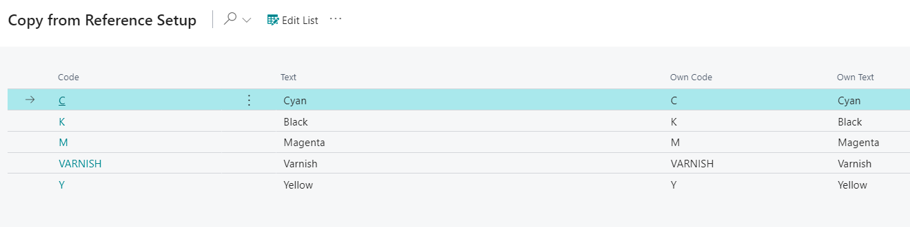

# Color Table - PV Assisted Setup

## Introduction

The Color Table section allows users to assign custom codes and texts to the colors Cyan, Black, Magenta, Yellow, and Varnish. These codes are used to identify items on the Item card and other sections of the system, such as the color table on the Job Card. The text field is for adding descriptions to further identify the items.

## Setup

| Field     | Description                                                                                                  |
|-----------|--------------------------------------------------------------------------------------------------------------|
| Code      | Generic code that was created for reference company mapping.                                                 |
| Text      | Generic text that was created for reference company mapping.                                                 |
| Own Code  | Insert code that is recognizable to users of your company when referencing Color/Varnish.                    |
| Own Text  | Insert text that is recognizable to users of your company when referencing Color/Varnish.                    |

Once you have entered or adjusted the information in the Own Code and Own Text fields, click **OK** at the bottom of the page to save your changes.

**Note:** Once you click **OK**, you will not be able to return to this page. Be sure to double-check that all information is entered correctly before clicking **OK**. If a mistake is made, please contact support for further assistance.

Pantones can be added through the Color Table page (separate from the PrintVis Assisted Setup page). 

