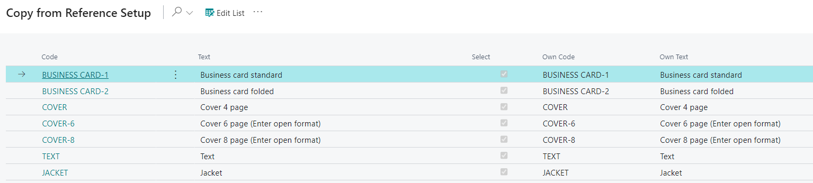

# Component Types - PV Assisted Setup

## Introduction

The PrintVis Component Types can be used to set defaults for every job item to automate and simplify user input. These component types serve as a "small template" to preset default sheet, imposition, or finishing settings. They can be assigned to each Product Group (PrintVis Product Group Lookup Filters) to ensure that only the relevant ones for the actual product group are available for selection. This setup should be completed after finishing the PrintVis Assisted Setup (RapidStart).

## Setup

| Field         | Description                                                                                                  |
|---------------|--------------------------------------------------------------------------------------------------------------|
| **Code**      | Generic code created for reference company mapping.                                                          |
| **Text**      | Generic text created for reference company mapping.                                                          |
| **Select**    | Check "yes" to import this line into your company. Unselect to exclude from import.                           |
| **Own Code**  | Insert a code recognizable to users of your company when referencing Component Types.                        |
| **Own Text**  | Insert text recognizable to users of your company when referencing Component Types.                          |

By default, all Component Types are selected for import into the system. To deselect Component Types, click the **Edit List** button at the top of the page and uncheck those you do not wish to import. You can also deselect all Component Types by clicking the three dots (at the top of the page next to **Edit List**) and selecting **Deselect All**.

When you have finished selecting/deselecting and making changes to the **Own Code** and **Own Text** fields, click **OK** at the bottom of the page to apply the changes and exit.

