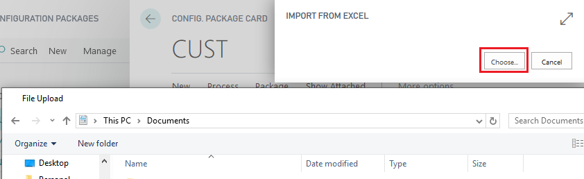

# Configuration Package - PV Assisted Setup

## Introduction

The Configuration Package is used for migrating data using a template, Excel sheet, or package. It provides a quicker and easier way to import and export information from the system. This feature is a Business Central function, and this article offers a quick overview of some tips and tricks for using the Configuration Package worksheet. For more detailed information, please contact a Business Central partner.

## Export Tables

1. Open the **“Packages”** worksheet and edit a package.

2. Mark a table, e.g., **Customer**.

3. Open the table field overview 

4. Select which fields should be included in the Excel sheet.

5. Export this table to Excel.

6. The printing company (customer) will need to fill in the Excel sheets. 

7. Create an Excel template for each customer type if applicable.

8. Repeat the process for Vendors and Items.

## Import Tables

After your customer has prepared their data in the Excel sheets, you can import these using templates.

1. Choose the worksheet in the navigation pane.

2. Open the **“Package Card”**.

  
3. Mark the table and select the related template.

4. Import the related Excel sheet.

6. Validate relations, then apply the imported data before importing the next Excel sheet.

7. Follow the same procedure for all Excel sheets, including those for vendors and items.

## Sorting Order

When using the RapidStart tool to move data from one company to another, you might encounter errors because the tool imports the fields as they are set and validates each field entry individually.

For example, when importing Table data for **PV Calc. Unit Setup Detail** (Table 6010375), the standard settings are:

   This import might result in an error stating that the Operations cannot be found, because Operations are listed above Configuration (and Operations are linked to Configuration to a Cost Center).

   To resolve this:

   1. Push the **Action Tab**, mark the line with **Configuration**, and select **“Move Up”** to reorder the fields.

2. If you prefer not to validate the input against other tables and values, simply untick the mark in the **“Validate Field”** column.

