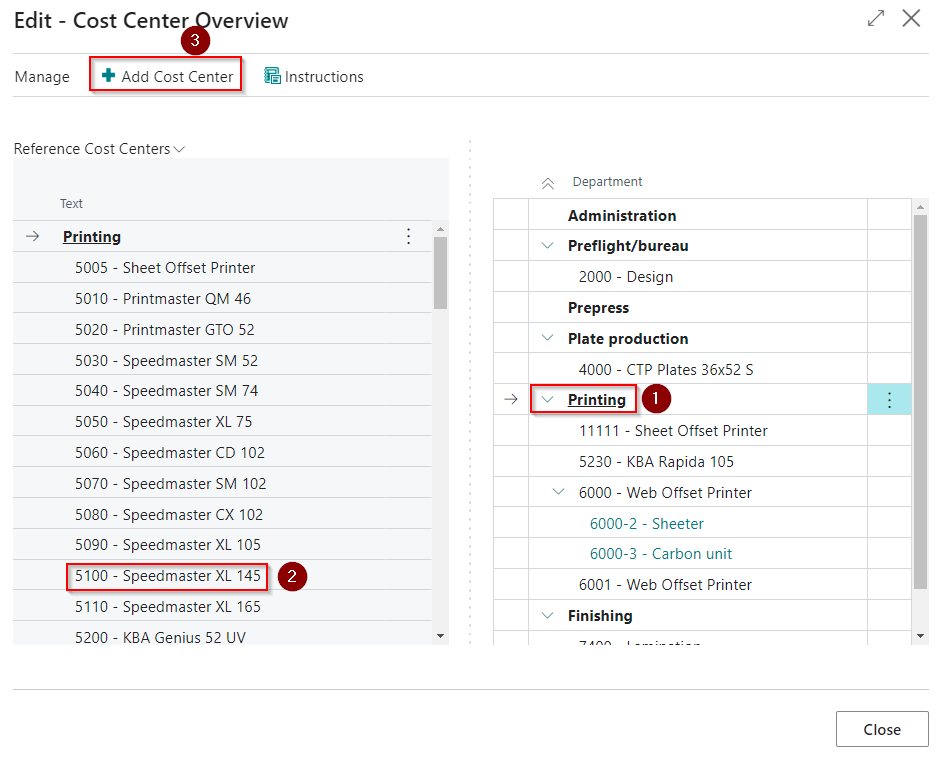
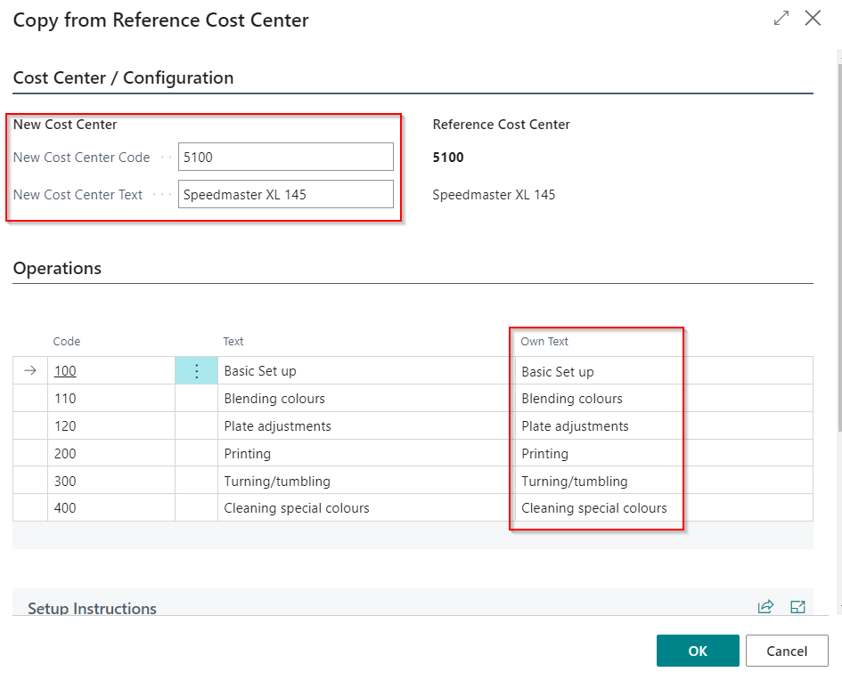

# Cost Center - PV Assisted Setup

## Introduction

A Cost Center represents a machine, function, workplace, or person with a fixed-hour rate. It involves entering all known and fixed values relevant to the specific Cost Center, such as resources, speeds, material consumption, slack, prices, variable profit, operations, etc. This ensures that the Cost Center provides a consistent basis for administrative procedures, while variables such as number, size, job, etc., are entered in operations.

The Cost Center is crucial to PrintVis and is essential for the following functions:
- Calculation
- Planning (indirectly via Capacity Units)
- Job costing
- Statistics

## Setup

Start After Creating Departments
Ensure all departments are set up before proceeding with cost center management.

### 1. Select a Department
- **Right Panel**: Choose your desired department.
- **Left Panel**: Reference database displays cost centers related to the selected department type.

### 2. Locate Cost Centers
- If a cost center isn’t listed, try switching to another department.
  - Example: Older presses like the Heidelberg Windmill are listed under "Finishing" instead of "Press" due to their modern usage for tasks like embossing.

### 3. Add a Cost Center
Choose one of the following options:

#### Add Cost Center
- Imports a single configuration from the selected cost center.
- Automatically creates corresponding Calculation Units (1:1).
- Default option for imports from the PrintVis machine database during Assisted Setup.

#### Add Cost Center and All Configurations
- Imports all configurations and related Calculation Units from the selected cost center.
- Updates codes and descriptions for duplicating cost centers (e.g., importing from a "master" environment).
- Truncates overly long codes or descriptions automatically.
- Requires a web service pointing to the "master" environment.

####. Handle Long Department Lists
Collapse views to show only department names for easier navigation when the list becomes cumbersome.

## Customization Options
- **Editable Fields**: You can overwrite the following:
  - Code
  - Cost Center Name
  - Operation Text

## Adding a Surcharge Unit to a Basic Unit

1. Highlight the required **Basic Unit** in the right panel.
2. Select the desired **Surcharge Unit** in the left panel.
3. Click **Add**.

**Note**: Surcharge units can be applied to any cost center.

---

