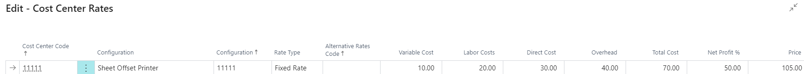

# Cost Center Rates - PV Assisted Setup

## Introduction

This window is used to create and maintain the hourly rates for a Configuration or for an individual operation on the Configuration. These hourly rates are essential for calculating Cost prices, Total costs, and Sales prices for all time operations within the company.

## Setup

| **Field**                | **Description**                                                                                                                                                                                                                                                                           |
|--------------------------|-------------------------------------------------------------------------------------------------------------------------------------------------------------------------------------------------------------------------------------------------------------------------------------------|
| **Cost Center Code**     | Code identifier for the Cost Center.                                                                                                                                                                                                                                                      |
| **Configuration (Text)** | Text identifier for the configuration attached to the Cost Center.                                                                                                                                                                                                                        |
| **Configuration (Code)** | Code identifier for the configuration attached to the Cost Center.                                                                                                                                                                                                                        |
| **Rate Type**            | By a lookup in the field, you may choose between Fixed Rate and Surcharge Rate.   - **Fixed Rate:** Operations are calculated based on the hourly rate matching the setup parameters. This is the most commonly used type.   - **Surcharge Rate:** Adds a surcharge to the base rate for additional configurations. For example, in a rotary machine performing both printing and cutting, a higher rate can be applied for configurations with additional cutting units. |
| **Alternative Rates Code** | Alternative Rates are used in Additional Rates and Cost Center Rates to define individual rates.                                                                                                                                                                                         |
| **Variable Cost**        | Indicates the amount of fixed variable costs per hour, e.g., for electricity, rags, lubrication, etc. Some companies also include consumables like color and varnish under variable costs.                                                                                                 |
| **Labor Cost**           | Labor costs per hour for the selected configuration. For machines operated by multiple people, enter the combined hourly rate for all operators.                                                                                                                                            |
| **Direct Cost**          | Displays the Configuration Cost price, which is the sum of Variable and Labor costs.                                                                                                                                                                                                      |
| **Overhead**             | Indicates the Configuration's share of company overhead, such as rent and administration costs.                                                                                                                                                                                           |
| **Total Cost**           | Displays the Configuration Total Cost, which is the sum of Direct Costs and Overhead.                                                                                                                                                                                                     |
| **Net Profit %**         | Enter the desired net profit percentage to calculate the Sales Price as: `Total Cost + Net Profit %`. The percentage is applied to the Total Cost.                                                                                                                                        |
| **Price**                | Displays or allows entry of the Sales Price for the configuration.                                                                                                                                                                                                                        |

 **Important Notes**

- Enter all relevant information according to your company's operations. If some fields are not necessary, you can leave them as "0".
- Total Cost (with at least Labor Cost filled in) and Price are crucial for accurate estimating.
- After entering all relevant details, click "OK" at the bottom of the page to apply the information into the cost center rates.

