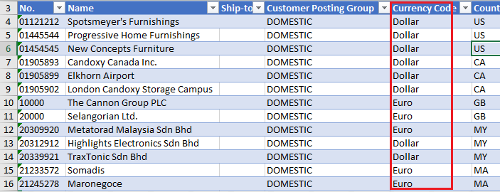
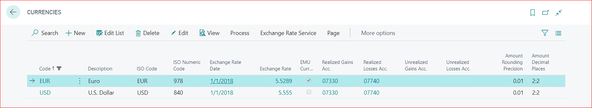
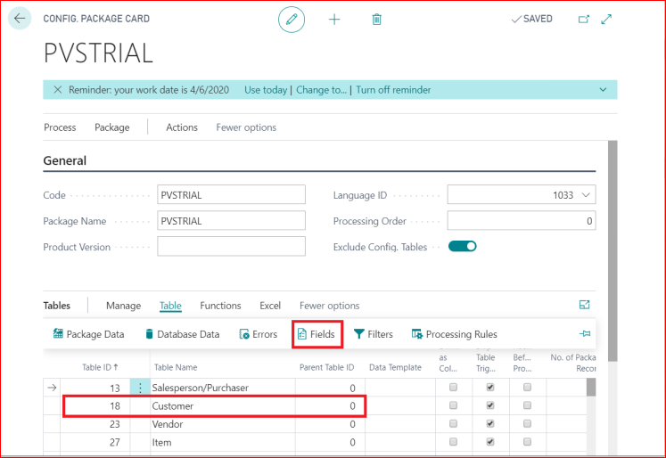
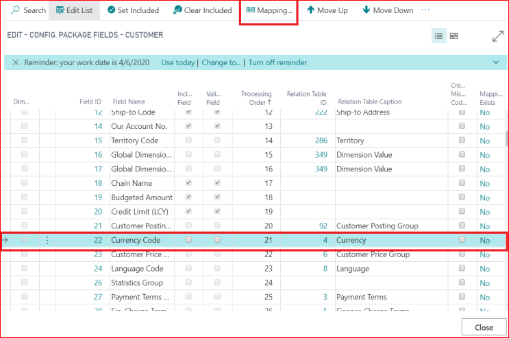
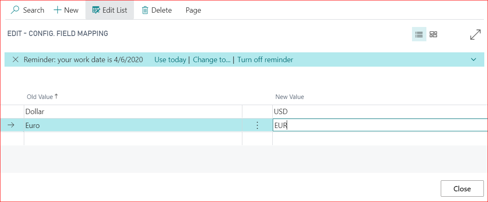
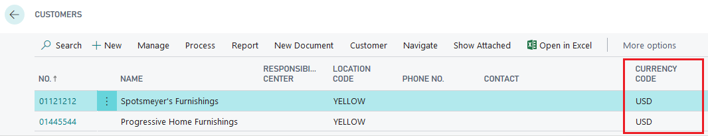

# Data Mapping in MS BC - PV Assisted Setup

## Introduction

This guide illustrates the method of importing existing customer data into your new system. This step is crucial in the RapidStart process, utilizing standardization as a time-saving strategy. Fields are mapped and configured to align old values with new ones, ensuring seamless integration with the PrintVis system and Microsoft Dynamics 365 Business Central. Occasionally, discrepancies may arise that need addressing.

## Data Mapping

Mapping old values to new ones is essential when importing customer data from an Excel sheet. For example, the Currency Codes in the old system might differ from those in 365 Business Central. Suppose the old system uses "EURO" and "Dollar" as Currency Codes:

In 365 Business Central, the corresponding Currency Codes are "EUR" and "USD":

Here's how to map old values to new values:

1. **Navigate to Configuration Package Fields**
   - Open the relevant configuration package fields in 365 Business Central.

2. **Select “Currency Code”**
   - From the ribbon, click on “Mapping.”

3. **Update the Values**
   - Modify the values so they match the new system’s codes. For example, map "EURO" to "EUR" and "Dollar" to "USD."

   You can map any field required for importing old data into 365 Business Central.

1. **Import the Excel Sheet**
   - Follow the process to import your data from the prepared Excel sheet.

2. **Apply the Data**
   - Ensure the data is correctly applied and aligns with the new system.

3. **Check the Imported Data**
   - Review the imported data to confirm that it is accurate and correctly mapped.

By carefully mapping fields and verifying data, you can ensure a smooth transition to the new system.

