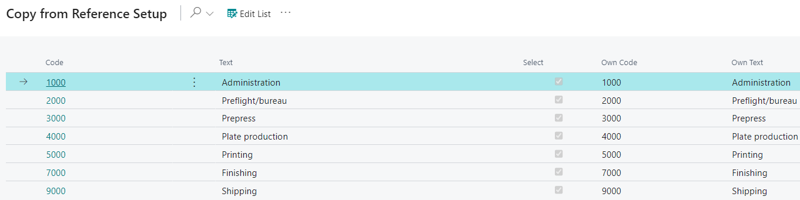

# Departments - PV Assisted Setup

## Introduction

Departments define where Cost Centers (employees and machinery) belong and are used throughout the system for statistical purposes. They are the primary grouping for various screens, such as calculation windows, the shop floor, and in certain reports, such as the job ticket.

The setup of production departments is crucial for:

- **Cost Centers**: Cost centers are connected to a department, affecting the entire estimating and job costing processes.
- **Job Tickets**: Production departments are divided on the job ticket, which must be considered when setting up departments.
- **Sorting**: Lists in the system are sorted according to the placement of departments in this table.

## Setup

| **Field**     | **Description**                                                                                 |
|---------------|-------------------------------------------------------------------------------------------------|
| **Code**      | A generic reference code created to map statuses or other elements to a reference company's standard. |
| **Text**      | A generic descriptive text used for mapping to the reference company's conventions.             |
| **Select**    | A checkbox to include or exclude this line during the import process. Select "Yes" to import, or unselect to skip importing. |
| **Own Code**  | A custom code that users in your company can easily recognize when referencing Departments.      |
| **Own Text**  | A custom text description that is user-friendly and recognizable within your company when referencing Departments. |

By default, all Departments are selected for import into the system. To exclude certain Departments from import, click the **Edit List** button at the top of the page and deselect those you do not want to import. You can also deselect all Departments by clicking the three dots (next to **Edit List**) and selecting **Deselect All**.

After making your selections and changes to the Own Code/Own Text fields, click **OK** at the bottom of the page to apply the changes and exit.
