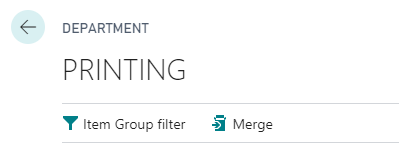
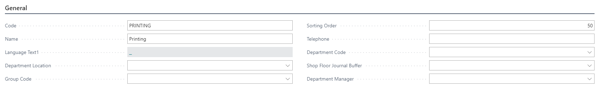
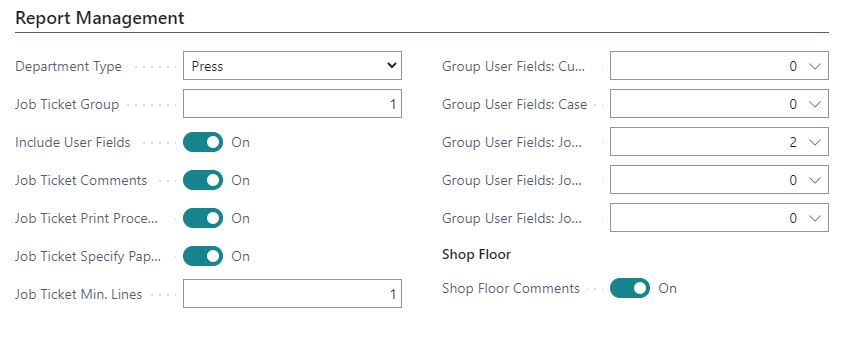
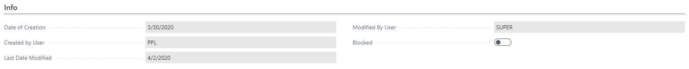

# PrintVis Departments

Departments are used throughout the system for statistical purposes and constitute the primary grouping of the presentation in different screens such as calculation windows, shop floor, etc., and in certain reports such as the job ticket.

Statistically speaking, the setup of production departments is very important. For example:

- The cost centers of the accounts are connected to a department, and therefore the entire estimating and job costing is divided into departments corresponding to this connection.
- A division into production departments is made on the job ticket. This should be considered when setting up production departments.
- All lists in the system are sorted in the order dictated by the production department based on its placement in the table.

## Department Setup

Before setting up departments, consider if there are other statistical dimensions you want to form an overview of, as this must be reflected in the department setup. For example: department locations and department groups.

## Menu

### Field Descriptions for Departments

| **Field**             | **Description**                                                                                                                                       |
|-----------------------|-------------------------------------------------------------------------------------------------------------------------------------------------------|
| **Item Group Filter** | This filter will automatically apply to all searches for web paper, paper, ink, etc., created with cost centers in this department. Functions similarly to a Product Group Filter. |
| **Merge**             | Allows you to merge multiple departments.                                                                                                           |

## General

| **Field**                     | **Description**                                                                                                                                                    |
|-------------------------------|--------------------------------------------------------------------------------------------------------------------------------------------------------------------|
| **Code**                      | Department Code.                                                                                                                                                   |
| **Name**                      | Department Name.                                                                                                                                                   |
| **Language**                  | The language for the department.                                                                                                                                  |
| **Department Location**       | The location this department is associated with.                                                                                                                  |
| **Group Code**                | The group this department is associated with.                                                                                                                     |
| **Sorting Order**             | Allows you to set an alternative sorting order for the departments. If no sorting order is defined, the lists will be ordered by the default primary key order (order in which the departments were created). |
| **Telephone**                 | Department phone number.                                                                                                                                          |
| **Department Code**           | Via the global dimension 1 code field, a filter is attached to the production department. This filter defines who will have access to view and use the department information. |
| **Shop Floor Journal Buffer** | Relates to the code field in the Job Costing Journal table. This can be selected if you want shop floor entries to be collected in a journal for review prior to being posted in the system. |
| **Department Manager**        | Relates to the code field in the PrintVis User Setup table. The department manager can be selected and assigned to the department here.                              |
|                               | **Example**: If a cost center has the setting "Shop Floor posting = Move to journal," all registration entries will be added to the department manager's job costing journal for approval and posting. |

## Report Management

| Field                        | Description                                                                                                                                                       |
|------------------------------|-----------------------------------------------------------------------------------------------------------------------------------------------------------------------|
| **Department Type**          | Fixed options to match the department type. Options include: Blank, Preflight, Prepress, Repro, Press, Warehouse, Post Press, Logistic.                             |
| **Job Ticket Group**         | Enter 0 if you do not want the department shown on the job ticket. Otherwise, enter a value to place the department and corresponding information on the job ticket. |
| **Include User Fields**      | Tick this field if you want the user fields included in reports. Select which user field groups to include for this department in "Group User Fields".                  |
| **Job Ticket Comments**      | Tick this field if you want to be able to select this department when entering an internal comment on the case card.                                                |
| **Job Ticket Print Processes** | Select this field if the department has print information on the job ticket and if paper is to be specified for each process.                                       |
| **Job Ticket Specify Paper** | Along with Job Ticket Print Processes, selecting this displays the paper information for each process.                                                                |
| **Job Ticket Min. Lines**    | State the minimum number of lines to be filled in for this department on the job ticket. Useful to ensure adequate space between departments when printed.           |
| **Group User Fields**        | Select which user field groups to assign to this department: Customer, Case, Job 1-3 fields.                                                                         |
| **Shop Floor Comments**      | If ticked, a "case description" internal comment on the case card will be shown in the FactBox on the Shop Floor.                                                   |

## Info

| Field                 | Description                                                                                   |
|-----------------------|-----------------------------------------------------------------------------------------------|
| **Date of Creation**  | The date this department was created.                                                          |
| **Created by User**   | The user who created this department.                                                          |
| **Last Date Modified** | The date this department was last modified.                                                    |
| **Modified by User**  | The user who last modified this department.                                                    |
| **Blocked**           | If ticked, this department will be blocked from further use. Use this only if the department is being completely discontinued. For merging, use the merge function in the menu instead. |
