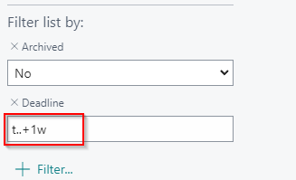
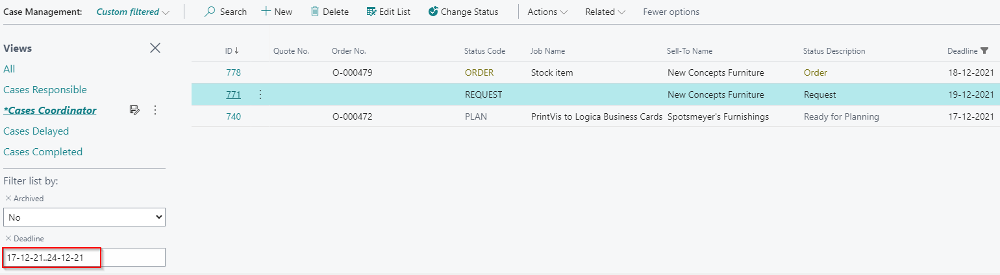

# Keeping Current with Dynamic Date Filters

## Summary

Managers typically need various overviews to make informed decisions. For instance, a Production Manager in a print company needs daily access to diverse views of time-related data, including:

- Jobs currently in the shop
- Tasks due this week
- Customer statements that need to be sent
- Reports to be generated and shared with the team during the morning meeting

PrintVis makes it easy to display such statistical information in chart form using the "Show as Chart" function. You can filter the data to meet specific needs, such as viewing the time planned for the week for each printing press.

However, manually updating report dates every week can be time-consuming. Instead, you can use Dynamic Date Filters to automate this process and always get the data you need without manually changing dates.

## Dynamic Date Filters

Dynamic Date Filters use basic 365 Business Central codes and formulas. Here are some common codes:

- `T` = Today
- `CW` = Current week (last day of current week)
- `CM` = Last day of current month
- `D` = Day (e.g., `+2D` for two days from today)
- `W` = Week (e.g., `2W` for two weeks from today)
- `M` = Month
- `Y` = Year (e.g., `-1Y` for one year ago from today)

 Examples


1. **View Data for the Coming Week**
   - To see deadlines for cases in the Case Management Page for the coming week, use the formula:
     ```
     t..+1w
     ```
   - This formula displays data from today until one week from now, eliminating the need to manually adjust dates weekly.




2. **Data for the Current Month**
   - To view data for the current month, use:
     ```
     CM-1M+1D..CM
     ```
   - `CM` represents the last day of the current month, so `CM-1M` gives the last day of the previous month, and `CM-1M+1D` is the first day of the current month.





 Applications

- **Monthly Customer Statements:** Use the monthly filter to generate PDF reports for customer statements, ensuring they are ready for distribution at the start of each month.
- **Employee Reviews:** Display productivity rates and time recordings for an employee's monthly review, with current data automatically shown based on the dynamic filter.

Using these filters helps automate reporting and data display, reducing the need for manual updates and ensuring timely access to relevant information.