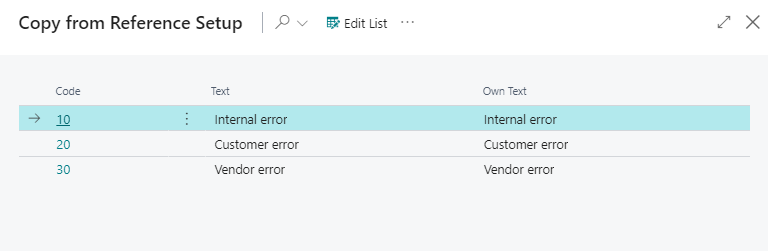

# Extra Work Codes - PV Assisted Setup

## Introduction

Create and maintain the company's extra work descriptions, also known as 'waste codes' on the shop floor worker pages. Extra Work Codes are used in job costing to indicate when additional time, materials, or other resources have been utilized on a given job.

## Setup

**Note:** You can rename the suggested text in the "Own Text" field before importing it.

