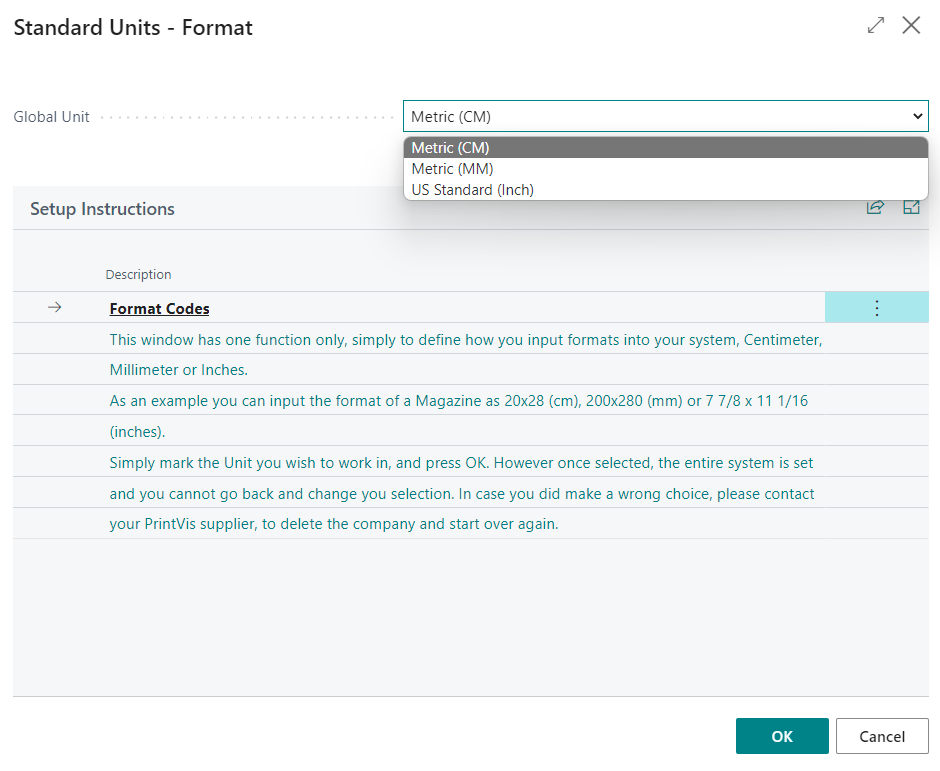
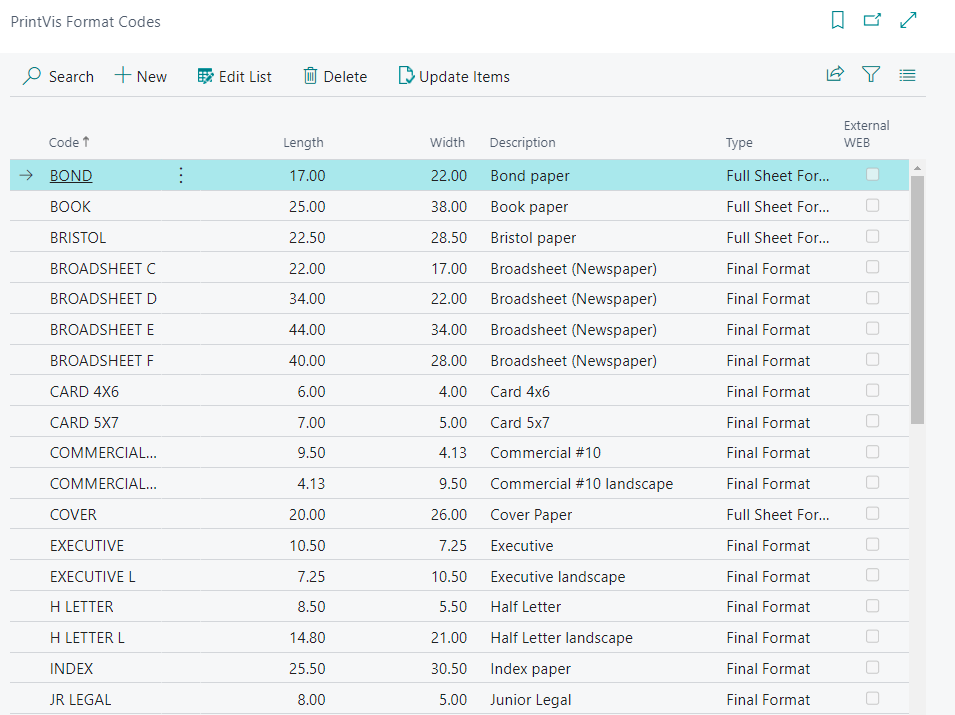
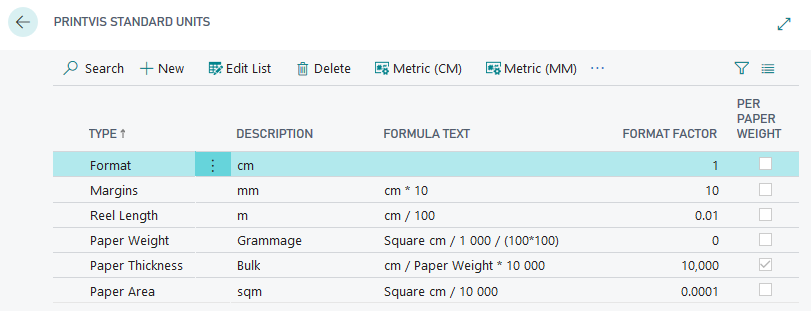
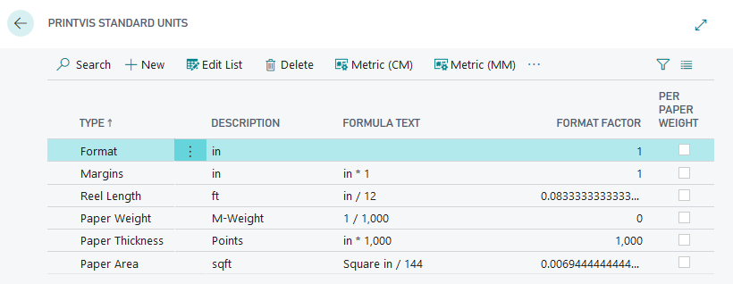

# Format Codes - PV Assisted Setup

## Introduction

Standard Units is an essential setup for measuring units related to format sizes, paper weights, and thicknesses. It defines the units of measure that are predefined for the sizes of machines, papers, products, their margins, and other parameters.

Format codes have multiple purposes, including:
- Calculating the imposition for production.
- Acting as parameters in Speed Tables, Price Lists, Scrap Tables, etc.
- Displaying the format on the right-hand side so you can verify the format height and width.

## Setup

There are 3 default setup settings to choose from:

1. **Metric Units in cm (Centimeter)**
2. **Metric Units in mm (Millimeter)**
3. **US Standard Units based on the Imperial System**

Make sure to select the correct units that best suit your company. Once you have made your selection, click the **"OK"** button at the bottom of the page.

**Note:** Once you click "OK," you will not be able to reopen this page. Ensure you double-check your selection before confirming.

### Format Codes

1. Navigate to the **PrintVis Format Codes** page.
   

2. Based on your selection of Units, Format Codes will be imported to match the units you selected. You can make adjustments to the Format Codes if needed.

### Standard Units

1. Navigate to the **PrintVis Standard Units** page.
   

2. For the US:

   Adjustments can be made if the default Type does not use the corresponding units. For example, in the US, not every company uses M-Weight for Paper Weight. Enter the correct formula and make further adjustments to get the desired unit for Paper Weight.
