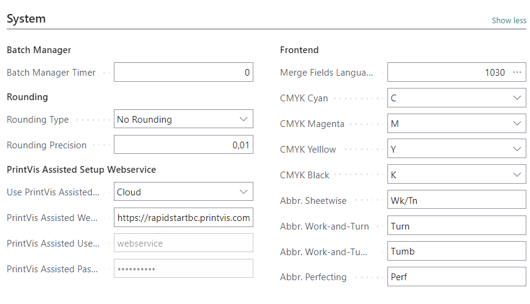
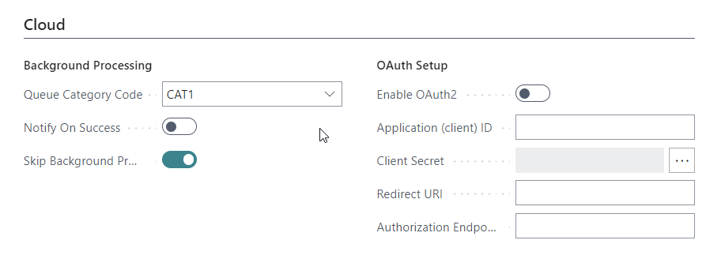

# PrintVis General Setup

The PrintVis General Setup page allows the company to set a number of standard parameters such as number series, invoicing, job costing, etc. The window consists of 12 sections, each containing information about specific parameters. The section content and function are described below.

## Menu

| Function | Description |
| --- | --- |
| User Fields | View/Edit the General Setup integrated user fields. |
| Create PrintVis Standard Bitmaps | This will create the Standard Bitmaps system entries used in PrintVis. |

## Case Management

| Field | Description |
|--------|------------|
| Application Type | PrintVis applies to Printing companies but also to other types of companies which may not use very specific printing pages and fields. PrintVis does not use BOMs or traditional routing. It defines job parts (called job "items") and the cost centers used for production. If a company has subsidiaries that do not use PrintVis, it can be disabled for those. |
| General Manufacturing | Can be chosen if print-specific pages and fields will not be used. Estimation, document management, etc., will still work. |
| Print Manufacturing | Used most of the time; print-specific descriptions benefit from print-specific pages. |
| Use Advanced Case Card | If enabled, the case card combines the case card and job card, reducing clicks. If disabled, the job card is opened separately. |
| Quote No. Series | Relates to the "Code" field in table "No. Series". The Quote No. Series can be selected from the No. Series table. |
| Order No. Series | Relates to the "Code" field in table "No. Series". The Order No. Series can be selected from the No. Series table. |
| Quote/Order No from Sales Order | If ticked, the Case Card quote/order number will be based on the sales order number with a suffix for differentiation. |
| Shipment No. Series | Relates to the "Code" field in table "No. Series". This setup is mandatory if combined shipments are used or if case shipment methods require posted shipments. |
| Manual Contact Person | Enables or disables users' ability to change the contact person on Case Cards. |
| Default Order Document | Specifies the default order confirmation document for automation. |
| Default Order Document Name | Shows the descriptive name of the default order document. |
| Search Name | Determines how the Case Card search name is updated (e.g., Job Description, Customer Name). |
| Exclude PrintVis Cases from Credit Limit Check | If enabled, quoted prices on orders are excluded from BC Credit Limit calculations. |
| Do Not Show Customer Comments on Case Card | If enabled, customer comments from the customer card will not appear on the case card. |
| Update Coupling Data Immediately | Immediately updates coupled CRM data on changes. |
| Recreate Deleted CRM Data | If CRM data is deleted, enabling this will recreate it during the next update. |
| PrintVis Order CF Account No. | Determines the Cash Flow Account for PrintVis order values. Requires active Cash Flow setup. |
| Additional Quantity | Default additional quantity (e.g., 1000) but can be changed per case. |
| Default Time for Shipment Date | Sets a default shipment time (e.g., 16:00) if not manually entered. |
| Status Code New Request | Defines the default status code for "Copy to" function when creating a new request. |
| Status Code New Quote | Defines the default status code for "Copy to" function when creating a new quote. |
| Status Code New Order | Defines the default status code for "Copy to" function when creating a new order. |
| Enable User Fields | Grants access to User Fields at the Calculation Unit level, useful for complex setups. |
| Enable Document Management | Enables document management for generating Word documents with variable information. |
| Enable Comments | Allows job-specific comments, optionally linked to departments for job ticket printing. |
| Enable Quote Text | Enables entering text lines for quotes, requiring a special report for merging the text. |
| Skip Eco Label Check | If enabled, the system will not validate ECO Label codes. |
| Text Code Quote Top | Links to "Code" in the "Text Code" table for quote header text. |
| Text Code Quote Bottom | Links to "Code" in the "Text Code" table for quote footer text. |
| Text Code Order Top | Links to "Code" in the "Text Code" table for order header text. |
| Text Code Order Bottom | Links to "Code" in the "Text Code" table for order footer text. |

## Estimating

| Field | Description |
|--------|------------|
| **Job Ticket layout** | Determines the preferred layout of information on the Job Ticket Report. Options: **2 columns** (shortens the report), **1 column** (easier to find information). |
| **Text Wrap Full Width** | Sets the number of characters for text wrapping in the External Description on the Job Ticket Report. Default: **130 characters**. |
| **Text Wrap Comments** | Sets the number of characters for text wrapping in job comments on the Job Ticket. Default: **130 characters**. |
| **Text Wrap User Fields** | Defines column width for User Field input, wrapping text to a max number of characters. Default: **90 characters** (suited for 2-column layout). |
| **Job Ticket copies** | Indicates if more than one copy of the Job Ticket should be printed. |
| **Job Ticket Bitmap Page** | Allows selection of a bitmap logo to be displayed on the Job Ticket Report. |
| **Entering Pages** | Determines how the number of pages is entered for a job. Options: **Pages with Print**, **Sheets**, **Total Pages**. |
| **Entering Format** | Defines how format is entered in the estimate. Options: **Length x Width**, **Width x Length**. |
| **Manual Grain Direction** | Allows setting each item individually as short- or long-grain, mainly for North America. |
| **Default Color Coverage** | Determines default color calculation. Options: **Both pages**, **Front**, **Back**, **Automatically** (determines based on color input). |
| **Print Sheet Specification View** | Defines how to view print sheet specification: **Length & Width** or **Format 1 & 2 Values**. |
| **Format decimal as fraction** | Determines how fractions are used when laying out multiple Job Items on the same printing sheet. |
| **1000 Character** | Specifies the character used to mark thousands (e.g., `.` or `,`). |
| **Decimal Character** | Specifies the character used to mark decimal values (e.g., `.` or `,`). |
| **Captions on Options** | Defines unit captions independently from the language setting. Options: **Metric**, **Imperial**, or based on language. |
| **Caption Calc. Factor 1** | A customizable field for complex calculations in Estimation (e.g., Number of Originals). |
| **Caption Calc. Factor 2** | Another customizable field for complex calculations in Estimation. |
| **Default Tool Step Across** | Specifies the default value for Step Across when creating new dies. |
| **Tool No. Series** | Defines the numbering series for Tools, often allowing manual input. |
| **Imposition No. Series** | Defines the numbering series for Impositions, often allowing manual input. |
| **Show Publication Fields** | Enables fields specific to publications, such as **Publications, Editions, Issues, Sections**. More details are available in the related PrintVis article. |

## Production

| Field | Description |
|------------------------------|------------------------------------------------------------------------------------------------------------------------------------------------------------------------------------------------------------------------------------------------------------------------------------------------------------------------------------------------------------------------------------------------------------------------------------------------------------------------------------------------------------------------------------------------------------------|
| Folder Archive Status Code | Defines which Status Code is to perform the Archiving function of the system's Folders. |
| Folder Archive New Status Code | Defines which Status Code is to perform the Archiving function of the system's Folders. |
| Folder Archive Days Delayed | Defines the number of days to delay the moving of folder items to the archive locations. |
| PrePress Job Template Usage | **Options:**  **Use Product Group Template**: If a prepress case (prepress job) is being created with a finished goods item attached, the template attached to the prepress status code is being copied for the new case/job, instead of the template that is attached to the finished goods item.  **Use Item Template**: If a prepress case (prepress job) is being created with a finished goods item attached, the template that is attached to the finished goods item is being copied for the new case/job. |
| PrePress Job Quoted Price = 0 | If ticked, any automatically created PrintVis Case Card for an ESKO workflow PrePress job will be set to 0 in the field Quoted Price on the job line which is created. The requirement behind this was that some printing companies do not want to charge their customers for the initial one-up pdf creation or other prepress tasks at all. |
| PrePress Product Group | Select the product group that is set up for prepress cases/jobs. |
| Product Group Text | Description of the selected product group will be displayed. |
| PrePress Status Code Order | Select the status code that is set up for prepress cases/jobs. |
| PrePress Status Code Description | Description of the selected status code will be displayed. |
| Gang Job Template | A general template for ganged jobs must be applied to use this function. When creating a combined order, the system will try to find a job template that fits the number of job items being combined. If such a template does not exist, the system will instead copy the case information from this "Gang Job Template" and add one sheet. The rest of the combined job will then have to be finalized manually. Since only the case header is used as a "dummy," it is common practice to also use the "Gang Job Template" case as a placeholder for the multiple template job. |
| Gang Job Status Code | Select which status you wish new combined orders to have when created. A lookup will display the Status Codes Set up. |
| Gang Job Order Type | Select which Order Type you wish Ganged Jobs to have when created. Only templates (jobs marked as templates) on cases with this Order Type will be suggested when creating a combined order. Templates could contain multiple jobs with different numbers of ganged job items, allowing the system to suggest the best-fit imposition based on the number of job items to be ganged. |
| Gang Job Cost Allocation | **Options:**  **Equal**: As per number of Job Items. If 3 different Job Items are present, each will carry 1/3 of the occurred cost.  **Proportion of sheet**: As per how much space each Job Item takes up. If 3 different Job Items are present, taking up 25%, 25%, and 50%, the occurred cost will be divided accordingly.  **Index**: The division is to be decided individually from Job to Job, by simply applying an Index factor to each Job Item manually. |

## Job Costing

| Field | Description |
|---|---|
| Location Production Released | When production is ended on an order and the goods are ready to ship, there still may be a surplus of material (paper) which was not consumed on the order. This field can be used to pick which location the items on the shop floor should have upon release of the material from reservation to the order just ended. This plays into the different options to set up location on shop floor per machine as well. |
| Auto Job Costing Journal | Auto Job Costing Journal relates to the "Code" field in table "Job Costing Journal". The Auto Job Costing Journal can be selected from the Job Costing Journal table. The journal picked here will be used for automatic posting of time and material to orders when the order has ended production. Whether or not items are posted automatically is decided on the Unit of Measure on material and time calculation lines in the estimate. |
| Job Cost. Hour Unit Cost | This field can be used for a more refined job costing based on efficiency. It can change the cost calculation (and thereby suggested sales price). • **Default**: Normal situation, using the time rates as they appear on the cost center. • **Weighted**: The time recorded is weighed against the efficiency set up on the user. For example, if the user is a trainee, the efficiency may be 50% and the time of 4 hours recorded may be turned into 2 hours for costing. • **Actual**: Using the hours as recorded but factoring in any overtime as set up on the unit of measure, which was used for the recording which may give a more expensive costing. |
| Dim1 Job Costing Mandatory | Tick this field if a Dimension 1 value is created and it is mandatory for costing to use a value. This requires careful setup in the system to avoid error messages on the shop floor. |
| Dim1 Job Costing Principle | If setting is made to make the job costing mandatory, this field will help get the right value in the field. • **Manual**: The user should put a manual value on each line or rely on system setup. • **Case**: The value is automatically copied from the Dimension 1 field on the case card. • **Department**: The value is taken from the department of the cost center used for this line. • **User Department**: The value is always taken from the user setup, department field. |
| Def. UoM Paper | Default Unit of Measure is set here for defaulting if the unit is required in a page or function and is not available from the item card. This function can also be used to ensure that even if a single Paper-Item does not have a Unit of Measure attached, this default setup will automatically apply. |
| Def. UoM Plates | Default Unit of Measure is set here for defaulting if the unit is required in a page or function and is not available from the item card. Should a Plate Item No. not have a Unit of Measure, the selected Unit will be applied as default. |
| Def. UoM Film | Default Unit of Measure is set here for defaulting if the unit is required in a page or function and is not available from the item card. Should a Film Item No. not have a Unit of Measure, the selected Unit will be applied as default. |
| Def. UoM Die | Default Unit of Measure is set here for defaulting if the unit is required in a page or function and is not available from the item card. Should a Die Item No. not have a Unit of Measure, the selected Unit will be applied as default. |
| UoM Slack Time | Slack Time is the time where a production machine is not working (during a lunch break or in between active jobs). If using electronic job ticket for time recording, the system can default a unit of measure to the slack time, so it builds up for statistical purposes such as an efficiency rate for individual machines. The Action "Slack time" in the "Job Costing Worksheet" will insert a time registration from when the last entry has stopped until current time. If no unit of measure is stated, the function will not do anything. |

## Invoicing

| Field                          | Description |
|--------------------------------|-------------|
| General Journal Templates      | Specifies which General Journal Template is used for posting invoice lines. |
| General Journal                | Specifies which General Journal Batch is used for posting invoice. |
| Dimension Allocation on Post   | When invoicing a customer with a single charge line, the system can be set up to allocate that turnover and re-post according to the dimensions, meaning you will be able to see the exact split of the turnover in your General Ledger after this automated re-posting. |

## Posting

| Field                   | Description |
|-------------------------|-------------|
| Location Code Mandatory | Here you can specify whether items must have a location code in the order to be posted. Tick the field on if you want the program to require a location code when posting item-related transactions. (NOTE: please use NAV setup: "Inventory Setup - field 'Location Mandatory'"). |
| Lock Archive Date       | If this field is ticked, the Archiving Date on the Case Card will not be editable or changeable after its first value. |
| Explode BOM on Posting  | Setup to decide if the BOM is expanded on posting. Two options:   **Explode** - Expand the BOM   **Do not explode** - Does not expand the BOM. |

## Logistics

| **Field**                          | **Description**                                                                                                                                                                      |
|-------------------------------------|--------------------------------------------------------------------------------------------------------------------------------------------------------------------------------------|
| **Copy Shipments**                  | Specifies whether to copy the shipments from an existing order when using the function Copy To. The options are: Always, Never, Always but not combined shipment.                     |
| **Default delivery address**        | Determines if the customer address should be defaulted on the shipment card. Options: Sell-To Address, Sell-To Ship Address, No Address.                                            |
| **Receipt Merge Code**              | Merge Code functionality creates a set of information lines on a document from the actual situation. It helps track receipts by building lines on the Receipt and Posted Receipt document. |
| **Way Bill Merge Code**             | Merge Code functionality builds lines on the shipment document, pulling data from various tables.                                                                                     |
| **Package Label Merge Code**        | Merge Code functionality builds lines on the package labels, pulling data from various tables.                                                                                       |
| **Package Label Text 1…6**          | PrintVis Package Label has up to 6 fields with fixed Captions. These fields are present on the Shipment Page. Captions should match merged text if a merge code is set up.             |
| **Item Journal Template Name**      | Determines which Journal Template Group is used for posting items consumed from production.                                                                                        |
| **Item Journal Name**               | Determines which Item Journal is used for posting items consumed from production.                                                                                                  |
| **Warehouse Journal Template**      | For companies using 365 Business Central warehouse module, this is the journal for PrintVis integration in warehouse-related posting outside normal PrintVis activities.              |
| **Warehouse Journal Batch**         | For companies using 365 Business Central warehouse module, this is the batch for PrintVis integration in warehouse-related posting outside normal PrintVis activities.                |
| **Create Shipment Item**            | When posting a PrintVis Shipment, the system can automatically generate a ‘standard 365 Business Central’ shipment. You can use a dummy item or have the system create a new item.     |
| **Shipment Item Template**          | Defines the template from which the new Item will be created when generating an individual item per shipment.                                                                        |
| **Shipment Item No. Series**        | Attaches a No. Series for the ‘Shipment Items’ to ensure they differ in numbering for easy filtering.                                                                                |
| **Tax Area Code Mandatory on Shipment** | Ensures that the Tax Area Code is set on each shipment to define the Tax Area when posting an invoice for the production/shipment.                                                  |
| **Case Shipment Method**            | Defines how the PrintVis shipment will be processed. Options: No Sales Order, Create Sales Order Per Shipment, Create Sales Order Per Shipment And Release, Create Sales Order Per Shipment And Post, Create Posted Shipments. |
| **Shipment Sales Order Removal**    | Specifies when the sales order should be removed after posting. Options: On Ship (default), On Archive, Never.                                                                       |

## Sales / Purchase Order

| **Field**                          | **Description**                                                                                                                                                                  |
|-------------------------------------|----------------------------------------------------------------------------------------------------------------------------------------------------------------------------------|
| **Production Page**                 | Specifies which page will be displayed as the production plan. Options: Case Card, Job Card, Quick Quote.                                                                      |
| **PopUp Page From Salesline**       | Determines if a popup page should appear from the salesline. Options: Never, Always, If no template.                                                                            |
| **Dim1 Sale Mandatory**             | If ticked, the sales order must have a Dimension 1 value before creating a production order. This value is then copied to the Case Card.                                          |
| **Salesorder Calculation Wait**     |                                                                                                                                                        |

## Sales Shipment

| **Field**                          | **Description**                                                                                                                                                                  |
|-------------------------------------|----------------------------------------------------------------------------------------------------------------------------------------------------------------------------------|
| **Ship Sales Order No. Series**     | Relates to the "Code" field in table "No. Series". The Ship Sales Order No. Series can be selected from the No. Series table.                                                   |
| **Ship Sales Invoice No. Series**   | Relates to the "Code" field in table "No. Series". The Ship Sales Invoice No. Series can be selected from the No. Series table.                                                 |

## Purchase Order

| **Field**                           | **Description**                                                                                                                                                                                                                                                                  |
|--------------------------------------|----------------------------------------------------------------------------------------------------------------------------------------------------------------------------------------------------------------------------------------------------------------------------------|
| **Purchase Order No. from Sales Order** | If selected, a purchase order created directly from a sales order will receive the same number as the sales order.                                                                                                                                                               |
| **Purchase Order No. Format**        | Specifies formatting for the purchase order number, using the number from the no. series. You can enter text before and/or after the number, e.g., "CASE-%1-DK" will result in "CASE-8856-DK" (if the order number is 8856).                                                       |
| **Dim1 Purchasing**                  | Determines the dimension value set on the purchase order. Options: Manual (user sets the value), PV Case (set from Case Card Field Dimension 1 value), Department (set from the department of the calculation line), User Department (from user setup), Purchaser Dimension (from Sales Person table). |
| **Dim1 Purchasing Mandatory**        | If ticked, all Purchase Orders must have a Dimension 1 code.                                                                                                                                                                                                                   |
| **Purch. Order Paper Automatic**     | If eProcurement for Paper purchase is required, this field should be ticked to activate automated paper purchase.                                                                                                                                                               |
| **Purch. Order Paper Documents eProcurement** | If ticked, activates paper purchase automation using eProcurement (OnLine functionality).                                                                                                                                                                                     |

## Special

| **Field**                          | **Description**                                                                                                                                                                                                                                  |
|-------------------------------------|--------------------------------------------------------------------------------------------------------------------------------------------------------------------------------------------------------------------------------------------------|
| **Scheduling Locked Behavior**     | Default setting: "Stop Manual Move". If a planning unit is locked, it cannot be manually moved to another timeslot unless it is unlocked. Alternatively, "Allow Manual Move" can be used if there is customization around the scheduling functionality. |
| **Case Milestone 1 …10 Ok**         | Up to 10 milestones from the planning setup can be selected for presentation in the Production plan and Case Management overview.                                                                                                                |
| **Report Production Plan**         | Replaces the standard Production Plan report with a customized version, if necessary. The report can be printed from the Production Plan page or the production menu.                                                                            |
| **Report for Quote Description**   | If the Quote Description text is too complex for Merge Codes, a custom report can be created and used for generating quote reports, or edited in the "Build Invoice Text" function on the Case Card.                                            |
| **Report Production Plan Milestones** | Replaces the standard Milestones report with a customized version, if needed. The report can be printed from the Production Plan page or the production menu.                                                                                   |

## System

| **Field**                              | **Description**                                                                                                                                                                                                                                                                                                      |
|-----------------------------------------|----------------------------------------------------------------------------------------------------------------------------------------------------------------------------------------------------------------------------------------------------------------------------------------------------------------------|
| **Rounding Type**                       | Impacts how the Quoted Price on the Job line is rounded. Options: No Rounding, Up, Down, Nearest.                                                                                                                                                                                                                     |
| **Rounding Precision**                  | Impacts the Quoted Price field on the Job card in cooperation with the Rounding Type field.                                                                                                                                                                                                                           |
| **PrintVis Assisted Setup Webservice URL** | URL for connecting to PrintVis Assisted Setup. Two options based on units: Imperial Units: `http://rapidstart.printvis.com:7040/DynamicsNAV/WS/PRIME%203%20US/Codeunit/RapidStart` or Metric Units: `http://rapidstart.printvis.com:7040/DynamicsNAV/WS/PRIME%203/Codeunit/RapidStart`.                                |
| **PrintVis Assisted Username**          | Username for logging into PV RapidStart (reference database).                                                                                                                                                                                              |
| **PrintVis Assisted Password**          | Password for logging into PV RapidStart (reference database).                                                                                                                                                                                              |
| **Frontend Merge Fields Language**      | Relates to the "Language ID" field in the "Windows Language" table. Needed for legacy customers upgrading, as merge fields will now always be generated in English.                                                                                                                                                 |
| **CMYK Cyan**                           | Points to the item card for the cyan color in the CMYK process color distribution. Helps the system recognize and group process colors (Cyan, Magenta, Yellow, Black) under "CMYK" in job tickets and order placements.                                                                                         |
| **CMYK Magenta**                        | Points to the item card for the magenta color in the CMYK process color distribution. Helps the system recognize and group process colors (Cyan, Magenta, Yellow, Black) under "CMYK" in job tickets and order placements.                                                                                      |
| **CMYK Yellow**                         | Points to the item card for the yellow color in the CMYK process color distribution. Helps the system recognize and group process colors (Cyan, Magenta, Yellow, Black) under "CMYK" in job tickets and order placements.                                                                                       |
| **CMYK Black**                          | Points to the item card for the black color in the CMYK process color distribution. Helps the system recognize and group process colors (Cyan, Magenta, Yellow, Black) under "CMYK" in job tickets and order placements.                                                                                         |
| **Abbr. Sheetwise**                     | Internal abbreviation for the printing process of Sheetwise. Visible on the Job Ticket Report.                                                                                                                                                                                                                       |
| **Abbr. Work-and-Turn**                 | Internal abbreviation for the printing process of Turning. Visible on the Job Ticket Report.                                                                                                                                                                                                                         |
| **Abbr. Work-and-Tumble**               | Internal abbreviation for the printing process of Tumbling. Visible on the Job Ticket Report.                                                                                                                                                                                                                       |
| **Abbr. Perfecting**                    | Internal abbreviation for the printing process of Perfecting. Visible on the Job Ticket Report.                                                                                                                                                                                                                       |

## Job Queues

| **Field**                | **Description**                                                                                                          |
|--------------------------|--------------------------------------------------------------------------------------------------------------------------|
| **Maintain Jobs (Req. JobQueue)** |                                                                                              |
| **Auto Create Jobs (Req. JobQueue)** |                                                                                              |
| **Transfer Costs (Req. JobQueue)** |                                                                                              |
| **Transfer Sales (Req. JobQueue)** |                                                                                              |

## Cloud

| **Field**                           | **Description**                                                                                                                                                                                        |
|--------------------------------------|--------------------------------------------------------------------------------------------------------------------------------------------------------------------------------------------------------|
| **Queue Category Code**              | Relates to the "Code" field in the "Job Queue Category" table. The Cloud Queue Category Code can be selected from the Job Queue Category table.                                                        |
| **Notify on Success**                | Specifies whether a success log line should be created if cloud processing has been executed successfully.                                                                                              |
| **Skip Background Processing**       | Specifies whether the system should perform some functions as background processes, allowing the user to continue working (e.g., while case folders are created or status codes are moved).               |
| **Enable OAuth2**                    | Enables OAuth2 authentication.                                                                                                                                                                           |
| **Application (client) ID**          | The unique ID for the application used in OAuth2 authentication.                                                                                                                                         |
| **Client Secret**                    | The secret key for the client used in OAuth2 authentication.                                                                                                                                             |
| **Redirect URI**                     | The URI to which the user will be redirected after successful OAuth2 authentication.                                                                                                                   |
| **Authorization Endpoint**           | The endpoint used for OAuth2 authorization.                                                                                                                                                               |