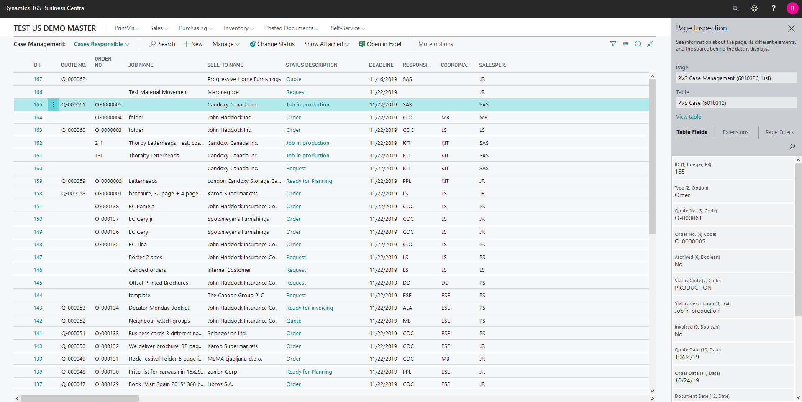
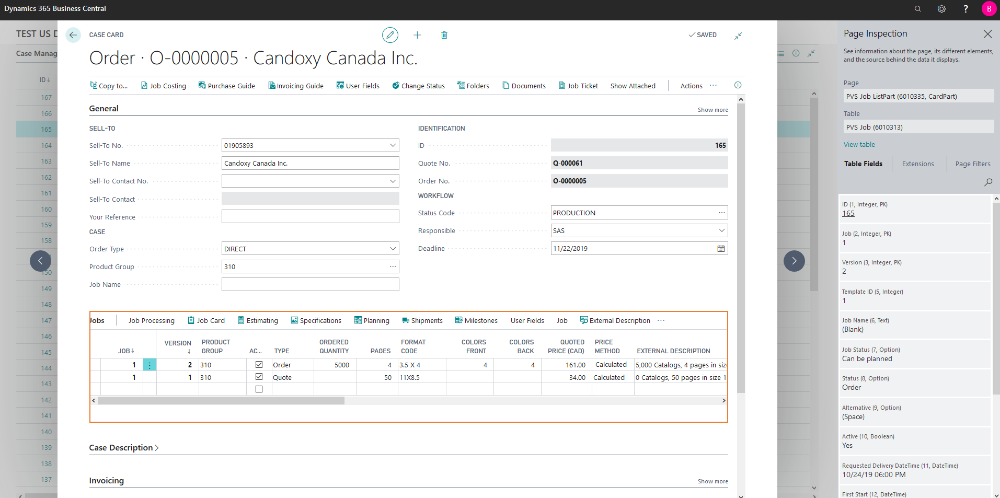

# Finding Hidden Field Values - Page Inspection

## Page Inspection in PrintVis

PrintVis offers custom views of job data, tailored to a user's needs and role within the company. For example, a production manager doesn’t need to see all the company finances, and a shop floor worker doesn’t need to examine every facet of the estimate for a job he’s running. However, there are occasions when it’s necessary to view minor details within a case, such as contact information for a specific representative who sent in the quote or other quantities originally requested.

  Using Page Inspection in Business Central

Business Central provides a "Page Inspection" function for this purpose.

 Accessing Page Inspection

1. **Keyboard Shortcut:**
   - Press the key combination `Ctrl + Alt + F1` on your keyboard.

2. **Via the Help & Support Menu:**
   - Click on the Question Mark (`?`) in the upper right corner of the Modern Client.
   - Navigate to **Help & Support**.
   - A new page will open. In the "Troubleshooting" section, find the link labeled **Inspect pages and data**.
   - Clicking on this link will open the "Page Inspection" panel to the right of your client.

 Using Page Inspection

- **Viewing Header Table Data:**
  - Typically, the header table data will be displayed.

- **Inspecting Sub Pages or Tables:**
  - If you need information located in a table on the page, simply click on the sub page or table. A red border will appear around the selected sub page, and the Page Inspection panel will update to display the relevant information.

