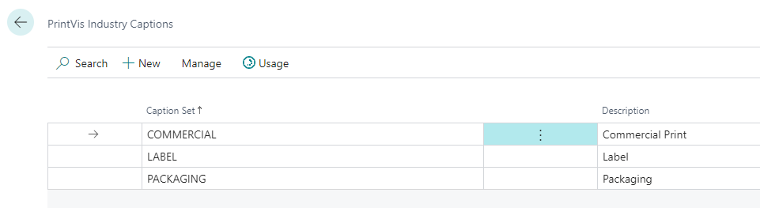
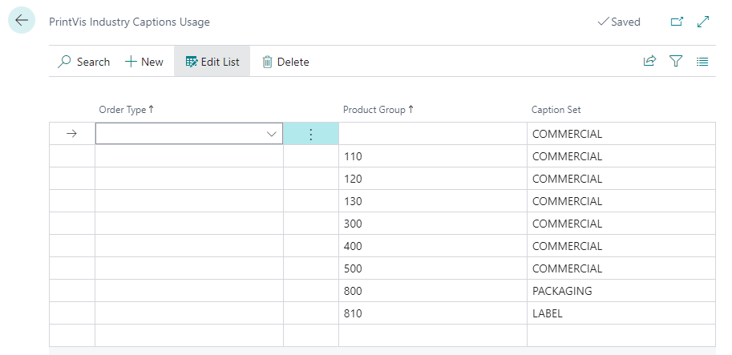

# PrintVis Industry Captions

PrintVis Industry Captions allow for customization of field labels based on industry, order type, or product group, ensuring the system aligns with company terminology and industry standards. If no custom captions are set, default PrintVis captions are used.

## Setup

**Access Industry Captions:**
   - Search for "PrintVis Industry Captions" or find it in the PrintVis System menu of the Admin role center.

#### **Caption Sets:**
   - **Caption Sets Configuration:** Configured separately for each company. Multiple sets can be used within a single company.
   - **Industry Captions Page:** Used for setting up caption sets for different types of captions needed.
   

   - **Fields:**
     - **Caption Set:** Code used for the caption set.
     - **Description:** Text description of the caption set.

#### **Edit Caption Set:**
   - Highlight a caption set and click "Edit" to modify captions for individual fields.
   
   

   - **Fields:**
     - **Caption Set:** Code used for the caption set.
     - **Description:** Text description of the caption set.
     - **Caption Type:** The PrintVis field being modified.
     - **Caption:** New caption to use for the field.
     - **Default:** Original PrintVis caption for reference.

#### **Translations:**
   - Click on the number in the Translations column to enter appropriate captions for different languages.

#### **Generate Industry Lines:**
   - Quick creation of industry-specific captions based on defaults such as Commercial Printing, Label, and Packaging.
   
 

#### Industry Captions Usage

1. **Assigning Caption Sets:**
   - **Usage Page:** Assign caption sets to different order types or product groups.
   - **Default Caption Set:** Always needed for the standard setup when specific order types or product groups are not available.

 ## Using this functionality:
   - Once caption sets are configured, the system will display captions based on the set assigned to the order type, product group, or default settings.

 
  - **Note:** Some fields, such as those related to tools or dies, will always use the default caption set.