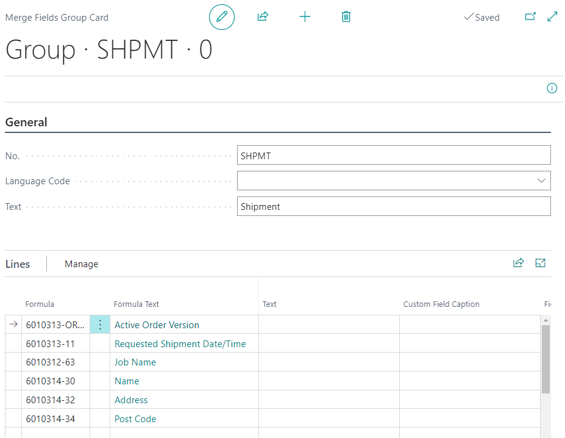

# Invoice Template - PV Assisted Setup

## Introduction

The concept of invoice templates is to streamline the invoicing process by allowing predefined information to be pulled in by selecting the desired template and clicking "build" on the invoice. This method saves time compared to creating each invoice from scratch. PrintVis Assisted Setup (RapidStart) offers the option to import pre-created invoice templates, with the ability to adjust them to fit your needs.

## Importing

To import invoice templates:

1. **On the PrintVis Assisted Setup page**, click on the Invoice Template text to open the import option:

2. **Alternatively**, click on the line for Invoice Template and then click on the Select button at the top of the page:

3. A message will pop up asking if you want to "Create 5 invoice templates?"

4. Click 'Yes' to import the invoice templates. Click 'No' if you do not wish to import them.

## Invoice Templates

There are 5 invoice templates provided:

### General Invoice

   - Does not have an Invoice Method attached, meaning the sales amount must be manually input by the finance department.
   - Description lines can be edited.
   - Pulls information from Merge Field "INVOICE" set up in the PrintVis Merge Field Group page under the Invoice group.

### Invoice Built on Job Level
  

   - Based on job level and will create an amount line for each job in the case.
   - Description lines can be edited.
   - Pulls information from Merge Field "INVOICE" as described above.

### Invoice Built on Case Level

  
   - Based on case level and will create a single amount line for the case.
   - Description lines can be edited.
   - Pulls information from Merge Field "INVOICE" as described above.

### PV General Setup for Shipment Invoicing

1. **Navigate to the PrintVis General Setup page**.
2. Under Logistics, activate **Create Shipment Item**, and select/create a number series for the items that will be created from posting.

3. Select an Item Template that includes finance settings and a base Unit of Measure.
4. Under Sales Shipment, create two Number Series for handling shipments.

**Note:** Do not use an existing Number Series for these.

### Invoice Template Based on Shipments
  
 
	
  - Based on PV Shipment and will create an amount line for each PV Shipment posted to this case.
   - Pulls information from Merge Field "SHPMT" set up in the PrintVis Merge Field Group page under the Shipment group.

### Invoice Template Based on PV Shipments and Tax Area Code
  

 
  - Creates one amount line for each different Tax Area shipment, grouping shipments to the same Tax Area together on one line. (US ONLY)
   - Pulls information from Merge Field "SHPMT" as described above.

 