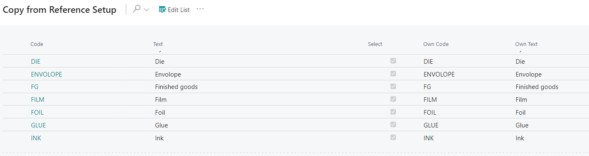

# Item Qualities - PV Assisted Setup

## Introduction

PrintVis Qualities are used as settings on Items within PrintVis. Each item must have a quality assigned to it. Without an assigned quality, certain options in calculations or other features may be unavailable. Qualities affect various aspects, including:

- Showing an Item in the Material Transfer list
- Displaying an Item in the PrintVis Purchase Guide
- Defining the PrintVis Cost price (for calculation)
- Serving as a speed-impacting parameter in Speed Tables
- And more

PrintVis Qualities are a sub-type of Item Type. On the Item card, only those Qualities assigned to the selected Item Type will be available.

## Setup

| Field     | Description                                                                                                  |
|-----------|--------------------------------------------------------------------------------------------------------------|
| Code      | Generic code that was created for reference company mapping.                                                 |
| Text      | Generic text that was created for reference company mapping.                                                 |
| Select    | Check yes to import this line into your company. Unselect to not import into your company.                   |
| Own Code  | Insert code that is recognizable to users of your company when referencing Item Qualities.                   |
| Own Text  | Insert text that is recognizable to users of your company when referencing Item Qualities.                   |

By default, all Item Qualities are selected for import. To deselect Qualities you do not wish to import:
1. Click the **Edit List** button at the top of the page.
2. Deselect the Qualities you do not want to import.
3. Alternatively, click the three dots (next to Edit List) and select **Deselect All** to remove all selections.

After making changes to the Own Code/Own Text fields and selecting/deselecting Qualities, click **OK** at the bottom of the page to apply the changes and exit.
