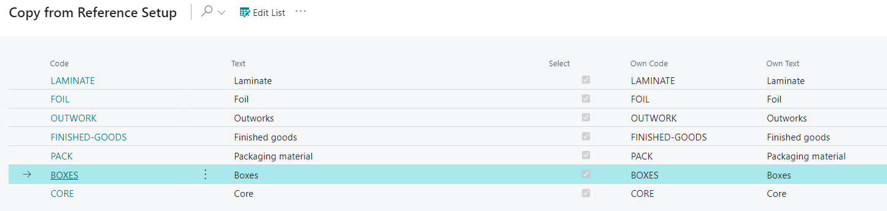

# Item Type Codes - PV Assisted Setup

## Introduction

Item Type Codes are used to categorize items on the Item card. They help narrow down the list of items when using search filters.

## Setup

| Field     | Description                                                                                                  |
|-----------|--------------------------------------------------------------------------------------------------------------|
| Code      | Generic code that was created for reference company mapping.                                                 |
| Text      | Generic text that was created for reference company mapping.                                                 |
| Select    | Check yes to import this line into your company. Unselect to not import into your company.                   |
| Own Code  | Insert code that is recognizable to users of your company when referencing Item Type Codes.                  |
| Own Text  | Insert text that is recognizable to users of your company when referencing Item Type Codes.                  |

By default, all Item Type Codes are selected for import. To deselect codes you do not wish to import:
1. Click the **Edit List** button at the top of the page.
2. Deselect the codes you do not want to import.
3. Alternatively, click the three dots (next to Edit List) and select **Deselect All** to remove all selections.

After making changes to the Own Code/Own Text fields and selecting/deselecting codes, click **OK** at the bottom of the page to apply the changes and exit.

