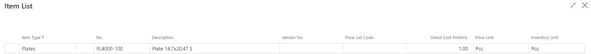

# Items - PV Assisted Setup

## Introduction

The PrintVis Item Card is an extension of the standard 365 Business Central item card. It includes fields specific to handling the posting of items such as raw materials (ink, paper, plates) and services, which are treated as items in the system.

## Setup

For the PrintVis Assisted Setup (RapidStart), only a few select fields are shown on the Item page/section. This allows for quick creation of items, but you can view the Item card or use the Configuration Package for further adjustments.

| **Field**            | **Description**                                                                                                                                                       |
|----------------------|-----------------------------------------------------------------------------------------------------------------------------------------------------------------------|
| **Item Type**        | Used to categorize items and set the corresponding 'Item Type' (e.g., paper, plates, etc.).                                                                           |
| **No.**              | Specifies the number assigned to the item.                                                                                                                           |
| **Description**      | Specifies a description of the item.                                                                                                                                 |
| **Vendor No.**       | Specifies the vendor code of the default supplier for this item.                                                                                                     |
| **Price List Code**  | Displays or selects the code of a price list attached to the item.                                                                                                   |
| **Direct Cost PrintVis** | Indicates the cost amount used for estimation for this item (if no price list is set). The cost is calculated per 'PVS Price Unit'.                                   |
| **Price Unit**       | Specifies how the unit is priced in the estimation.                                                                                                                  |
| **Inventory Unit**   | Indicates how the item is handled and counted in inventory.                                                                                                          |

- Enter all relevant information for each item. If some fields are not applicable, such as Vendor No. and Price List Code, leave those fields blank.
- If the Price List Code field is filled in, the Direct Cost PrintVis field should be left blank.
- If no Price List Code is used, it is highly recommended to enter a value in the Direct Cost PrintVis field to ensure accurate estimations.

Once you have entered all the relevant information, click "OK" at the bottom of the page to apply the changes to the item cards.

