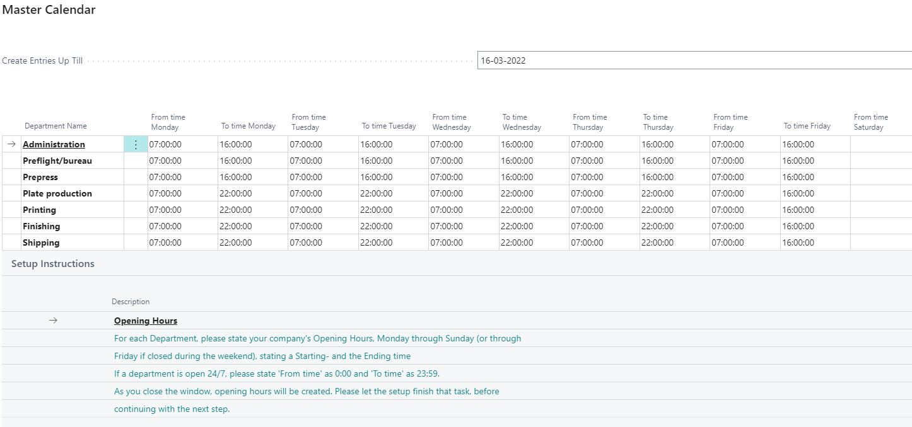

# Opening Hours - PV Assisted Setup

## Introduction

The setup of opening hours is done by department, specifying the hours from Monday to Sunday (or through Friday if the department is closed during the weekend). You need to enter both starting and ending times for each day.

## Setup

Departments are imported based on what was selected or created in the departments section of the PrintVis Assisted Setup (RapidStart).

**Important Note**

- If a department operates 24/7, set the 'From time' to `00:00` and 'To time' to `23:59`.

The system will generate all time slots entered up to the date specified in the "Create Entries Up Till" field.

1. Enter all time slots according to the company's opening hours for each department.
2. Click "OK" at the bottom of the page to apply the changes. The system will then create the opening hours based on your entries.

