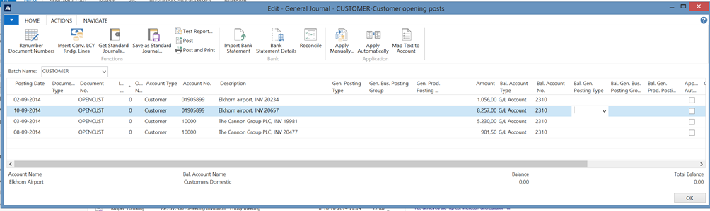
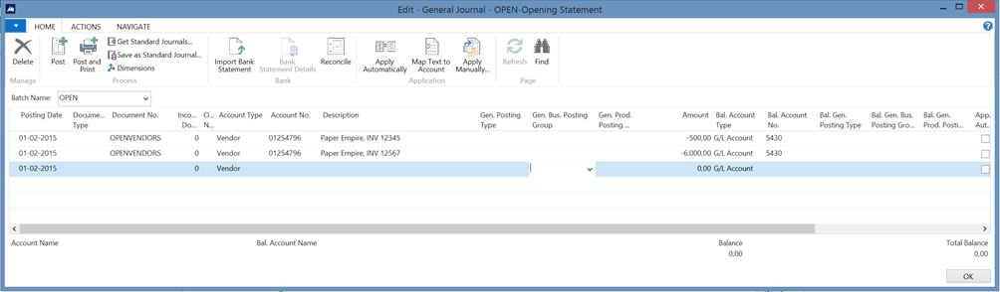
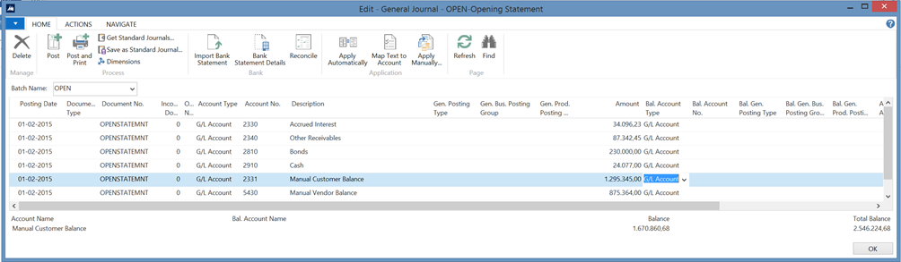

# Opening finance books in PrintVis

## Summary
This article aims to help you get settled with finance in your new system. The goal is to create a user-friendly document, rather than an exhaustive technical manual, keeping it clear what the necessary steps are without detailing every option. For specific concerns, please consult your PrintVis consultant.

 Aligning the Books
Before starting, ensure that the books from the previous system are aligned with the current financial situation. Everything must match so that the new books will also be accurate.

It is not a technical requirement to post the opening statement before using the system. The posting dates ensure sequence integrity, so transactions can be made in the new system before the closing statement from the old system is posted as the opening statement.

## Getting Your Customer Open Balance In
 
- Create all customers with open balances.
- Prepare your posting:
	- Create (if not existing) a G/L account under your existing customer balance account and name it ‘Manual Customer Account.’ Ensure **Direct Posting** is set to **Yes**.
	- Create a General Ledger batch and name it **OPEN**, or use an existing batch.
- Create a general journal for open customers:
 Create opening lines for each customer, preferably one line per open invoice.
  

- Fields of Interest:
- **Posting Date:** Invoiced date from the old system.
- **Document Type:** Leave open.
- **Document No.:** Create a custom document number for future reference.
- **Account Type/Account:** Select **Customer** and Customer Number or **G/L Account** and the manual account created earlier.
- **Description:** Customer and invoice number from the old system.
- **Amount:** Open customer entry amount from the old system.

The purpose of these steps is to create the open invoices in a way, which is easy to navigate later on when payments come in. A lazy bookkeeper could argue that only one total posting per customer is enough – and technically, it is. We do not advise to make only one, as it produces a less transparent picture.

The Manual Customer balance account will not be very busy in daily life but can sometimes prove convenient for later use. All regular invoicing will go to the ordinary customer balance account. 

As a result of posting a customer ledger entry with balance in this Manual customer balance account, we will create 3 ledger entries:

 Ledger Entries Created:
| Ledger Entry | Amount |
|-------------|--------|
| Customer Ledger Entry | 1,056.00 |
| Customer Balance Account Entry | 1,056.00 |
| Manual Customer Balance Account Entry | -1,056.00 |

When the **Opening Statement** is posted, the Customer Balance from the previous system should be moved to the **Manual Customer Balance Account** to clear the accumulated amount.

## Getting Your Vendor Open Balance In
 
- Create all vendors with open balances.
- Prepare your posting:
	- Create (if not existing) a G/L account under your existing Vendor Balance Account and name it **Manual Vendor Account** with **Direct Posting** set to **Yes**.
	- Create a General Ledger batch and name it **OPEN**, or use an existing batch.
- Create a general journal for open vendors:
Create opening lines for each vendor, preferably one line per open invoice.
This posting is done in a general journal.

 Fields of Interest:
- **Posting Date:** Invoiced date from the old system.
- **Document Type:** Leave open.
- **Document No.:** Create a custom document number for reference.
- **Account Type/Account:** Select **Vendor** and Vendor Number or **G/L Account** and the manual account created earlier.
- **Description:** Vendor and invoice number from the old system.
- **Amount:** Open vendor entry amount from the old system.

 Ledger Entries Created:
| Ledger Entry | Amount |
|-------------|--------|
| Vendor Ledger Entry | -6,000.00 |
| Vendor Balance Account Entry | 6,000.00 |
| Manual Vendor Balance Account Entry | -6,000.00 |

When the **Opening Statement** is posted, the Vendor Balance from the previous system should be moved to the **Manual Vendor Balance Account** to clear the accumulated amount.

## Creating and Posting Your Opening Statement
 
1. **Use a General Journal.**
2. **If daily bookkeeping has already started**, create a separate batch to work without interference (e.g., call it **OPEN**).
3. **Set a document number** (e.g., OPEN).
4. **Set the date** for all postings as the first day of the first open period (e.g., January 2, 2015).
5. **For each account with a balance** in the old system’s closing statement, create a journal line in the new system.

6. **For some accounts, enable Direct Posting** to enter the opening statement value. Remember to disable it afterward.
7. **For Customer and Vendor Balance Accounts**, use **Manual Balance Accounts** instead of regular ones.
8. **Ensure figures balance properly** and adjust discrepancies manually if needed.
9. **Use Post and Print when posting the opening statement.**

This process ensures that the opening statement accurately reflects the previous system’s balances and integrates smoothly into the new system.

