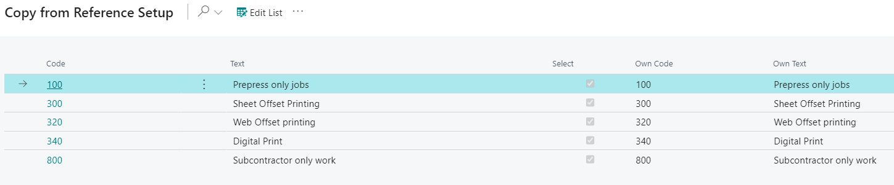

# Order Type - PV Assisted Setup

## Introduction
Order Types are used in the system to generate statistics to measure production. Typically, the Order Type is combined with a product group. Hereby, you may get an overview of how much each product group sells per Order Type. Order Types are attached directly to a Case.

Furthermore, the setup of Order Types gives you the option - by marking the product group field filter - that only the product groups which are setup with affinity to the order type may be selected. Another option is to let the selection Order Type control which Status Code a case shall be started in - the required code is selected via the Status Code field. Thus, all cases attached to the selected order type will automatically be attached to the selected eco-label. You may also select between the system’s standard eco-labels via the field, "Eco-labels."

Order Types are also used in the "Responsibility Areas" to control the workflow of an order.

## Setup

| Field     | Description                                                                                                  |
|-----------|--------------------------------------------------------------------------------------------------------------|
| Code      | Generic code that was created for reference company mapping.                                                 |
| Text      | Generic text that was created for reference company mapping.                                                 |
| Select    | Check yes to import this line into your company. Unselect to not import into your company.                   |
| Own Code  | Insert code that is recognizable to users of your company when referencing Order Types.                      |
| Own Text  | Insert text that is recognizable to users of your company when referencing Order Types.                      |

By default, all the Order Types are selected to be imported into the system. In order to deselect Order Types to not import them, click the Edit List button at the top of the page and deselect those you do not want to import. It is also possible to deselect all the Order Types by clicking the three dots (at top of page next to Edit List) and clicking 'Deselect All.'

When done selecting/deselecting and making changes to the Own Code/Own Text fields, click OK at the bottom of the page to apply changes and exit the page.

