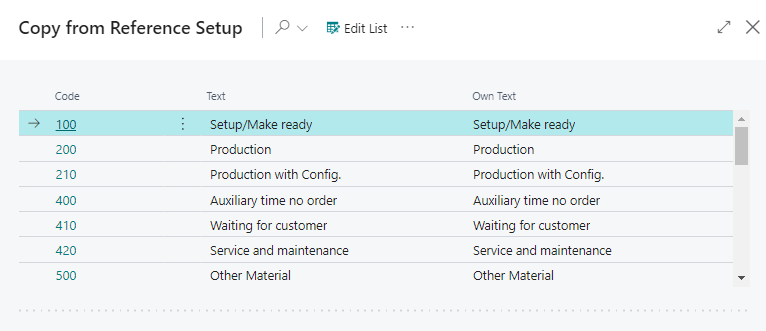

# PV Unit of Measure - PV Assisted Setup

## Introduction

The PrintVis Unit of Measure is used to structure job costing data. For labor hours, it serves as a "Job Costing Operation" and is mapped with the (pre-) calculation structure.

PrintVis Unit of Measure is a concept created for PrintVis. It is a tool for configuring and controlling job costing functions, including:

- Calculation of cost price, self-cost, and sales price during the registration of incurred costs.
- Presentation of input for job costing in printouts or display pictures.
- Configuration of data input/bookkeeping behavior.
- Appearance of the unit of measure on the electronic Job ticket.

## Setup

**Note:** In the "Own Text" field, you can rename the suggested text before importing it.

In PrintVis, you can define different unit of measure types as follows:

| **Type**                 | **Indirect Time (not job related)** | **Example Code** |
|--------------------------|-------------------------------------|------------------|
| Labor Hours              | no                                  | 100 / 200 / 300 |
| Labor Hours              | yes                                 | 400 / 410 / 420 |
| Material                 | ---                                 | 500              |
| Sub-contractors          | ---                                 | ---              |

