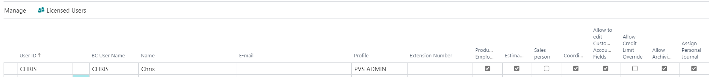
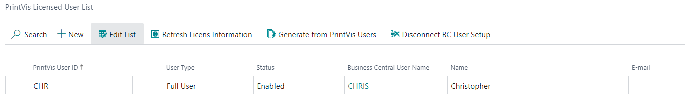

# PrintVis User Setup - PV Assisted Setup

## Introduction

Via the user setup, the company can control which ledger entries a user has access to, determine the user's rights in the graphical interface, define the user's customized menu, and more. To gain access to the system, PrintVis users must be granted relevant user rights and set up with information on function, field of activity, etc., within the company.

All users who need direct access to work in the system must first be created as Microsoft Dynamics 365 Business Central users. This involves assigning an ID, password, and rights to the system tables via the assignment of Roles.

Microsoft Dynamics 365 Business Central users are created using the menu item **Functions > Security > Database** or **Windows login**. Additionally, the user must be assigned Roles.

The user setup provides a unique user profile for each employee. This profile is activated when the user logs in with their own ID and controls access to various system features. Typically, the user profile is based on the employee's field of activity, function, and system knowledge. Properly preparing the user setup helps reduce the risk of users unintentionally accessing areas outside their expertise.

In connection with user setup, it is also possible to customize a screen to fit the individual user's profile.

The user setup is also used for extracting employee statistics from the system. For this purpose, users must be set up with the correct attachments, personal data, function areas, etc.

## User Setup

| Field                            | Description                                                                                                    |
|----------------------------------|----------------------------------------------------------------------------------------------------------------|
| **User ID**                      | User ID that is set up on the PrintVis User card.                                                               |
| **BC User Name**                 | User ID that is set up for the Business Central user.                                                            |
| **Name**                         | Name of the user.                                                                                               |
| **E-mail**                       | User's e-mail address.                                                                                           |
| **Profile**                      | Specifies an ID used to identify the user's profile (role). The profile also defines the home page with links to common tasks. |
| **Extension Number**             | User's phone number.                                                                                            |
| **Production Employee**          | Select if the user is a production worker. This is used in connection with shop floor management.               |
| **Estimator**                    | Select if the user is an Estimator. This user can be selected as an estimator for a PrintVis Order.              |
| **Salesperson**                  | Select if the user is a Salesperson. This user can be selected as a Salesperson on a PrintVis Order.             |
| **Coordinator**                  | Select if the user is a Coordinator. This user can be selected as a Coordinator on a PrintVis Order.             |
| **Allow to edit Customer Accounting Fields** | Select if the user can edit the customer's financial setup, payment terms, posting groups, etc., via the customer card. |
| **Allow Credit Limit Override**  | Select if the user can override the credit limit. The credit limit window pops up if the status code or amount is changed. |
| **Allow Archiving**              | Select if the user has the right to archive cases.                                                               |
| **Assign Personal Journal**      | Selecting this field creates an individual job costing journal for this user.                                   |

## PrintVis Licensed User List

Clicking the **Licensed User** button at the top of the User Overview page opens the PrintVis Licensed User List. This list shows PrintVis User IDs attached to BC User IDs and licensing. Each user needs to be created here to operate within the system.

| Field                            | Description                                                                                                    |
|----------------------------------|----------------------------------------------------------------------------------------------------------------|
| **PrintVis User ID**             | User ID set up on the PrintVis User card.                                                                       |
| **User Type**                    | Specifies the licensing attached to this user:   - Full User   - Registration User   - External Consultant   - External |
| **Status**                       | Specifies if the user is Enabled or Disabled.                                                                   |
| **Business Central User Name**   | User ID set up for the Business Central user.                                                                    |
| **Name**                         | Name of the user.                                                                                               |
| **E-mail**                       | User's e-mail address.         

