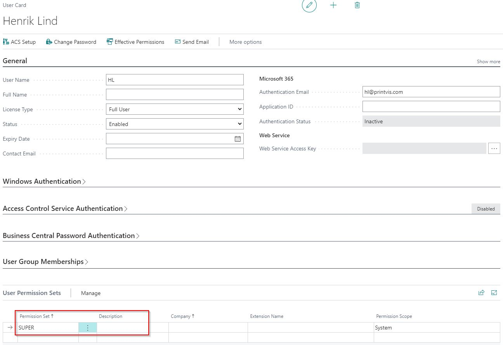
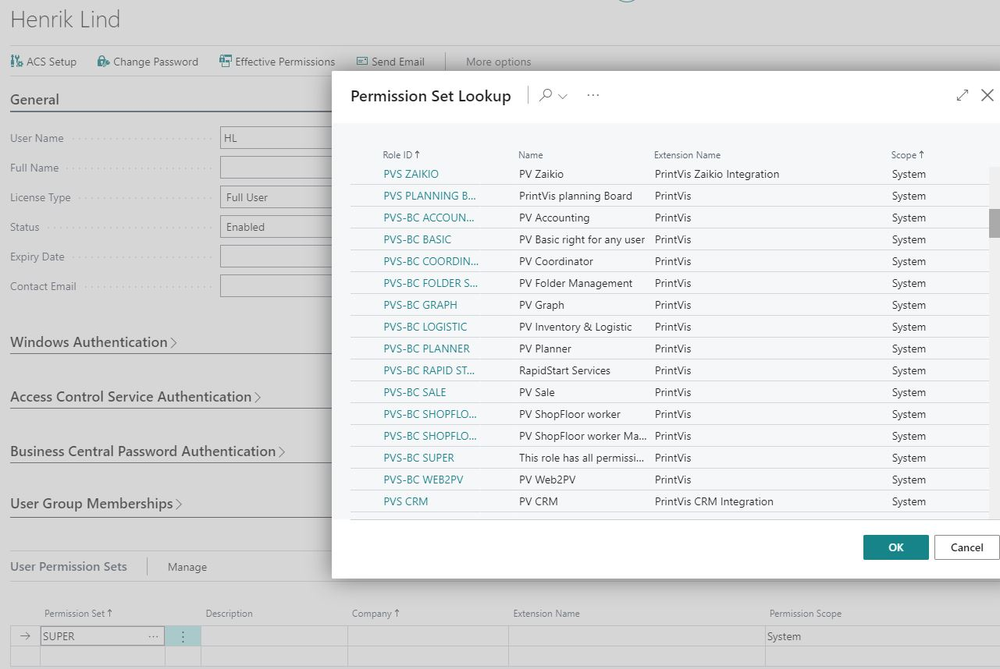
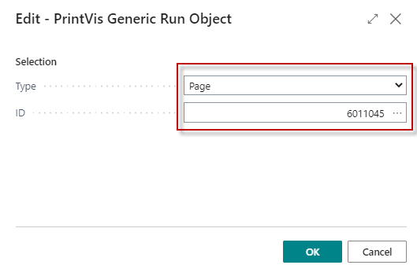
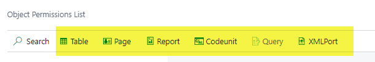
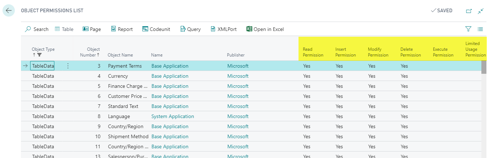

# Permission Sets and List - 365 Business Central Permission

## Setup

Setting up Permission Sets for users is crucial to manage access and functionality. Assigning the "SUPER" Role/Permission Set to all users grants all rights, which can be risky and is not recommended. 

Instead, use specific PrintVis Permission Sets tailored to user roles such as Planner, Coordinator, Sales, etc.

## PrintVis Permission Sets

Permissions Sets have the ability to include and exclude permissions.

Permission Sets Overview

1. **Old Permission Sets**: 
   - **PVS-BC ...**: Older sets still in use but not maintained for new PrintVis versions.

2. **Current Permission Sets**: 
   - **PVS 365 ...**: Updated sets with a more streamlined structure, maintained for new PrintVis versions.

## PV 365 Permission Sets

PrintVis provides the following permission sets:

#### **PVS 365 Case Edit**  
  Needed for users who perform non-read actions with cases or related pages.  
  **Includes**: PVS 365 Basic

#### **PVS 365 Setup**  
  Needed for users who edit PrintVis setup data (e.g., cost centers, planning units).  
  **Includes**: PVS 365 Basic

#### **PVS 365 ADV**  
  Required for users utilizing advanced features such as the planning board or Web2PV.  
  **Includes**: PVS 365 Basic

#### **PVS 365 ADV Setup**  
  For users setting up advanced features (e.g., planning board, Web2PV, CIM connections).  
  **Includes**: PVS 365 ADV, PVS 365 Basic, and PVS 365 Setup

#### **PVS 365 SFloor**  
  Required for any shop floor user.  
  **Includes**: PVS 365 Basic and PVS 365 Job Cost ENT

#### **PVS 365 Job Cost ENT**  
  Needed for users recording job costing entries.  
  **Includes**: PVS 365 Basic

#### **PVS 365 None PVS**  
  For BC users with no other PrintVis access.

#### **PVS 365 Basic**  
  Included automatically by other permission sets. Manual setup is not required.

#### **PVS 365 API**  
  Required for assisted setup API connections.

For a detailed overview of permissions for each user, use the "Effective Permissions" action on the BC "Users" page.

## Object Permissions List

The **Object Permissions List** (Page 6011045) provides an overview of permissions per object based on the installed database license.

 Object Permissions Filters

The Object Permissions List page allows filtering for:

- **Read**
- **Insert**
- **Modify**
- **Delete**
- **Execute**
- **Limited Usage**

Use the action buttons across the top of the Object Permissions List to filter the data.

