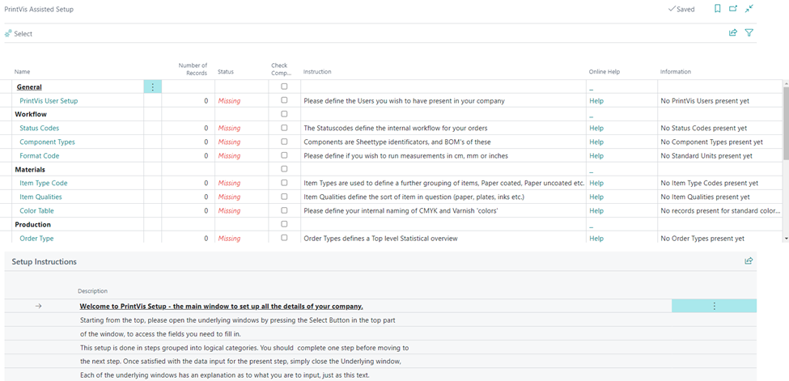

# PrintVis Assisted Setup

## Introduction

PrintVis Assisted Setup (also referred to as PrintVis RapidStart) is an add-on to the RapidStart Services for Microsoft Dynamics 365 Business Central. RapidStart Services is a tool designed to expedite the time for implementation. During setup, a customer will be connected via a Web Service to a reference database where all preselected data will be copied to their local database. This Web Service holds information from commonly used cost centers, status codes, format codes, departments, component types, etc. that have already been set up and can just be imported into your database.

There is a step-by-step worksheet that assists in setting up a database with the important information that is needed for customers to use the database. The PrintVis Assisted Setup is designed to guide the user with setting up PrintVis information (not Business Central). In order to get started using the Assisted Setup, you will have to get access to your own database.

## Preparation

 Create a New Company

- Start Microsoft Dynamics 365 Business Central Development Environment.
- Open the appropriate database.
- Create a new Company.

 Check User Setup

- Start the 365 Business Central client.
- Select the new company.
- Click on the gear icon and select **My Settings**.

Select the role "PrintVis Admin" and choose your newly created company:

Once you click **OK** after entering the Role and Company on the My Settings page, the system will update with the PrintVis Admin home screen. You can access the PrintVis Assisted Setup by clicking on the tile or by going to the **PrintVis General** drop-down menu and selecting **PrintVis Assisted Setup**.

Note that all the tiles will show '0' (except for **PrintVis Full Users** and **PrintVis Registration Users**). As you complete tasks in PrintVis Assisted Setup, these tiles will begin to reflect the corresponding data. The system takes information from the Assisted Setup and populates it into the appropriate pages.

## PrintVis Assisted Setup

| Field              | Description                                                                                                                                                                                                                                                                                                                                                                           |
|--------------------|---------------------------------------------------------------------------------------------------------------------------------------------------------------------------------------------------------------------------------------------------------------------------------------------------------------------------------------------------------------------------------------|
| **Name**           | Headers marked in **black bold text** (such as General, Workflow, Materials, etc.) are used to break up the sections into groups. The sections will be marked in **blue/green text** (such as PrintVis User Setup, Status Codes, Component Types, etc.) and these are links to the setup page for that section.                                                                          |
| **Number of Records** | Records that have been applied.                                                                                                                                                                                                                                                                                                                                                       |
| **Status**         | Shows if the section is **missing**, **ready**, **completed**, or **not yet available**. Sections might not yet be available because other sections need to be completed before starting that section.                                                                                                                                                                               |
| **Check Completed** | Mark this field if the section is completed. **Format Code** and **Color Table** will automatically be marked completed after clicking "OK" on that page. These sections cannot be reopened once marked "OK." All other sections should be marked completed manually because it is possible to exit and re-enter sections (except for Format Code and Color Table).                      |
| **Instruction**    | Helpful generic hints are used to provide quick help. More detailed instructions are available on each page when clicking into the sections.                                                                                                                                                                                                                                            |
| **Online Help**    | Direct link to support articles that relate to the section.                                                                                                                                                                                                                                                                                                                            |
| **Information**    | This gives a view to act as a reminder if there is no information input yet, or if sections have been completed.                                                                                                                                                                                                                                                                       |

 Suggested Workflow

It is strongly recommended to start at the top with **PrintVis User Setup** and work your way down. Several sections are unavailable for importing information without first completing the prior section. 

**Example:** The **Cost Center** section cannot be started without first completing the **Departments** section. This won't be an issue if you follow the suggested top-down approach since **Departments** is listed before **Cost Center**.

Once PrintVis Assisted Setup is completed, it should be possible to run through the full process from **Request** to **Invoicing**, as long as the initial Business Central setup has been done. There is still an option to conduct a more advanced and custom setup based on customer needs, but this process will significantly reduce the time required to set up a company.

