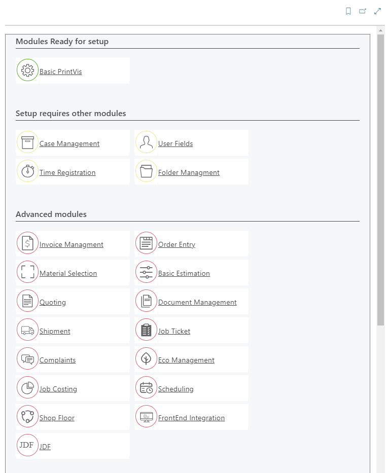
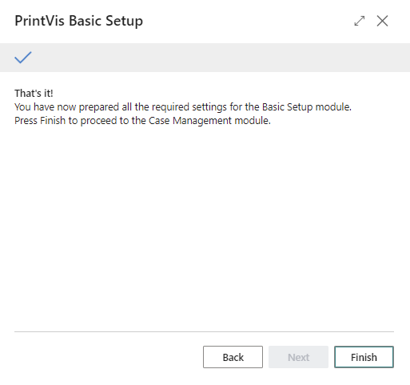

# PrintVis Onboarding

---

## Introduction  

PrintVis Onboarding is designed to assist users in getting started with the software, understanding its features, and becoming proficient in its use. This initiative builds on past efforts to simplify the onboarding process, aligning with Microsoft's enhancements to the onboarding experience in Business Central.  

With a few simple steps, users can start a trial period to explore the system's functionalities hands-on.  

Our primary goal is to streamline the initial setup and exploration process, making it intuitive and efficient for users.  

Included in this guide are screenshots and detailed instructions to help users complete each setup step effectively.  

---

## Onboarding Role Center  

New cloud users are automatically assigned the Onboarding Role Center, which can also be manually selected under "PrintVis Onboarding."  

### User Screen 

 

The user screen facilitates access to onboarding tools and serves as a hub for navigating setup modules and tasks.  

---

## Entry-Level Modules  

The following are considered entry-level modules:  

- **Basic Setup**  
- **Case Management**  
- **Folder Management**  
- **User Fields**  
- **Time Registration**  

Additional modules will be introduced over time.  

---

## Examples for the Setup Screens  

PrintVis operates as a comprehensive system comprised of interconnected modules. Some modules depend on data from others, requiring setup in a specific sequence. Advanced modules may necessitate support from experienced PrintVis Implementation Partners.  

Step-by-step instructions ensure a gradual and manageable deployment, reducing potential disruptions to daily operations. 

 

Each successfully configured module is marked as "Ready."  

  

The structured onboarding process is designed to help users transition smoothly from trial to full adoption, unlocking the complete potential of PrintVis and Business Central.  

This approach aims to significantly improve user experience, ensuring a successful and seamless integration into existing workflows.  

