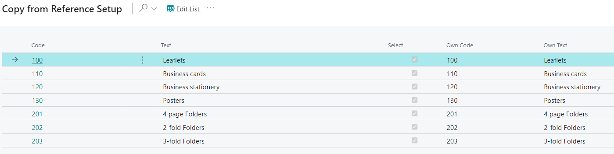

# Product Group - PV Assisted Setup

## Introduction

Product Groups are a sub-topic of Order Types used to manage basic information on orders and categorize products for statistical analysis, such as production and sales data. Each Product Group is attached directly to a Case, allowing the case to be included in the selected Product Group for statistical purposes and potentially controlling imposition information and basic templates for specific job lines.

## Setup

| **Field**     | **Description**                                                                                 |
|---------------|-------------------------------------------------------------------------------------------------|
| **Code**      | A generic reference code created to map statuses or other elements to a reference company's standard. |
| **Text**      | A generic descriptive text used for mapping to the reference company's conventions.             |
| **Select**    | A checkbox to include or exclude this line during the import process. Select "Yes" to import, or unselect to skip importing. |
| **Own Code**  | A custom code that users in your company can easily recognize when referencing the imported status codes. |
| **Own Text**  | A custom text description that is user-friendly and recognizable within your company when referencing the imported status codes. |

By default, all Product Groups are selected for import into the system. To exclude certain Product Groups from import, click the **Edit List** button at the top of the page and deselect those you do not want to import. You can also deselect all Product Groups by clicking the three dots (next to **Edit List**) and selecting **Deselect All**.

After making your selections and changes to the Own Code/Own Text fields, click **OK** at the bottom of the page to apply the changes and exit.

