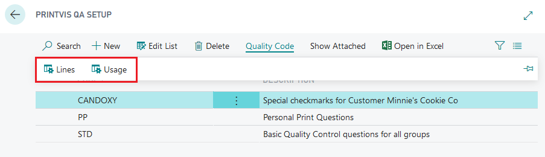
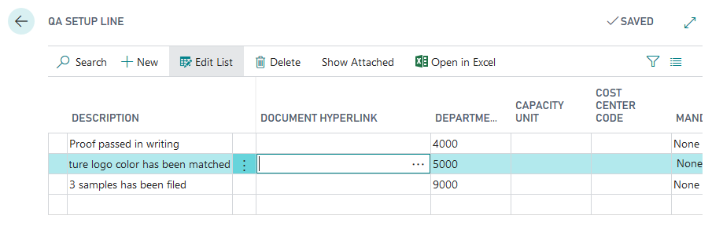

# Quality Assurance - QA Setup

## Sumary

PrintVis Quality Assurance provides a customizable checklist for production quality control.

The QA Checklist setup can be accessed by searching for **QA Setup**. The checklist is customizable based on various parameters (Usage), and the quality questions (Lines) presented to the operator are summarized based on these parameters.

The checklist can be displayed on:
- The **Case Card - Job**
- The **Shop Floor Role Center**

Example Setup

An example setup might include:
- A basic set of questions
- Questions specific to a particular order type
- Questions specific to a particular customer
- Additional questions based on usage setup

If an order matches the given order type and customer, the checklist will include questions from all applicable usage groups.

## QA Groups and Usage

Configure and structure groups requiring special questions and assign their usage. 

Options include:

- **General**: Questions/Lines are always displayed.
- **Order Type**: Questions/Lines are displayed if the order is of the selected type.
- **Customer Group**: Questions/Lines are displayed if the customer is a member of the customer group.
- **Customer No.**: Questions/Lines are displayed if the order is for this specific customer.
- **Finished Good Item No.**: Questions/Lines are displayed if the job line of the order contains the given item number.
- **ECO Code**: Questions/Lines are displayed if set to the selected Eco Label.

## QA Lines

Set up the lines required for the selected QA setup. The **Document Hyperlink** field allows linking files or web pages to QA lines for additional information or printing documents that need to be signed by the operator.

##### Field Mandatory Options

1. **None**: The operator can fill out the field.
2. **Checkmark only**: The operator must indicate "Is OK".
3. **Comments only**: The operator must fill out "Comments".
4. **Both**: The operator must complete both "Is OK" and "Comments".

##### Field QA Type

1. **General**: The QA line must be completed before marking a job as "Job Complete". If not completed, a message will prevent job completion.
2. **Production**: The QA line must be completed before starting production time. If not completed, a message will prevent recording production time.
3. **Make Ready**: The QA line must be completed before starting make-ready time. If not completed, a message will prevent recording make-ready time.

## Result

Lines marked as OK will store the User ID and date, showing when and by whom the lines were marked. Clicking on the hyperlink will open the linked document or webpage.

**Note**: When searching for a Shop Floor Job Ticket with Job = 0, if no QA lines are found, filtering will apply to all Jobs.

## Troubleshoot

If expected lines do not appear on the QA Checklist from the shop floor:

1. Check the "usage" from the QA Setup Member, especially if using the "General" type.
2. Ensure that the line is properly set up in the "usage". If the "Delete" button is inactive, the line is not generated.

   Example of an inactive line:

   

3. To activate the line, click into the **Description** field. The line should become active and visible in the shop floor setup location, assuming no other setup errors are present.

   Example of an active line:
   