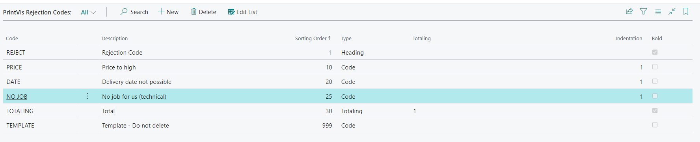
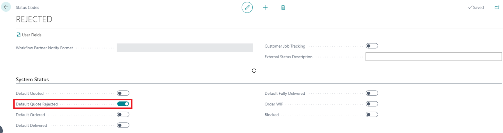
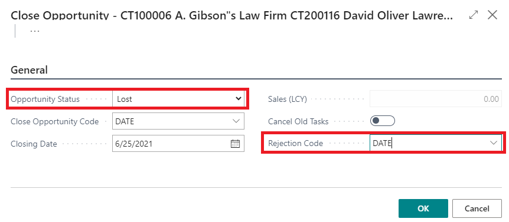

# Rejection Codes

## Introduction

Rejection Codes are used to specify reasons when a case is rejected. This information can be analyzed statistically to understand the reasons behind case rejections, such as pricing issues, scheduling conflicts, or feasibility concerns. Rejection codes are also useful for relationship management to track lost opportunities.

## Setup

### Field Descriptions

| Field            | Description                                                                                      |
|------------------|--------------------------------------------------------------------------------------------------|
| **Code**         | Identification field for the Status Code. Maximum length is 20 characters.                      |
| **Description**  | A meaningful description that explains what this code represents.                                |
| **Sorting Order**| Numeric sorting order for the Status codes within each Order status. Codes are presented sorted by this value. |
| **Type**         | Identifies what the line/code represents. Options:                                              |
|                  | - **Heading:** Describes the section of the codes under the header.                              |
|                  | - **Code:** Represents an individual rejection code.                                             |
|                  | - **Totaling:** Allows setup in the totaling field to decide how to sum up other codes.           |
| **Totaling**     | Used for summing up codes when the Type is set to Totaling.                                      |
| **Indentation**  | Determines the indentation level when displayed on a report. Options:                           |
|                  | - **Blank:** No indentation.                                                                     |
|                  | - **1:** Level 1 indentation.                                                                   |
|                  | - **2:** Level 2 indentation.                                                                   |
| **Bold**         | Check if you want the line to be displayed in bold text on the report.                          |

The rejection code setup can be used for generating reports and Power BI reports.

## Business Central Relationship Management

When an opportunity is closed and marked as Lost, if the opportunity status is set to a status code marked as Default Quote Rejected, then the corresponding PrintVis case can automatically move to the default quote rejected status.

The PrintVis rejection code is also available on the close opportunity page, allowing the rejection reason to be recorded and added to the PrintVis case.

