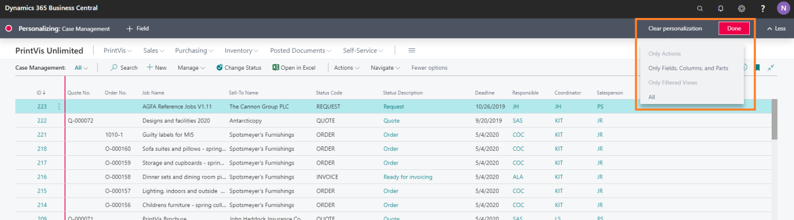
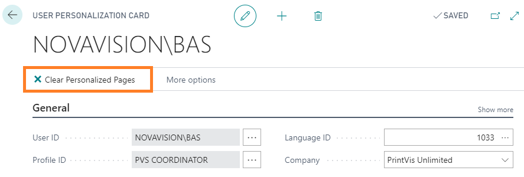

# Resetting User-specified page customizations

In 365 Business Central, users have the ability to customize their individual page layouts, menus, Role Centers, and other settings to their satisfaction. However, there may be instances when you need to undo these customizations, either to revert to standard settings or because the customizations have caused issues with the page, such as crashes.

### For a Specific Page

To clear personalization for a specific page:

1. **Open the Page:**
   - Click the gear icon in the upper right corner of the page.
   - Select **Personalize**.

2. **Clear Personalization:**
   - In the top menu, select **Clear personalization**.
   - You will see four options:
     - **Only Actions (menu items)**
     - **Only Fields, Columns, and Parts**
     - **Only Filtered Views**
     - **All**

   Choosing the appropriate option will clear the specified types of personalizations on the page.

### For All Pages

If you need to clear personalization across all pages:

1. **Search for User Personalizations:**
   - Go to **User Personalizations** in the search bar.

2. **Edit User:**
   - Select the user whose personalizations you want to clear.
   - Click the **Clear Personalized Pages** button.

This action will remove all customizations and revert the pages to their default settings.

#### Notes

- **Clearing Personalization for a Specific Page:** This action only affects the current page and not the entire system.
- **Clearing All Personalizations:** This action will remove all customizations for the selected user, affecting all pages.

By following these steps, you can efficiently manage and revert customizations in 365 Business Central.
