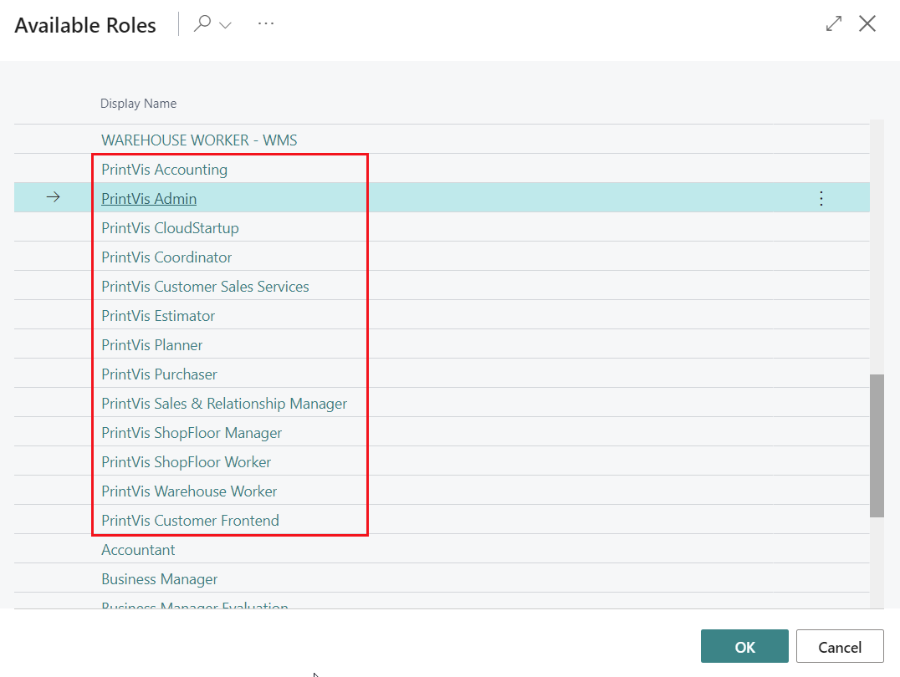
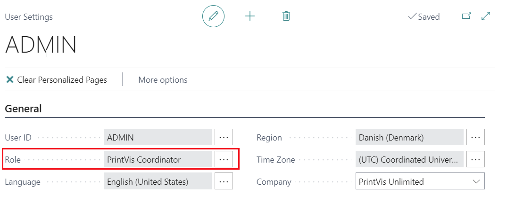
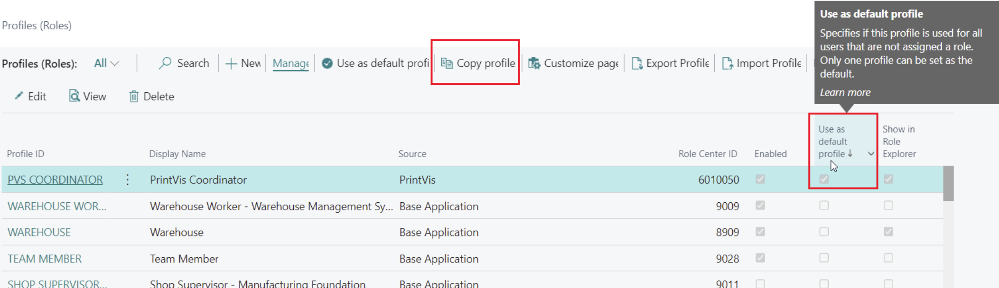
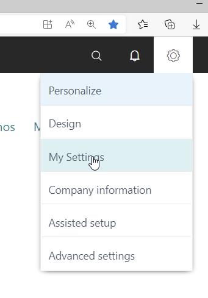
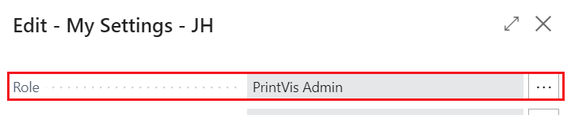
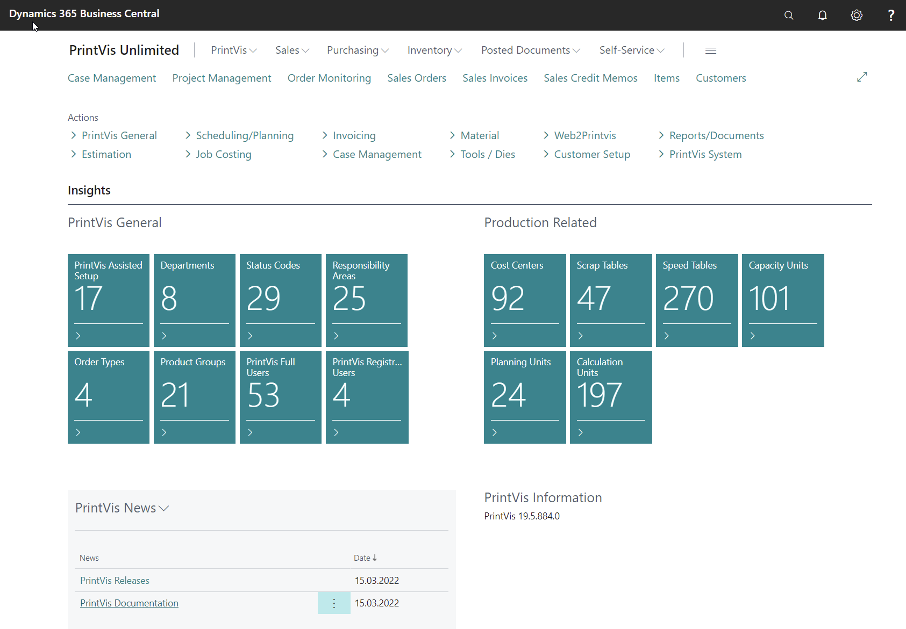
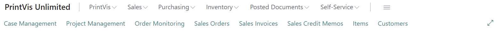
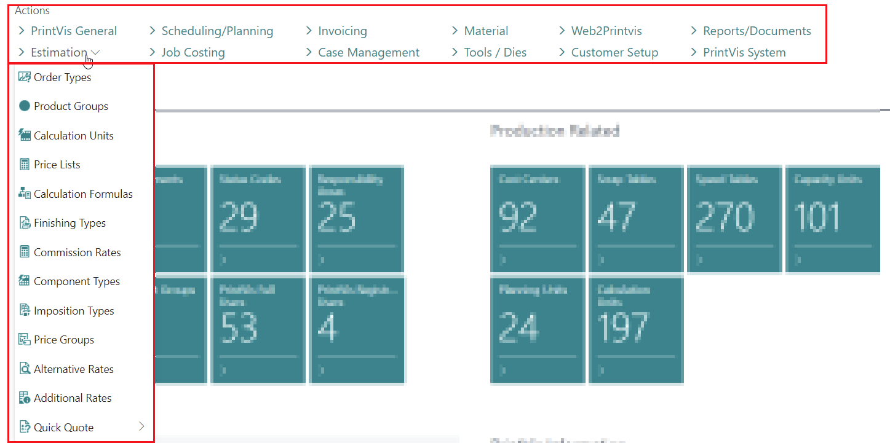
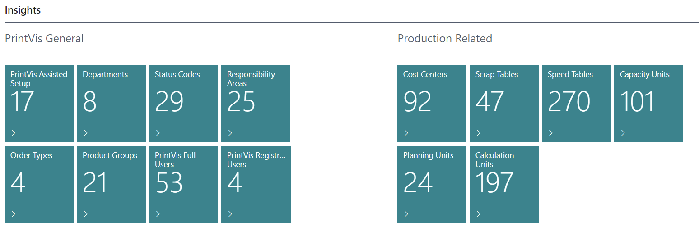

# PrintVis Role Centers - Profiles

## Summary

In Business Central, all users are assigned profiles that reflect their business roles, departments, or other categorizations. Profiles allow administrators to manage what different user types can see and do in the user interface, enabling efficient task performance.

A **Role Center** gives users quick access to information pertinent to their daily work, displaying relevant data and facilitating navigation to necessary pages for tasks.

PrintVis extends this functionality by providing specific Role Centers for various user roles in a printing company.

 Available PrintVis Profiles

The screenshot below shows the list of available PrintVis profiles:

In this document, the term "Profile" encompasses both roles and profiles, referring to the same concept.

## Usage

PrintVis profiles aim to provide access to specific print production-related areas of PrintVis and Business Central. If a company wishes to create custom profiles, it is recommended to copy an existing profile with the required access and modify it, keeping the original PrintVis profiles intact.

Profiles are assigned to users under "User Settings" (field "Role"). If no profile is assigned, the default profile is used. Profiles can be copied and saved under a custom name on the Profiles page.

#### Common PrintVis Profiles

- **PrintVis Admin Profile**  
  For setting up and administrating PrintVis. Access all setup areas, including RapidStart/Assisted setup.

- **PrintVis Coordinator Profile**  
  For customer service and scheduling. Manages typical requests and order management tasks, including purchase and inventory.

- **PrintVis Shop Floor Worker Profile**  
  For production staff, providing access to production information and shop floor data collection.

## PrintVis Admin Profile

This profile is designed for users who build and maintain the PrintVis setup. It allows access to all setup areas and the initiation and control of the initial PrintVis setup.

To select the PrintVis Admin role/profile:
1. Click the gear icon in the upper right-hand corner of the screen.

2. Choose "PrintVis Admin" from the role options.

3. Click "OK" to access the Admin Role Center.

### Main Menu

Access major PrintVis and Business Central areas to create case examples, items, purchase orders, and other tests for setup changes.

### Actions

In this area, all relevant PrintVis setup options are accessible, grouped by specific topics:

| Menu Topic          | Description                                                                                       |
|---------------------|---------------------------------------------------------------------------------------------------|
| **PrintVis General** | Essential settings not part of another group, including: PrintVis Assisted Setup, General Setup, User Setup, Cost Center Setup |
| **Estimation**       | Estimation-related setup, including: Order Types/Product Groups, Calculation Units, Component Types, Additional Rates |
| **Scheduling/Planning** | Planning-related setup, including: Capacity Units and Groups, Planning Units, Opening Hours and Profiles |
| **Job Costing**      | Job costing-related setup, including: Units of Measure, Job Costing Journals, Shop Floor Setup |
| **Invoicing**        | Job invoicing-related setup, including: G/L Posting Setup, Invoice Templates, and BC General/Inventory Posting Setup |
| **Case Management**  | Setup related to status flow, including: Status Code Setup, Responsibility Areas Setup, Planning Unit Setup |
| **Materials**        | Item-related settings, including: Item Qualities, Item Types Codes, BC Item Templates |
| **Tools / Dies**     | Tool and die-related settings and the Tools/Dies themselves |
| **Web2PrintVis**     | Back-end and front-end related settings |
| **Customer Setup**   | Customer-related settings |
| **Reports/Documents** | Storage, Report, and PV Document setup-related settings |
| **PrintVis System**  | System settings not relevant for the above menus |

### Insights

Provides direct access to related and important setup areas/tables, with a tile showing the number of entries and opening the table with one click.

### PrintVis News

Direct links to PrintVis documentation, such as release information and documentation on the PrintVis Support Portal.

### PrintVis Information

Displays more PrintVis-related information, including the version of the currently installed PrintVis base app.