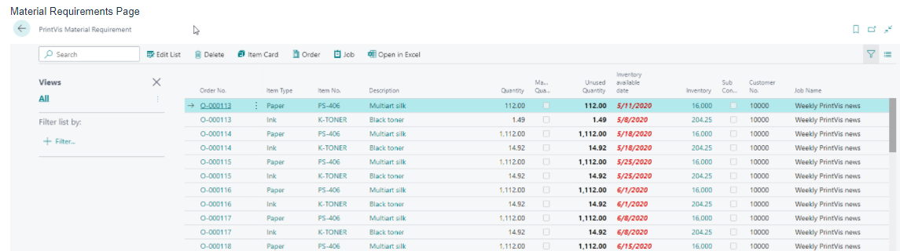
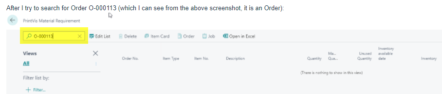
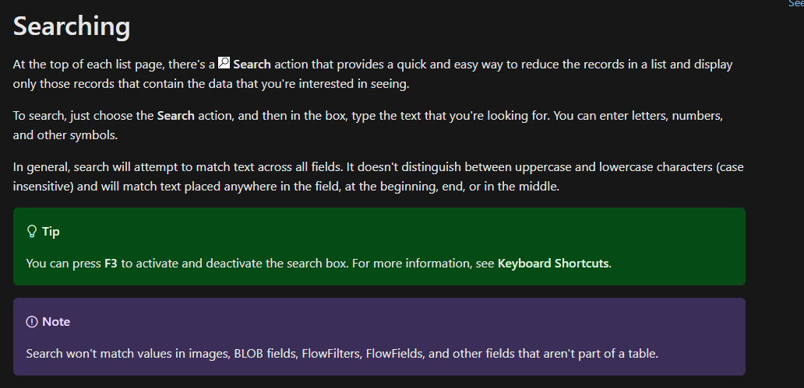

# Searching in modern client

## Summary

In the modern client of 365 Business Central, there are some limitations regarding search functionality:

- **Search Functionality Limitation:** The modern client does not support searching on flow fields. It only searches within "real" fields in the table.

#### Filtering on Flow Fields

Despite the search limitation, you can still filter on flow fields as before.

## Example

In the **Material Requirements** page, searching directly for an "Order No." is not possible because it is a flow field.

**Recommended Approach:**

1. **Right-Click on Order No.:**
   - On the **Material Requirements** page, locate the "Order No." field.
   - Right-click on the field.

2. **Filter on Order No.:**
   - Select the filter option for "Order No." to apply the desired filter.

For further details on sorting, searching, and filtering lists in Business Central, refer to the official documentation:

- [Sorting, Searching, and Filtering Lists - Business Central]

By understanding these limitations and using the recommended filtering methods, you can effectively manage and work with flow fields in 365 Business Central.