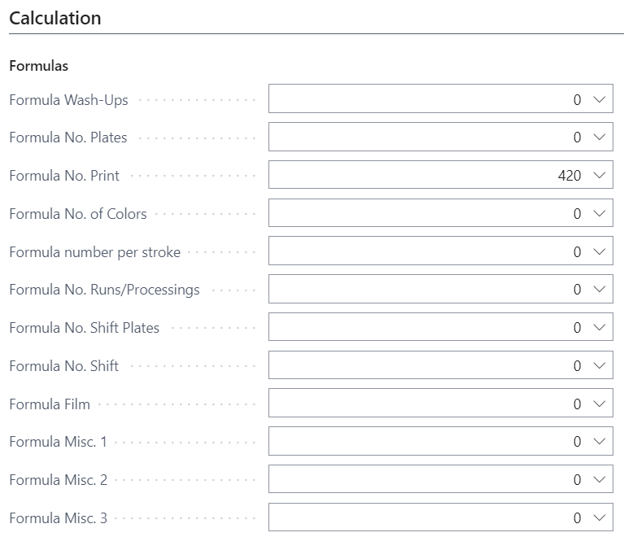

# Just a Simple Cost Center Setup - How-to!?

## Summary

This article will guide you through all the necessary steps to create new equipment as a Cost Center. It explains the required structure for making changes to existing Cost Centers and the dependencies and settings between Cost Centers, Configurations, Scrap/Speed tables, Price Lists, and Calculation Units.

PrintVis provides many options for all kinds of machines and work centers. All fields are described in the article: **Cost Center setup**.

> **Note:** A fully manual setup is not required, as you can easily import from existing machinery and work centers using the "PrintVis Assisted Setup" under the topic **Cost Centers**.

## Introduction

This article starts from the PrintVis Admin profile, but if you're using other profiles, you can search for "PrintVis Cost Centers" if available on the Role Center/profile.

### Steps to Follow

1. Create Cost Center
	- Assign Department
	- Select Cost Center/Machine Type
2. Create Configuration(s)
	- Set Up Scrap
	- Set Up Hourly Rate
	- Operations
		- Speed Tables
		- Price Lists
	- Calculation Formulas
3. Create Calculation Unit(s)

> Do not forget to sort so the machine appears in the typical process flow (chronologically).

## Create Cost Center

Find PrintVis Cost Centers and click +New.

1. Enter a Code.
2. Enter a Name.
3. Select a Department.
4. Select a Type.
5. If Type = Machine is selected, choose Machine Type.

6. Click on the action **Configurations** to create/view configurations.

## Create Configuration(s)

1. Enter a Configuration Code.
   - At least one configuration is mandatory if you want to use the Cost Center on the Shop Floor or for calculation.
   - Often, the same code as the Cost Center is used if only one configuration is needed.
2. Enter a Name.
3. Select Configuration Type.
   - At least one basic configuration is required.
   - Surcharge configurations are additional machine devices/units that can be used with a basic configuration but can also be switched off (e.g., a 3-knife trimmer on a saddle stitcher).

   > Example: 1 basic and 1 surcharge configuration.

### Configuration: Rates and Scrap

Click on Edit to enter details for the basic configuration.

1. Hit the action Rates to enter the hourly rates for this configuration.
   - Each configuration needs its own rate setup.

2. If the configuration involves scrap, hit the action Scrap Table to create/edit the scrap table.
   - A scrap table is created (if not existing) and opened in Edit mode.
   - Enter the scrap amount for make-ready and running.
   

    - Close the scrap table when done.
 3. The newly created scrap table will be assigned to the Scrap Table field.
 4. Select a Scrap Unit if scrap is not counted in pcs/each, but in length (ft/m) or area (ft²/m²).

   > Ensure the quantity formula matches the unit of scrap. It is crucial that the quantity and speed units align.

## Configuration: Operations - Formulas - Speed Tables - Price Lists

### Operations

1. Create a line for each operation for this configuration and enter a number for the operation.
2. Enter a description for the operation.
3. Select a PrintVis Unit of Measure for this operation.
   - This links to calculated operations in job costing overviews.
4. Enter a Fixed Quantity or select a Formula Code.
   - Both reflect the quantity in the calculation for this operation.

   > If the quantity is fixed (usually = 1), enter the quantity directly. For example, if a setup takes 0.25 hours with a fixed speed of 4 setups per hour, enter the fixed quantity as 1.

   - Typical formulas include:
     - Formula 10 = Number of plates for a press
     - Formula 14 = Number of print substrate/paper sheets
     - Formula 15 = Weight of print substrate/paper
     - Formula 22 = Number of impressions on a sheet press
     - Formula 220 = Number of cylinder rotations on a web press
     - Formula 240 = Length of paper
     - Formula 250 = Weight of paper
     - Formula 260 = Area of paper
     - Formula 420 = Finishing quantity

5. Select the desired operation and hit the action Speed Table if required.
   - A new speed table (if not existing) will be created and opened in Edit mode.
   - Ensure the speed unit aligns with the quantity.

6. Select the desired operation and hit the action Price List if required.
   - A new price list (if not existing) will be created and opened in Edit mode.
   - Ensure the unit matches the quantity or can be calculated from item units (e.g., price per 1000 pcs).

### Configuration: Machine Tab

Details are available only for configurations of Machine type "Printing machine".

### Configuration: Planning Tab

1. If no Capacity is assigned to the cost center, hit Create Capacity Unit to add a new capacity to the cost center and configuration.

   > This is required only once per cost center. If multiple configurations exist, ensure each configuration has its own capacity calendar if needed.

### Configuration: Calculation Tab

#### Formulas
   - Check formulas similar to configurations with comparable functionality/processes.
   - Minimum requirement is the "Formula No. Print", often a "pcs" formula matching the production operation formula.

#### Auto Color
   - If this is a basic configuration for a press, select default colors/inks for estimates.

#### JDF
   - Select the required settings for your JDF workflow.

## Create Calculation Unit(s)

1. Hit "Create Calculation Unit" to create a new calculation unit. If no calculation unit is created, the machine will not be available for calculation.

   > You can create multiple Calculation Units. If prompted, enter a new code and name. Settings and operations will match the first created unit but can be modified.

2. Click on "Calculation Units" to list and edit all created calculation units.

   > Ensure sorting so the machine appears in the typical process flow.

### Add Material Consumption Lines to Calculation Unit.
   - Material calculations are not part of the configuration and must be added to the Calculation Unit.

### Example Calculation Unit for shipping.

### Example for More Than 1 Calculation Unit
   - For machines like a folding machine with formulas for cross folding, gate-folding, etc., you can create multiple Calculation Units with identical operations and delete unnecessary ones.

