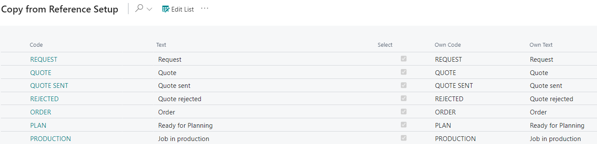

# Status Codes - PV Assisted Setup

## Introduction
Status Codes are an integrated tool in PrintVis which directs the workflow of a case through the company on a general level; controlling whether, for example, you may register job costing, plan, invoice, etc. On selected points, it also controls whether a case has been created correctly before it changes status, etc. It is important that you consider how you want to control individual cases when you set up the company's status codes. You must also consider the demands made on the case and what a case is allowed in each individual status.

When the company's status codes have been created, you must also set up a natural status flow and set up who is to be responsible for a case when it reaches a given status. You do this in the Responsibility areas window.

## Setup

| Field      | Description                                                                                                     |
|------------|-----------------------------------------------------------------------------------------------------------------|
| Code       | Generic code that was created for reference company mapping.                                                   |
| Text       | Generic text that was created for reference company mapping.                                                   |
| Select     | Check yes to import this line into your company. Unselect to not import into your company.                     |
| Own Code   | Insert code that is recognizable to users of your company when referencing Status Codes.                        |
| Own Text   | Insert text that is recognizable to users of your company when referencing Status Codes.                        |

By default, all the Status Codes are selected to be imported into the system. In order to deselect Status Codes to not import them, click the Edit List button at the top of the page and deselect those you do not want to import. It is also possible to deselect all the Status Codes by clicking the three dots (at top of page next to Edit List) and clicking 'Deselect All.'

When done selecting/deselecting and making changes to the Own Code/Own Text fields, click OK at the bottom of the page to apply changes and exit the page.

