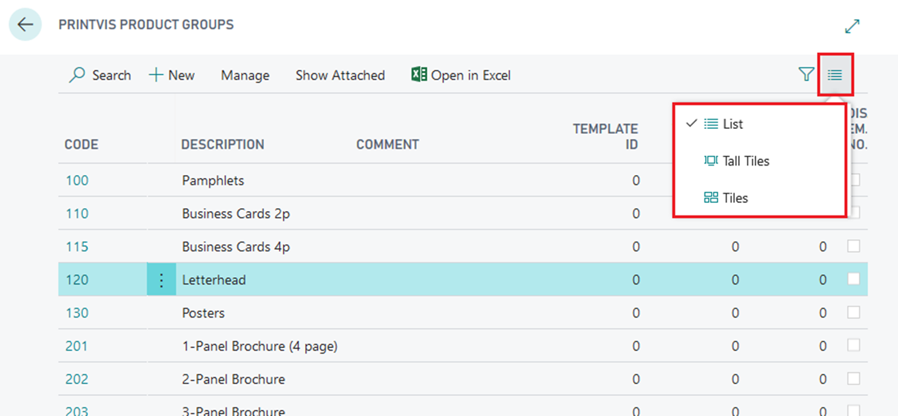
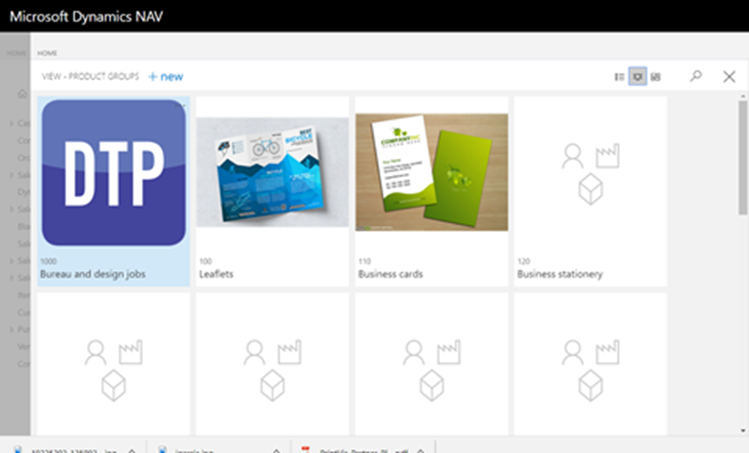
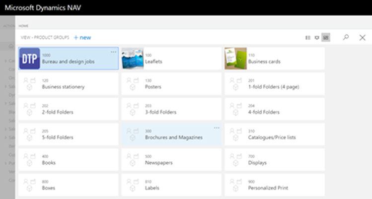
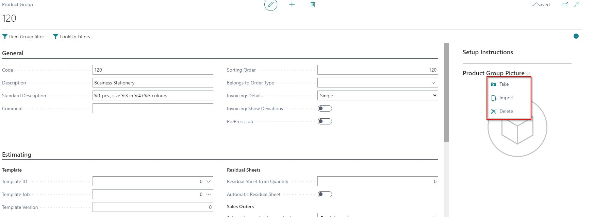
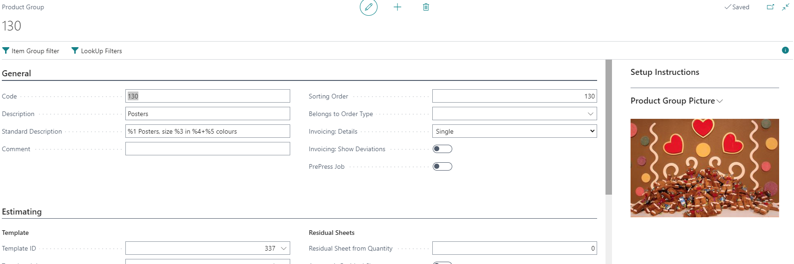
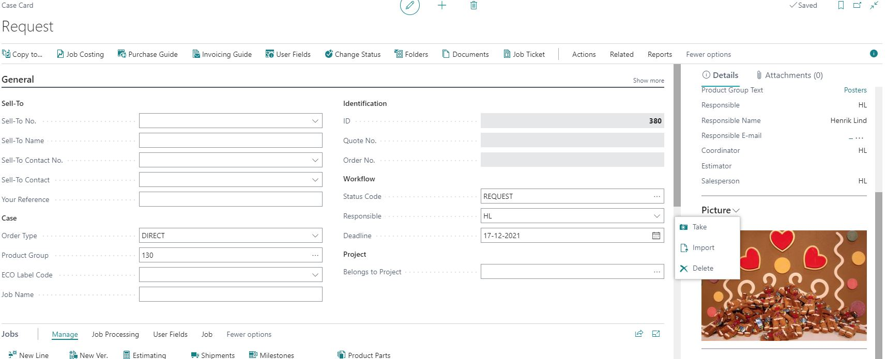

# Tile and Brick View for Product Groups and Cases

## Introduction

This article summarizes how to attach thumbnail graphic files to Product Groups and Cases, both manually and automatically.

**NOTE:** This function is only available in the Web Client, Phone Client, and Tablet Client.

### Attaching a Thumbnail to Product Groups

The primary function is to attach thumbnails to Product Groups. This is the “highest” level of thumbnail and will be used for all Cases associated with the Product Group that do not have their own thumbnail, which will be discussed later.

#### The Product Group Page

The Product Group page is displayed as a list by default:

You can change this view using the three options highlighted below. The three options are: List (selected), Tall Tiles, and Tiles. The view will default to the last one you used from this client.

**Tall Tiles View of Product Groups:**

**Tiles View of Product Groups:**

After opening the product group from any of these views, you will see a FactBox on the right-hand side of the screen called **Product Group Picture**:

### The Case Card Page

Similarly, the Case Card Page has the same three view options located in the same place.

Inside the Case Card, the option to import a thumbnail also exists in the FactBox on the right-hand side of the screen. If the Case has a specific thumbnail, it will override the Product Group thumbnail.

