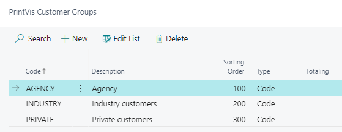

# To-Do's after PV Assisted Setup

## Summary

This article outlines the checklist and necessary modifications after completing the PrintVis Assisted Setup. Ensure all items are addressed before performing initial tests.

## BC / PrintVis (with BC Partner)
- **No. Series**
  - Verify and configure series for Quote and Order in PV General Setup.

- **PV G/L Posting Setup**
  - Ensure the General Ledger Posting Setup is correctly configured.

##PV Workflow / User
  - Set up workflows and assign users.
  - **Capacity Resources – Teams**
    - Check and configure capacity resources and team assignments.

- **Responsibility Areas**
  - Address any missing users or teams and assign the Responsible Code.

- **User Setup**
  - Add the Team Code to the Responsibility Area for each user.

- **Check User Permission Setup**
  - Verify user permissions and access levels.

## Production
- **Cost Center**
  - Configure the Shop Floor Production Plan Tile Setup.

 

 - Set up the Shop Floor Job Ticket Tile (Teams, Extra Work, Unit of Measure).

## Estimation
- **Calculation Units**
  - Add any missing items to Calculation Units.
 

 - Verify "Show Line in Job Ticket" and configure FastTab Print Control.

- **Product Groups**
  - Ensure proper filtering for Item Type Code / Lookup.

- **Item Qualities**
  - Confirm the setup for Purchase Management.

## Planning Setup
- Capacity Units
  - Standard Setup:
    

    - Time Rounding (e.g., 00:15:00).
    - Efficiency Planning Unit (real possible working time).
    - Minimum Split Time for auto-splitting.
    - Shop Floor Prod. Sorting = Planning Unit Priority.

  - **Group Code**
    - Set up Group Code for planning filters.

  - **Setup for Same Machines**
    - Ensure consistent setup so orders can be moved between machines.

- **Planning Units**
  - Delete all “Lists - Calculation Units” from the Planning Units.
  - Remove any Units that should not be planned.

## Optional Setup
- **Q/A Setup**
  - Configure Quality Assurance settings.

- **Commission Rates**
  - Set up commission rates for sales.

- **Customer Groups**
  - Define and configure customer groups.

- **Complaint Reasons**
  - Set up reasons for customer complaints.

- **Rejection Codes**
  - Configure rejection codes.

- **Discount Groups**
  - Establish discount groups.

- **Rates of Discount**
  - Define discount rates.

