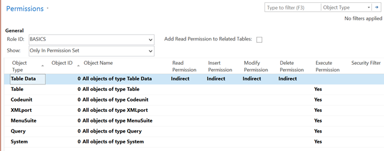
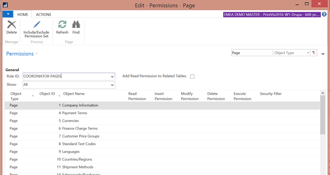
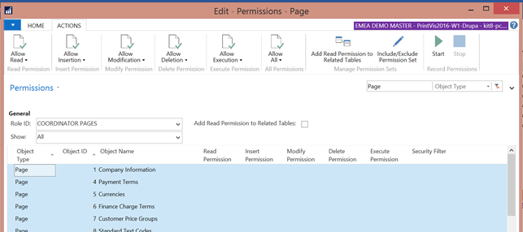
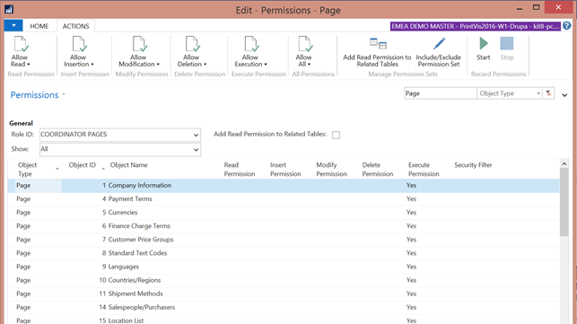
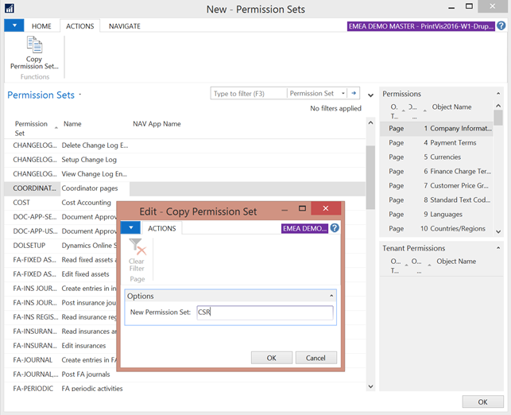

# User Rights and restrictions

## Summary

Microsoft Dynamics 365 Business Central permission setup can be both straightforward and complex. Customers often approach user permissions from a restrictive perspective, but Business Central operates on a positive basis: granting access to various database objects. 

 
Permissions in Business Central cover various objects, including:

- Tables
- Table data
- Code units
- Pages
- Reports
- System objects
- XML imports
- Queries
- Menu Suites

Setting up user permissions during the implementation phase can feel overwhelming. Business Central provides a list of permission sets for simple tasks, but PrintVis Coordinators and other roles often require more complex setups.

## How to Start

1. Connect Users to Role Centers

- Use the **User Profiles** page to connect each user to a Role Center.

2. Set Up Accountants

- Accountants can typically be set to **Super Users** or use predefined Business Central permission sets to avoid using the SUPER role.

3. Set Up PrintVis Users
**Create a Business Central USER GROUP** called *Coordinators*.
4. Add newly created groups to the Coordinator group.
5. **Navigate to the Permissions page** and create a new group named *BASICS* with the following permissions:

   - NOTE: Table Data: Indirect permissions in all areas (no Pages or Reports).

6. Create Coordinator Pages Permission Set

-  Create a new Permission Set called *Coordinator Pages*.
-  Set filters on the view:

   - **Show**: All
   - **Object Type**: Page
   - Mark all lines (click in the top left field to select all).

-  Go to Actions on the ribbon.

-  Use the **Allow Execution** button to set permissions to **Yes**.

-  Remove finance-related pages from the list if they are not needed.

7. Create Coordinator Reports Permission Set

-  Create a new Permission Set called *Coordinator Reports*.
-  Follow similar steps as for Pages to compile a list of accessible reports.
-  Remove reports related to finance, budgets, and dimension analysis.

8. Create Table Data Permission Set

- Create a new Permission Set called *Table Data*.
- Set all Read Permission fields to **Yes** using the ‘Allow Read’ button.
- Adjust permissions for specific Table Data entries as needed.

9. Configure User Groups

- Add the four groups to the Coordinators User Group.
- Test the user group by attempting to access finance areas to ensure proper permissions.
- Adjust permission sets based on testing outcomes.

10. Copy and Adjust Permission Sets

- **Copy the Coordinator Pages permission set**:
   - Use the copy function in the ribbon under Actions.
   - Write a code for the new permission set.
- **Remove** unnecessary pages for other roles (e.g., CSRs).
- Place new permission sets into appropriate User Groups.

## Copy a Permission Set

1. Mark up the Coordinator pages’ permission set.

2. Ongoing Adjustments

Permission settings and groups may need to be adjusted over time. Super Users should anticipate ongoing updates to ensure permissions align with role requirements.