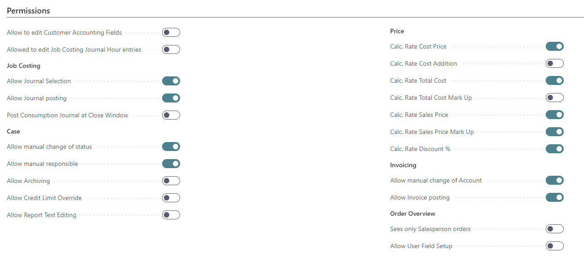

# Setting Up a PrintVis User

## Summary

Every user in PrintVis must be a named user. The user setup is to be made in two steps:

1. **PrintVis Licensed User**  
   The user must be licensed if the status is "Enabled." The user and license type will be controlled.
   
2. **PrintVis User**  
   All detailed settings for the user are made here.

---

## Setting up a PrintVis Licensed User

| Field | Description |
| --- | --- |
| **PrintVis User ID** | This is the identifier for the licensed user. Typically, it is equal to the Business Central User Name. |
| **Status** | Only select "Enabled" if the user is licensed. |
| **Business Central User Name** | This links to the Business Central User, which needs to be set up first. |
| **Name** | Name of the user. This field controls the name for the PrintVis User Setup. Changes must be made here. |
| **E-mail** | E-mail address of the user. This field controls the e-mail for the PrintVis User Setup. Changes must be made here. |

### Fact Box Information

| **Field**                     | **Description** |
|-------------------------------|-----------------|
| **Users Used**                | Information about the users that are enabled in this database. |
| **Full Users**                | Shows the number of full users that are enabled. |
| **Registration Users**        | Shows the number of registration users that are enabled. |
| **Advanced License Required** | Indicates if all full users need to be advanced users. Required, for example, if the PrintVis Planning Board and CIM functionality is in use. |
| **Users Licensed**            | Information about the users registered in the PrintVis License system. |
| **Full Users**                | Shows the number of full users that are registered. |
| **Registration Users**        | Shows the number of registration users that are registered. |
| **Advanced**                  | Shows if advanced users are registered. |

A mismatch between the registered license and used license is a violation of the license terms!

Note: PV Licensed User page/table is instance specific now and the PV Users page is company specific. So if you are on the Users page and go to pick a User ID, you see the full list of licensed users for the instance.

## Setting up a PrintVis User

Before creating or copying a PrintVis User, it is mandatory to create a PrintVis Licensed User first.  

The PrintVis User Setup defines the user's rights in the system and customizes their menu. Users must be set up with relevant rights and company-specific information (e.g., function, field of activity).  

A Microsoft Dynamics 365 Business Central user must first be created, then assigned an ID, password, and rights via roles and permissions that include PrintVis objects.

### General Tab

| Field | Description |
| --- | --- |
| **User ID** | Controlled by the PrintVis Licensed User Setup. Changes must be made there. |
| **Name** | Controlled by the PrintVis Licensed User Setup. Changes must be made there. |
| **E-mail** | Controlled by the PrintVis Licensed User Setup. Changes must be made there. |
| **Coordinator / Order Planner** | Select this if the user is a Coordinator or Order Planner. |
| **Production Employee** | Select if the user is a production worker. Important for shop floor management. |
| **Estimator** | Select if the user is an estimator. |
| **Salesperson** | Select if the user is a salesperson. |
| **Capacity Resource** | Select if the user is a Capacity Resource. |
| **Create as Employee** | Select to create the user as an employee in Microsoft Dynamics 365 BC. |

### Permissions

This tab assigns special rights and functionality related to the system's use, different from general rights set in Microsoft Dynamics 365 BC.

| **Field**                                 | **Description** |
|-------------------------------------------|-----------------|
| **Allow to edit Customer Accounting Fields** | If you select this field, the user is assigned the right to edit the customer's economics setup, payment terms, posting groups, etc., via the customer card. |
| **Allowed to edit Job Costing Journal Hour Entries** | If this field is turned on, the user has permission to make changes on the Job Costing Hour Entries page. The page can be found by selecting the Job Costing button on a Case Card and choosing Hour Entries. |
| **Allow Journal Selection**               | Allows the user to enter registrations on all consumption journals manually. This means that the user has access to register in all company job costing journals. If access is not given to this item, the user should be assigned a personal journal. |
| **Allow Journal Posting**                 | Select this field if the user may post a job costing journal. |
| **Post Consumption Journal at Close Window** | If you select this field, a job costing journal is automatically posted when the user closes the journal window, i.e., without having chosen Post for the journal. |
| **Allow Edit Time Recordings**            | If this field is checked, the shop floor user has permission to make changes on the time recordings page. | 
| **Allow manual change of status**         | Gives the user the right to perform manual status changes on orders. Without this right, status changes may only be performed by clicking the "Next Status" button, and the user must follow the procedure set up via Responsibility Areas. Example: A salesperson may only have the right to change status in an established sequence (e.g., Request, Quote sent, Order must be created). Other changes (e.g., Quote rejected) must be done by someone else. |
| **Allow manual responsible**              | Gives the user the right to change the 'responsible' code in the Case Card manually. If the user does not have this right, the 'responsible' code is set according to guidelines defined via Responsibility Areas. |
| **Allow Archiving**                       | Gives the user the right to archive a case. |
| **Allow Credit Limit Override**           | Gives the user the right to override the credit limit. If "Allow Credit Limit Override" is enabled and the user clicks Yes on the credit limit pop-up, the status will still change, even if the credit limit was exceeded. |
| **Allow Report Text Editing**             | Allows the user to edit report text. |
| **Calc. Rate Cost Price**                 | Select this field if the user must indicate cost prices manually in the individual calculation details for a case. All users who need to calculate should have this right unless calculations are automated. |
| **Calc. Rate Cost Addition**              | If selected, the user may manually control the additional percentage added to the cost price in individual calculation details. |
| **Calc. Rate Total Cost**                 | If selected, the user may manually control which total cost applies to individual calculation details. |
| **Calc. Rate Total Cost Markup**          | If selected, the user may manually control the additional percentage added to the total cost in individual calculation details. |
| **Calc. Rate Sales Price**                | If selected, the user may manually control which price applies to individual calculation details. |
| **Calc. Rate Sales Price Markup**         | If selected, the user may manually control the additional percentage added to the price in individual calculation details. |
| **Calc. Rate Discount %**                 | If selected, the user may manually indicate a discount percentage for individual calculation details. |
| **Allow manual change of Account**        | If selected, the user is allowed to build invoice lines manually and select which account number the invoicing is to be posted in. |
| **Allow Invoice Posting**                 | Select this field if the user may post an invoice draft. If not selected, the case must be given a new status, assigning a new Current Responsible with access to post the invoice draft. |
| **Sees only Salesperson orders**          | If selected, the user only has access to view cases in the case list where they are the salesperson. |
| **Allow User Field Setup**                | If selected, the user can modify User Fields. If not marked, the "Setup" button on the User-Field-Card is not visible. |

### Preferences

| Field | Description |
| --- | --- |
| **Default Salesperson** | Automatically adds a salesperson code to new entries. |
| **Default Coordinator** | Automatically adds a coordinator code to new entries. |
| **Job Costing Journal** | Specifies the job costing journal to open when the job costing journal screen is accessed. |
| **Department Location** | Attaches the user to a specific department location. |
| **Run Report on Login** | Specifies a report to run when the user logs in. |
| **Item Look Up Show Inventory** | Grants the user the ability to view inventory levels. |

### Case Management

| **Field**                     | **Description** |
|-------------------------------|-----------------|
| **Responsibility Areas**      | Indicates which assignments of Responsible the user can view in the case list. Usually includes the user's own ID but can also include other users' IDs to expand responsibility areas. Imaginary users are sometimes created to manage specific functions (e.g., team resources for status-based tasks) allowing an accountant, for example, to view both personal and shared cases. Multiple users/teams must be separated by a vertical line. |
| **Responsible Comment**       | This field currently has no function and will be removed later. |
| **Deadline not Editable**     | Restricts the user from manually editing the deadline on the case card or in case management. The deadline dates are derived from the Status Codes. |
| **Status Code new Request**   | Allows the user to select which status code is assigned to a new request upon creation. |
| **Status Code new Quote**     | Allows the user to select which status code is assigned to a new quote upon creation. |
| **Status Code new Order**     | Allows the user to select which status code is assigned to a new order upon creation. |
| **Default Order Type**        | Allows the user to select the default Order Type for new orders by looking up options in the field. |
| **Timeline**                  | Determines additional information visible on the case management list. Options include: |
|                               | - **Nothing**: No additional fields are shown. |
|                               | - **Status Code**: Displays a list of status codes with an "X" or a date indicating completion. |
|                               | - **Milestone**: Displays milestones along with their planning status. |
|                               | - **Planning**: Displays planning units along with their planning status. |
---

### Production

The fields in the Production tab are only used in connection with the use of Shop Floor Management. Via the setup, you indicate where in the production and at which machines an employee is working.

The fields in this tab are filled in stating the attachment which the user may have. If no direct attachment exists, the fields are left empty.

| **Field**                       | **Description** |
|---------------------------------|-----------------|
| **Capacity Manning Code**       | Select the capacity resource code assigned to the employee by looking it up in this field. |
| **Fixed Department**            | Choose the department to which the employee is attached. If the user is assigned to a fixed department, only that department appears in the list at login. |
| **Fixed Department Filter**      | If the user belongs to multiple departments, list them here, separated by a vertical line. |
| **In Capacity Group**           | In job planning, you can make a group responsible rather than a specific user. Specify the group to which the user belongs here. |
| **Fixed Capacity Unit**         | Specify a single capacity unit if the user is attached to only one. |
| **Fixed Cost Center**           | If the user is attached to a single cost center, select it by looking it up in this field. |
| **Password Shop-Floor**         | Use the "3-dot-button" to open a dialog and set a password for the Shop Floor for this user. |
| **Shop Floor Cost Centers**     | Select if the user logs into only specific cost centers. |
| **Shop Floor Auto Login**       | Enables auto-login on the Shop Floor using a password. |
| **Shop Floor - Role**           | Specifies the role of the user on the Shop Floor. |
| **Shop Floor - Allow Case Edit** | Allows the user to edit the case from the Shop Floor if selected. |
| **Shop Floor - Show Journal Logout** | Allows visibility of the journal logout on the Shop Floor. |
| **Shop Floor - Production Plan** | Choose whether the user sees a tile view or a list on the production plan. |
| **Shop Floor Item Consumption** | Choose the item, lot number, or special function for consumption. If left blank, the default page in PrintVis Shop Floor Setup ("Consume Lot Page ID") will be displayed. |
| **Shop Floor Item Consumption ID** | Specify the Page ID for the selected consumption method. |
| **Payroll Employee Code**       | Attach the standard BC payroll employee code to the PrintVis user. |
| **Barcode ID**                  | For companies using barcode scanners for job costing, specify the barcode ID for the employee here. |
| **Planning Board**              | Three options: None (no access), View Only (view access), and Full Access (edit access to planning/scheduling). |
| **Capacity Groups**             | Assign which Capacity Group (A to E) the user should see when opening the planning board. |
| **Replanning**                  | Enables automatic rescheduling of subsequent planned units if a unit is moved on the schedule, provided there is enough time and availability. A message displays if a unit cannot be replanned. |

### Purchase

The fields concern employees who have a purchasing function. These employees handle purchase orders to which items are received. The user must be selected as a salesperson in the Salesperson field in the General tab to be able to appear as the purchaser on the purchase order.

| **Field**                        | **Description** |
|----------------------------------|-----------------|
| **Status Code for new Purchase Order** | Select the status code for a new purchase order when it is returned to the user by using a look-up field. |
| **Status Code Goods received**   | Select the status code for the order when the goods are received, using a look-up field. |
| **Manual Purchase List Filter**  | Filter to customize the purchase list manually. |
| **Purchase Journal Template**    | Select the type of purchase journal for users with purchasing functions. Choosing a template is necessary to access the associated tables under the selected group. |
| **Purchase Journal Name**        | Select the purchase journal that will function as the standard for the user. Each user with purchasing duties should have a separate purchase journal. Note: A purchase journal is required to perform purchases via the system. |

### Cloud Preferences

Setup for the cloud connection.

---

#### Info

In the Info tab, you enter information on the employee's communication connections. The information is typically used in connection with merge codes for mail merges.

| **Field**                 | **Description** |
|---------------------------|-----------------|
| **Extension Number**      | Enter the employee's extension number, preferably including the full prefixed phone number. |
| **Cell Phone**            | Enter the employee's cell phone number. |
| **Fax**                   | Enter the employee's direct fax number. |
| **Dev. Trace Mode**       | Displays a warning form upon login and populates a trace table from various system functions. |
| **Automation Debug Tool** | Tool for debugging automation processes. |

---

### Page Actions

#### Status Codes
When clicking the action "Status Codes," the following list opens. For every new line, it is possible to select a status code for this user.

PrintVis provides the possibility to limit status codes per user. On each PrintVis User, a set of status codes can be selected from the existing status codes. With such setup, it is only possible for the given user to work on a limited workflow, and the user cannot change to other status codes than the ones selected in the PrintVis user setup.

This could be used, for example, if a user should not be able to create orders, quotes, etc.

The screenshot shows an example where the user can only work on requests and templates. This could be a user who is calculating prices and maintaining templates but cannot create quotes and process a case further through the workflow.

---

### Copy User

**Prerequisites:**
- New users must be created as PrintVis Licensed Users first.
- PrintVis Licensed User must be Enabled, otherwise, it cannot be created as PrintVis user.
- The Name of PrintVis User is synchronized with the PrintVis Licensed Username. Changes must be made on the PrintVis Licensed User.
- The Email address of PrintVis User is synchronized with the PrintVis Licensed User email address. Changes must be made on the PrintVis Licensed User.

On the PrintVis User list/card, choose the action "Copy User".

The copy screen will be displayed. Choose from the following:

- New PrintVis User from the look-up of the PrintVis Licensed User.
- If you want to edit the new user, switch on "Open User Setup Card after copy."

When you click copy user, the new PrintVis User will be created with the following settings:
- **User ID** = User ID from PrintVis License User
- **Name** = Name from PrintVis License User
- **Email** = Email from PrintVis License User

The following will be created with the new User ID, if filled on the user that is copied from:
- Case Default Coordinator
- Salesperson Code
- Case Default Salesperson
- Resource
- Payroll Employee code
- Responsibility Areas
- Job Costing Journal
- All other fields are copied from the user that is copied from.

#### Printer Selection
This action opens the Business Central "Printer Selection" setup. Here it is possible to set up per user and report a printer.

---

#### Licensed Users
This action opens the PrintVis Licensed User list, to add/edit the user's name, etc.

---

#### Capacity
This action opens the PrintVis Capacity Resources card for the selected user to add/edit the settings.

---

#### Salesperson
This action opens the Salesperson/Purchase card for the selected user.

---

#### User Fields
This action opens the PrintVis User Fields for the PrintVis user table. It is possible to set up fields for additional information for every user that can be stored in the PrintVis User Fields.

---

#### User Picture
This action opens the option to import a picture from the user.

---

#### User Signature
This action opens the option to import a JPG or PNG of the signature from the user. This could be used for quotes or other documents.

---

### Add Time Register Entries for Users
PrintVis User list has an action called "Add Time Register Entries for Users." This must be run from a BC full user, every time a new user is created!

 

This action will create time registration lines for all users that are missing in the User Time Registers page. Users with Team Member license are not allowed to create lines in the User Time Register page.

If the entry was not created, the user will get the following error in the shop floor worker role center:

