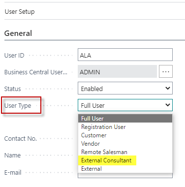

# PrintVis User Types

## Summary

This document explains the different user types and their respective licenses for PrintVis Cloud. It supports the sales process by helping determine which user licenses a potential customer needs.

## License Model

With Microsoft Dynamics 365 Business Central, all licensing is based on a **"named user"** model. This simplifies understanding and budgeting for the correct licensing.

Business Central Licenses

- Business Central licenses are purchased separately from PrintVis licensing.
- Note the limitations of Business Central licenses when combined with PrintVis licenses. For example, Business Central Team Member licenses can only modify 15 unique non-BC tables per login.
- When PrintVis indicates "Total Access to the System," this could be limited by the chosen Business Central license.

## PrintVis User Types

### Advanced Full User

**Description:** Total access to the system, including setup.

**Includes:**

- PrintVis Planning Board  
- Manufacturing Integration  
- Web2PV integration

**Note:** All Full Users must be Advanced; Advanced and Standard Full Users cannot be mixed.

---

### Standard Full User

**Description:** Total access to the system, including setup.

**Note:** All Full Users must be Standard; Advanced and Standard Full Users cannot be mixed.

---

### Registration User

**Description:** For time registration on the shop floor.

**Often Combined With:** BC Device Only license or a Team Member User.

**Note:** The PrintVis User Code must match the BC Team Member User Code if a Registration User and Team Member are combined and need to register time.

## Special PrintVis User Type

### External Consultant

- **Description**: This user type will **not** be counted as a full PrintVis user for license calculation.
- **Usage**: Can be used by PrintVis employees or partners to log in to a customer database for support.
- **Note**: All users are named users. PrintVis usernames are not editable, so this type cannot be used by a customer.
