# PrintVis General Setup Print

The PrintVis General Setup page allows the company to set a number of standard parameters such as number series, invoicing, job costing, etc. The window consists of 12 sections, each containing information about specific parameters. The section content and function are described below.

## Menu

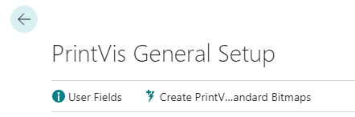

| Function | Description |
| --- | --- |
| User Fields | View/Edit the General Setup integrated user fields. |
| Create PrintVis Standard Bitmaps | This will create the Standard Bitmaps system entries used in PrintVis. |

## Case Management

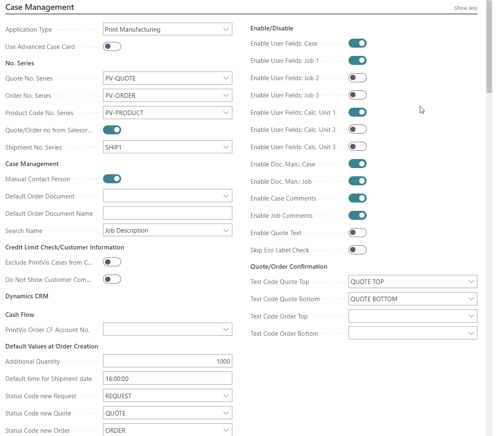

| Field | Description |
| --- | --- |
| Application Type | PrintVis applies to Printing companies but also to other types of companies which may not use very specific printing pages and fields. For a unique, order-by-order production which is not based on production BOMs etc., PrintVis is the replacement for standard "Manufacturing" in 365 Business Central. PrintVis does not use BOMs or traditional routing. It is more the definition of job parts (called job "items," such as the cover and text of a book - its components) and the cost centers used for the production of those. If a company has different subsidiaries which are not all printing companies - and wants to use 365 Business Central without PrintVis, it is possible to disable the PrintVis functionality for those database companies. |
| General Manufacturing | Can be chosen if the print specific pages and fields will not be used. Estimation, document management, etc. will still work. |
| Print Manufacturing | Is used most of the time, any use of print specific description will benefit from the print specific pages. |
| Use Advanced | |
| Case Card | If enabled, the case card is a combination of the case card and job card, and the job is only opened to review the prices. It reduces the number of clicks for the user. The flow through all case details is: Case Card, Estimation, Specification. If disabled, the flow through all case details is: Case Card, Job Card, Estimation, Specification. |
| Quote No. Series | Quote No. Series relates to the "Code" field in table "No. Series". The Quote No. Series can be selected from the No. Series table. |
| Order No. Series | Order No. Series relates to the "Code" field in table "No. Series". The Order No. Series can be selected from the No. Series table. |
| Quote/Order no from Salesorder | This field relates to the Sales Order integration. If ticked, the Case Card quote or order number will be the sales order number, followed by a number. A Sales Order can be used to create several Case Cards and the xxx-1, xxx-2, etc. will make sure they are individually numbered for reference. |
| Shipment No. Series | Shipment No. Series relates to the "Code" field in table "No. Series". The Shipment No. Series can be selected from the No. Series table. This setup is mandatory, in case: Combined Shipments are in use The Case Shipment Method is set to "Create Posted Shipments" |
| Manual Contact Person | It is possible to enable or disable the ability for users of Case Cards to change the contact person which comes from the customer card. A tick in this field will enable this for the users. |
| Default Order Document | In Document Management, there may be several order confirmation documents. For automation of internal processes, it is an option to state a default document here. If the status changes to a status which generates an Order Number, this document may be automatically generated for the user. |
| Default Order Document Name | This field shows the Descriptive name of the default order document picked. |
| Search Name | The Case Card has a Search Name field which is updated from the user input. Here we can determine what is the most desired input: - Job Description - Customer Name |
| Exclude PrintVis Cases from Credit Limit check | By default, the quoted price on orders will be included in the total amount of the BC Credit Limit functionality. If this is not desired, you can switch this option on. Please note: The amount will include VAT in countries with VAT In countries with sales tax, the net amount will be included in the total amount |
| Do Not Show Customer Comments On Case Card | If a customer has comments attached to the customer card, these comments will be displayed by default after the customer is selected on a case card. If this is not desired, you can switch this option on. |
| Update Coupling Data Immediately | Immediately update coupled CRM data on changes. |
| Recreate Deleted CRM Data | If CRM data is deleted in the CRM system, checking this option will recreate this deleted information during the next update. |
| PrintVis Order CF Account No. | This field determines which Cash Flow Account the value of the PrintVis orders should be shown on. The use of this field requires active setup of Cash Flow. There is a white paper available on the setting and use of Cash Flow monitoring in PrintVis. |
| Additional Quantity | The business typical Additional Quantity is 1000 and this will be preset. However, for special companies, a smaller or larger additional quantity may be the usual, and this field may be the usual, and this field may be changed. The default quantity will be on all Case Cards but can be changed on each case if the product or context requires. |
| Default Time for Shipment Date  | The **Requested Shipment Date** includes both a date and time. If nothing is entered, the time defaults to **00:00**. This field allows setting a default time, such as **16:00** or **4 PM** as the company shipment time. Companies may also use a time like **15:59** (3:59 PM) to indicate an undecided placeholder that still keeps planning open for the shipment day. |
| Status Code New Request        | This field lets you select the status code the system should use when using the **"Copy to"** function on the Case Card. Options include copying to a new **Request**, **Quote**, or **Order**, and a standard status code can be set for each.                                                                                                                    |
| Status Code New Quote          | Similar to the New Request, this field allows setting the status code for new quotes created via the **"Copy to"** function on the Case Card.                                                                                                                                                                                                                      |
| Status Code New Order          | Similar to the New Request and New Quote, this field allows setting the status code for new orders created via the **"Copy to"** function on the Case Card.                                                                                                                                                                                                        |
| Enable User Fields             | This field enables access to **User Fields** on the Calculation Unit level, typically used when calculations rely on user-specific field input. These fields become visible only if the Calculation Unit is applied in the estimation, usually in complex setups that require more input from the estimator.                                                        |
| Enable Document Management     | Enables access to **Document Management** on the job/order level. Document Management allows generating Word documents with variable information from related tables. Access can be configured based on job and document types defined in the company setup.                                                                                                    |
| Enable Comments                | If activated, this field allows entering comments for each job. It can be combined with PrintVis Departments, enabling department-specific comments that may print on the Job ticket. Departments must be set up in Job ticket comments.                                                                                    |
| Enable Quote Text              | This field, when activated, allows entry of text lines printed on quotes. It requires a special report that merges text from these quote comments. Alternatively, **User Fields** can be used to create quote text for documents via document control.                                                                      |
| Skip ECO Label Check           | Enables skipping ECO Label code checks if ECO Labels are used but validation is unnecessary.  |                                                                                                                                                                                                                               
| Text Code Quote Top            | Sets the **Text Code Quote Top** to a code from the "Text Code" table, specifying the quote's top text. |                                                                                                                                                                                                                     
| Text Code Quote Bottom         | Sets the **Text Code Quote Bottom** to a code from the "Text Code" table, specifying the quote's bottom text. |                                                                                                                                                                                                               
| Text Code Order Top            | Sets the **Text Code Order Top** to a code from the "Text Code" table, specifying the order's top text. |                                                                                                                                                                                                                     
| Text Code Order Bottom         | Sets the **Text Code Order Bottom** to a code from the "Text Code" table, specifying the order's bottom text. |                                                                                                                                                                                                     

##Estimating

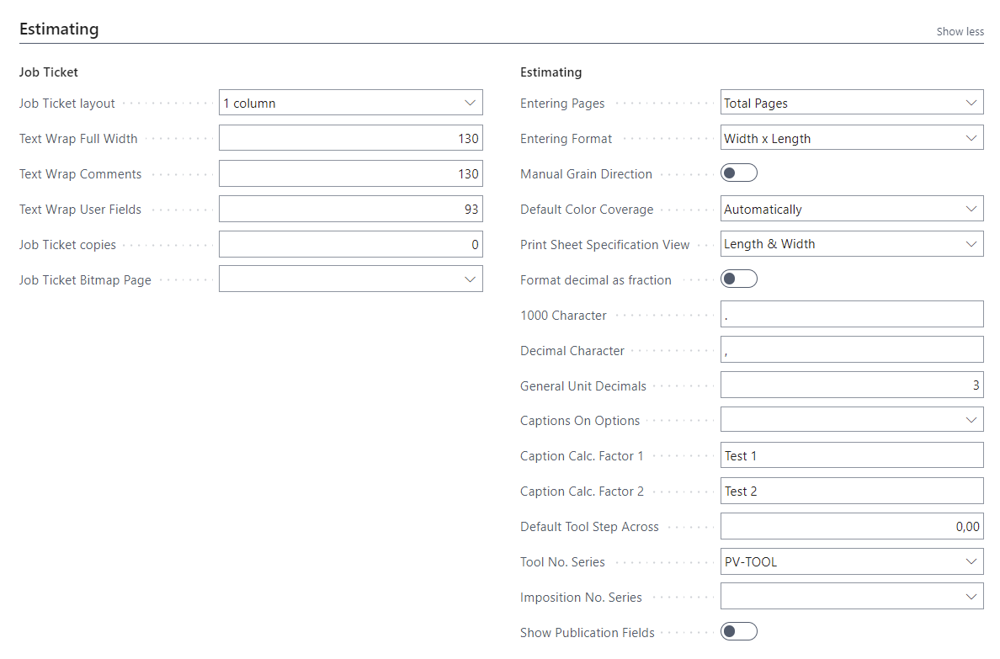

| Field                          | Description                                                                                                                                                                                                                                                                                                                                                                                                                                                                                       |
|--------------------------------|---------------------------------------------------------------------------------------------------------------------------------------------------------------------------------------------------------------------------------------------------------------------------------------------------------------------------------------------------------------------------------------------------------------------------------------------------------------------------------------------------|
| Job Ticket Layout              | Defines the preferred layout for the PrintVis Job Ticket Report, which is a flexible and complex report with many options. Options include:  • 2 columns: Displays data in 2 columns, shortening the report  • 1 column: Displays data in a single column, possibly making information easier to find. The choice depends on the amount of data on the job ticket.                                           |
| Text Wrap Full Width           | Sets the character limit for text wrapping External Descriptions on the Job Ticket Report. The default is 130 characters.                                                                                                                                                                                                                                                                                                                                |
| Text Wrap Comments             | Determines character limit for text wrapping of job comments on the job ticket. Default is 130 characters.                                                                                                                                                                                                                                                                                                                                               |
| Text Wrap User Fields          | Allocates column width for text-wrapping lengthy User Field inputs on the Job Ticket. Default is 90 characters, suited for a 2-column layout.                                                                                                                                                                                                                                                                                                            |
| Job Ticket Copies              | Sets the number of copies to print for the Job Ticket.                                                                                                                                                                                                                                                                                                                                                                                                    |
| Job Ticket Bitmap Page         | Allows selection of a logo bitmap from a list for the Standard Job Ticket report. A new logo must be added to the list before use.                                                                                                                                                                                                                                                                                                                      |
| Entering Pages                 | Presets the page unit field for each job on the case card. Options include:  • Pages with Print: Includes only printed pages  • Sheets: The number of sheets in the finished product, often used for calendars  • Total Pages: Includes all pages (with or without print). Example: A one-sided poster with 2 sides but only front printing would have 2 pages, but only 1 page with print.                       |
| Entering Format                | Determines the format entry in the estimate, with options:  • Length x Width  • Width x Length (most common, adaptable to country or company standards).                                                                                                                                                                                                                                                                                           |
| Manual Grain Direction         | Allows manual setting of grain direction (short- or long-grain) for each item, especially useful in North America.                                                                                                                                                                                                                                                                                                                                      |
| Default Color Coverage         | Sets the default color calculation based on production machinery. Options include:  • Both pages: Coverage on front and back  • Front: Only front coverage  • Back: Only back coverage  • Automatically: Coverage determined by color input (e.g., 4+4 for both pages, 4+0 for front only).                                                                                                          |
| Print Sheet Specification View | Determines print sheet specifications as either "Length & Width" or "Format 1 & 2 Values."                                                                                                                                                                                                                                                                                                                                                               |
| Format Decimal as Fraction     | Specifies the use of fractions in layout for multiple job items on the same printing sheet, useful for spacing.                                                                                                                                                                                                                                                                                                                                          |
| 1000 Character                 | Specifies the character for marking thousands (e.g., . or ,) based on local usage.                                                                                                                                                                                                                                                                                                                                                                       |
| Decimal Character              | Specifies the character for marking decimals (e.g., . or ,) based on local usage.                                                                                                                                                                                                                                                                                                                                                                        |
| Captions on Options            | Allows selection of unit captions (e.g., m/m² or ft/ft²) as "Metric" or "Imperial" independently of language. Options include:  • Blank: Captions based on language (e.g., US English = Imperial)  • Imperial: Inch, ft, lbs., Gallon, etc.  • Metric: cm, m, kg, Liter, etc.                                                                                                                             |
| Caption Calc. Factor 1         | Allows user input for complex calculations in Estimation, commonly used in digital print for quantity calculations (e.g., Number of Originals). Names the field Factor 1.                                                                                                                                                                                                                                                                               |
| Caption Calc. Factor 2         | Similar to Factor 1, used for complex calculations in Estimation, commonly used in digital print for quantity calculations (e.g., Number of Originals). Names the field Factor 2.                                                                                                                                                                                                                                                                       |
| Default Tool Step Across       | Sets the default Step Across value for dies when creating new ones.                                                                                                                                                                                                                                                                                                                                                                                     |
| Tool No. Series                | Relates to the "Code" field in the No. Series table, holding Tool numbers. Often accepts manual input for codes that imply usage.                                                                                                                                                                                                                                                                                                                      |
| Imposition No. Series          | Relates to the "Code" field in the No. Series table for impositions, often set to accept manual numbers that imply usage.                                                                                                                                                                                                                                                                                                                              |
| Show Publication Fields        | Used for products like newspapers and periodicals with requirements for pages and fields specific to publications. Pages include Publications, Editions, Issues, and Sections. More details can be found in the article about Publications.                                                                                                                                                                                                             |

## Production

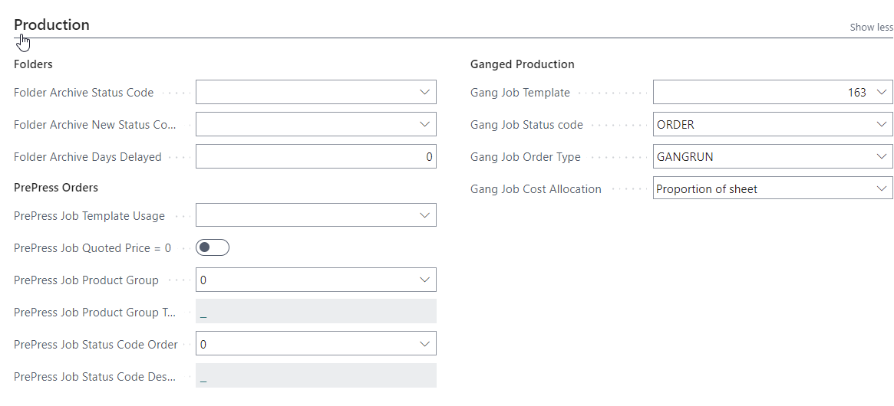

| Field                          | Description                                                                                                                                                                                                                                                                                                                                                                                                                 |
|--------------------------------|-----------------------------------------------------------------------------------------------------------------------------------------------------------------------------------------------------------------------------------------------------------------------------------------------------------------------------------------------------------------------------------------------------------------------------|
| Folder Archive Status Code      | Defines which Status Code is to perform the Archiving function of the system's Folders.                                                                                                                                                                                                                                                                                                                                  |
| Folder Archive New Status Code  | Defines the new Status Code for performing the Archiving function of the system's Folders.                                                                                                                                                                                                                                                                                                                               |
| Folder Archive Days Delayed     | Defines the number of days to delay moving folder items to archive locations.                                                                                                                                                                                                                                                                                                                                            |
| PrePress Job Template Usage     | Options are:  • Use Product Group Template: If a prepress case (job) is created with a finished goods item attached, the template from the prepress status code is copied to the new job.  • Use Item Template: If a prepress case is created with a finished goods item attached, the template from the item is copied to the new job.                                                                       |
| PrePress Job Quoted Price = 0   | If enabled, any automatically created PrintVis Case Card for an ESKO workflow PrePress job will set the Quoted Price field to 0 on the job line. This is often used by companies who do not charge customers for initial PDF creation or other prepress tasks.                                                                                                                                                     |
| PrePress Product Group          | Selects the product group that is set up for prepress cases/jobs.                                                                                                                                                                                                                                                                                                                                                        |
| Product Group Text              | Displays a description of the selected product group.                                                                                                                                                                                                                                                                                                                                                                    |
| PrePress Status Code Order      | Selects the status code set up for prepress cases/jobs.                                                                                                                                                                                                                                                                                                                                                                  |
| PrePress Status Code Description| Displays a description of the selected status code.                                                                                                                                                                                                                                                                                                                                                                      |
| Gang Job Template               | A general template for ganged jobs is applied to use this function. When creating a combined order, the system tries to match a job template with the number of items being combined. If no matching template exists, the "Gang Job Template" is used, adding one sheet as a placeholder. The case header is treated as a "dummy" and can be used as a placeholder for multiple templates.                              |
| Gang Job Status Code            | Selects the status code for newly created combined orders. A lookup will display the available status codes.                                                                                                                                                                                                                                                                                                            |
| Gang Job Order Type             | Selects the order type for newly created ganged jobs. Only templates (marked as such) for cases with this order type will be suggested when creating a combined order. Templates may contain multiple jobs with different numbers of ganged items to allow optimal imposition based on the number of items.                                                                       |
| Gang Job Cost Allocation        | Selects how to allocate posted costs across ganged jobs:  - Equal: Split costs equally based on the number of items.  - Proportion of Sheet: Costs divided according to space occupied by each item.  - Index: Division based on an individually applied index factor for each item.                                                                                                                      |

## Job Costing

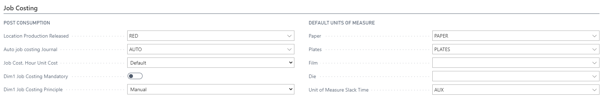

| Field                        | Description                                                                                                                                                                                                                                                                                                                                                                                                                                                                                                                                      |
|------------------------------|--------------------------------------------------------------------------------------------------------------------------------------------------------------------------------------------------------------------------------------------------------------------------------------------------------------------------------------------------------------------------------------------------------------------------------------------------------------------------------------------------------------------------------------------------|
| Location Production Released | When production is completed on an order and goods are ready to ship, there may be surplus material (e.g., paper) not consumed on the order. This field determines the location for items on the shop floor upon release of material from reservation on the just-ended order. Options exist to set up specific locations on the shop floor per machine.                                                                                                                                                  |
| Auto Job Costing Journal     | Relates to the "Code" field in the "Job Costing Journal" table. The journal selected here will be used for automatic posting of time and materials to orders when production has ended. Whether items are posted automatically depends on the Unit of Measure set on material and time calculation lines in the estimate.                                                                                                                                        |
| Job Cost. Hour Unit Cost     | Allows for refined job costing based on efficiency, potentially affecting cost calculation and suggested sales price:  - Default: Uses standard time rates as they appear on the cost center.  - Weighted: Weighs recorded time against user efficiency (e.g., trainee efficiency at 50% turns 4 recorded hours into 2 hours for costing).  - Actual: Uses recorded hours factoring in any overtime setup from the unit of measure, giving a potentially higher cost.             |
| Dim1 Job Costing Mandatory   | Tick this field if a Dimension 1 value is mandatory for job costing. This requires system setup to avoid error messages on the shop floor if no value is provided.                                                                                                                                                                                                                                                                                                |
| Dim1 Job Costing Principle   | If job costing is mandatory, this field helps select the Dimension 1 value:  - Manual: The user inputs a value manually on each line or relies on system setup.  - Case: Automatically copies the Dimension 1 value from the case card.  - Department: Uses the department of the cost center for this line.  - User Department: Always uses the user setup department field.                                       |
| Def. UoM Paper               | Sets the default Unit of Measure (UoM) for paper items if a required unit is missing on the item card, ensuring all items have a UoM even if it’s not specifically set for each Paper-Item.                                                                                                                                                                                                                                                                      |
| Def. UoM Plates              | Sets the default UoM for plate items if required and no unit is provided on the item card. If a Plate Item No. lacks a UoM, the selected UoM here will apply.                                                                                                                                                                                                                                                                                                  |
| Def. UoM Film                | Sets the default UoM for film items if required and no unit is provided on the item card. If a Film Item No. lacks a UoM, the selected UoM here will apply.                                                                                                                                                                                                                                                                                                    |
| Def. UoM Die                 | Sets the default UoM for die items if required and no unit is provided on the item card. If a Die Item No. lacks a UoM, the selected UoM here will apply.                                                                                                                                                                                                                                                                                                      |
| UoM Slack Time               | Slack Time accounts for non-working machine time (e.g., breaks or idle periods). If using an electronic job ticket for time recording, the system can default a UoM to slack time for statistical purposes (e.g., machine efficiency rates). The "Slack time" action in the "Job Costing Worksheet" inserts a time entry from the last recorded stop time to the current time. If no UoM is stated, the function will not operate. |

## Invoicing

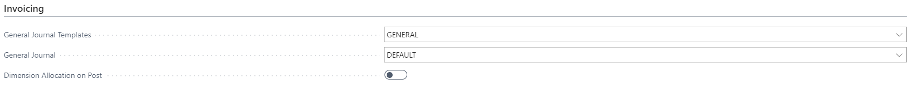

| Field                         | Description                                                                                                                                                                                                                                                                            |
|-------------------------------|----------------------------------------------------------------------------------------------------------------------------------------------------------------------------------------------------------------------------------------------------------------------------------------|
| General Journal Templates     | Specifies which General Journal Template is used for posting invoice lines.                                                                                                                                                                                                           |
| General Journal               | Specifies which General Journal Batch is used for posting invoices.                                                                                                                                                                                                                   |
| Dimension Allocation on Post  | When invoicing a customer with a single charge line, the system can be set up to allocate that turnover and re-post according to the dimensions, allowing you to see the exact split of the turnover in the General Ledger after this automated re-posting.                          |

## Posting

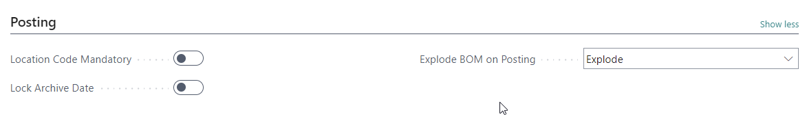

| Field                   | Description                                                                                                                                                                                                                                                                                                                |
|-------------------------|----------------------------------------------------------------------------------------------------------------------------------------------------------------------------------------------------------------------------------------------------------------------------------------------------------------------------|
| Location Code Mandatory | Here you can specify whether items must have a location code in the order to be posted. Tick the field on if you want the program to require a location code when posting item-related transactions. (NOTE: please use NAV setup: "Inventory Setup - field "Location Mandatory") |
| Lock Archive Date       | If this field is ticked, the Archiving Date on the Case Card will not be editable or changeable after its first value.                                                                                                                                                                                                    |

## Logistics

| Field                                  | Description                                                                                                                                                                                                                                                                                                                                                                                                                                                                                                                                                                                                                                                                                                                                                                                                                                                                                                                                                                                                                                                                           |
|----------------------------------------|-----------------------------------------------------------------------------------------------------------------------------------------------------------------------------------------------------------------------------------------------------------------------------------------------------------------------------------------------------------------------------------------------------------------------------------------------------------------------------------------------------------------------------------------------------------------------------------------------------------------------------------------------------------------------------------------------------------------------------------------------------------------------------------------------------------------------------------------------------------------------------------------------------------------------------------------------------------------------------------------------------------------------------------------------------------------------------------|
| Copy Shipments                         | Specifies whether to copy the shipments from an existing order when using the function Copy To. The options are: - Always - Never - Always but not combined shipment                                                                                                                                                                                                                                                                                                                                                                                                                                                                                                                                                                                                                                                                                                                                                                                                                             |
| Default delivery address               | This field determines if the customer address should be defaulted on the shipment card. - Sell-To Address: A shipment is created for an active job line and the customer address on the Case Card is the default value. - Sell-To Ship Address: On the customer card, there is a field for Ship-To Code. The address within this code would be the default address used when the shipment is created. - No Address: A shipment is created for an active job line, but the address is not copied from the case card.                                                                                                                                                                                                                       |
| Receipt Merge Code                     | Merge Code functionality allows us to create a set of information lines on a document which has information from the actual situation. If picked here, the Merge Code will build lines on the Receipt document and on the Posted Receipt document when a receipt is posted to the warehouse. A Merge Code allows more information than just the item lines and may help tracking receipts afterwards.                                                                                                                                                                                                                                                                                                                                                                                                       |
| Way Bill Merge Code                    | Merge Code functionality allows us to create a set of information lines on a document which has information from the actual situation. If picked here, the Merge Code will build lines on the shipment document. This information can come from various tables.                                                                                                                                                                                                                                                                                                                                                                                                                                                                                                                                                                                                                                            |
| Package Label Merge Code               | Merge Code functionality allows us to create a set of information lines on a document which has information from the actual situation. If picked here, the Merge Code will build lines on the package labels. This information can come from various tables.                                                                                                                                                                                                                                                                                                                                                                                                                                                                                                                                                                                                                                                |
| Package Label Text 1…6                 | The PrintVis Package Label has up to 6 fields which can be set up with fixed Captions. The fields are present on the Shipment Page. The Captions should match the merged text if a merge code has been set up - see above.                                                                                                                                                                                                                                                                                                                                                                                                                                                                                                                                                                                                                                                |
| Item Journal Template Name             | This field determines which Journal Template Group we pick the journal for posting items consumed from production. When posting items, the transaction is first posted through the PrintVis Consumption Journal (and checked for PrintVis data OK) and then posted through a normal item journal (and checked for 365 Business Central data OK). If failed in either of these journals, the line will remain where it is first stopped and must be sorted out before it can go further.                                                                                                                                                                                                                                                                                 |
| Item Journal Name                      | This field determines which Item Journal we use for posting items consumed from production. When posting items, the transaction is first posted through the PrintVis Consumption Journal (and checked for PrintVis data OK) and then posted through a normal item journal (and checked for 365 Business Central data OK). If failed in either of these journals, the line will remain where it is first stopped and must be sorted out before it can go further.                                                                                                                                                                                                                                                     |
| Warehouse Journal Template             | For companies using 365 Business Central warehouse module (with Extended license), it may be necessary to pick a journal to default to for PrintVis integration in warehouse related posting outside normal PrintVis activities. Warehouse Journal Template is pointed out here.                                                                                                                                                                                                                                                                                                                                                                                                                                                                                                                                                                                                           |
| Warehouse Journal Batch                | For companies using 365 Business Central warehouse module (with Extended license), it may be necessary to pick a journal to default to for PrintVis integration in warehouse related posting outside normal PrintVis activities. Warehouse Journal Batch is pointed out here.                                                                                                                                                                                                                                                                                                                                                                                                                                                                                                                                                                                                 |
| Create Shipment Item                   | When posting a PrintVis Shipment, the system can be set up to automatically generate a ‘standard 365 Business Central’ shipment as well, to accommodate for integration to 3rd party distribution systems, etc. You can then either use a single ‘dummy-item’, or have the system automatically generate a new item for each individual shipment.                                                                                                                                                                                                                                                                                                                                                                                                                                                                   |
| Shipment Item Template                 | If an individual item is being created per shipment, you may enter the template from which the new Item is to be created.                                                                                                                                                                                                                                                                                                                                                                                                                                                                                                                                                                                                                                                                                                                                                                                                   |
| Shipment Item No. Series               | Attach a No. Series for the ‘Shipment Items’, so they will differ in their numbering, thus making it very easy to filter out these one-hit items.                                                                                                                                                                                                                                                                                                                                                                                                                                                                                                                                                                                                                                                                                                                                                                           |
| Tax Area Code Mandatory on Shipment    | If the ‘Ship-to’ address is to define the Tax Area when posting an invoice for the production/shipment, the Tax Area Code must be set on each shipment. To ensure this, please mark this field as true, to ensure you cannot post a shipment without the Tax Area Code.                                                                                                                                                                                                                                                                                                                                                                                                                                                                                                                                                                                                                                           |
| Case Shipment Method                   | This option field defines how the PrintVis shipment will be processed. - No Sales Order: All shipping will be managed through the PrintVis shipment card. - Create Sales Order Per Shipment: Shipment will create an open BC sales order. - Create Sales Order Per Shipment And Release: Shipment will create a released BC sales order. - Create Sales Order Per Shipment And Post: Shipment will create a BC posted sales shipment. In order to avoid a posted invoice with Amount=0, a future date must be set in the "Allow Document Deletion" before field on the "Sales & Receivables" setup page. - Create Posted Shipments: This will create a posted shipment directly without creating a sales order. No inventory is affected, and this option should be used in case a logistics extension needs posted shipments to pickup shipment data. (UPS, DHL FedEx tracking) Note: The PV function "Undo Shipment" works only with Method "No Sales Order." |
| Shipment Sales Order Removal           | When the sales order is created and posted as shipped, should it be removed? - On Ship (default) - On Archive - Never                                                                                                                                                                                                                                                                                                                                                                                                                                                                                                                                                                                                                                                                                                                                                              |

## Sales / Purchase Order

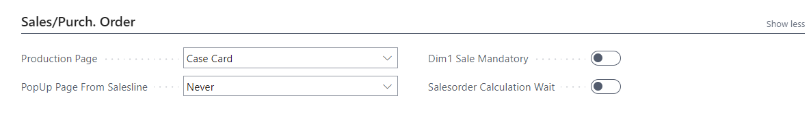

| Field                         | Description                                                                                                                                                                           |
|-------------------------------|---------------------------------------------------------------------------------------------------------------------------------------------------------------------------------------|
| Production Page               | Specifies which page will be displayed as production plan: - Case Card - Job Card - Quick Quote                                                                                       |
| PopUp Page From Salesline     | Options for displaying a pop-up page from the sales line: - Never - Always - If no template                                                                                          |
| Dim1 Sale Mandatory           | This field is ticked if the sales order must have a Dimension 1 value before creating a production order. This value is then copied to the Case Card.                               |
| Salesorder Calculation Wait   |                                                                                                                                                                                       |

## Sales Shipment

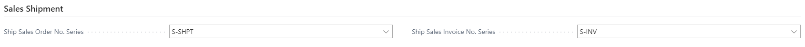

|Field	| Description |
|-------------------------------|---------------------------------------------------------------------------------------------------------------------------------------------------------------------------------------|
| Ship Sales Order No. Series	| Ship Sales Order No. Series relates to the "Code" field in table "No. Series". The Ship Sales Order No. Series can be selected from the No. Series table.				|
| Ship Sales Invoice No. Series	| Ship Sales Invoice No. Series relates to the "Code" field in table "No. Series". The Ship Sales Invoice No. Series can be selected from the No. Series table. 			|

## Purchase Order

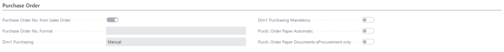

|Field		|Description 																								|
|--------------------------------------|--------------------------------------------------------------------------------------------------------------------------------------------------------------------------------|
| Purchase Order No. from Sales Order  | A selection in this field means that a purchase order, which is created directly from a sales order, receives the same number as the sales order.				|
| Purchase Order No. Format	       | If you want a specific formatting of the purchase order number, which is taken from the no. series, you may enter text before and/or after the concerned number.
The number is placed where it says %1 in the text
e.g.: CASE-%1-DK (to order no. 8856) will give the result:

    - CASE-8856-DK (as purchase order number).																						|

| Dim1 Purchasing			| If the setup demands that Dimension 1 is mandatory on the purchase order, this field helps determine the dimension value which is set on it.
- Manual: The user manually sets the value or has help of system settings.
- PV Case: The value is set from the Case Card Field Dimension 1 value
- Department: The value is set from the department of the calculation line which this purchase is generated from. For instance, PRINT (if specific paper) or EXTERNAL (if ordering external treatment)
- User Department: The value is set from the user setup, department field.
- Purchaser Dimension: The value is set from the Sales Person table, which is also used for purchasers. On user settings, there is a standard Purchaser field. This Purchaser will be set on the PO and the department set accordingly. |
| Dim1 Purchasing Mandatory		| Tick this field if all Purchase Orders must have a Dimension 1 code.															|
| Purch. Order Paper Automatic	        | If eProcurement for Paper purchase is required and set up, tick this field to activate automated paper purchase.								|
| Purch. Order Paper Documents eProcurement | Tick to activate paper purchase automation using eProcurement (OnLine functionality)											|

## Special

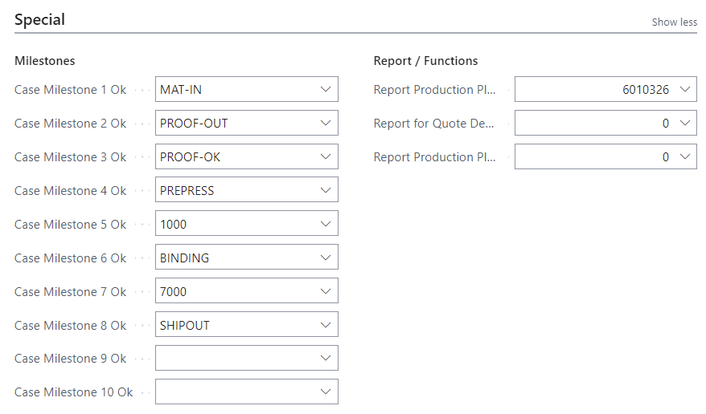

| Field		| Description																									|
|--------------------------------------|--------------------------------------------------------------------------------------------------------------------------------------------------------------------------------|
| Scheduling Locked Behavior	| Default setting: "Stop Manual Move". When a planning unit is marked as "locked" and user is trying to move the planning unit (manually) to another timeslot, by default the unit will not be able to be moved. If the planning unit is desired to be moved, then please unlock the planning unit before moving it. Then the unit can be marked as locked after the movement has been completed.					

"Allow Manual Move"- This option is only to be used if there is customization done around the scheduling, specifically the locked functionality. By using this setting, the system will respect the customization that was previously completed.																										|
| Case Milestone 1 …10 Ok	| Up to 10 milestones from the planning setup may be chosen for presentation in the Production plan and in the Case Management overview. Here, you pick the milestones wanted.		|
| Report Production Plan	| PrintVis comes with a standard report called Production Plan.		
Sometimes this report is customized. This field is used to replace the original report with the customized version.
The report can be printed from the Production Plan page as well as the production menu.																	|
| Report for Quote Description	| If a Quote Description text is too complex to generate through Merge Codes, a report can be made and addressed through this field.
This will be a custom report and be used on one or more custom Quote reports. It may also be used on the Case Card through the function "Build Invoice Text," and, from here, be editable before generating the quote report.
Not typically used with Document Management generated quotes.																				|
| Report Production Plan Milestones    |
	PrintVis comes with a standard report called Milestones.
Sometimes, this report is customized. This field is used to replace the original report with the customized version.
The report can be printed from the Production Plan page as well as the production menu.																	|

## System

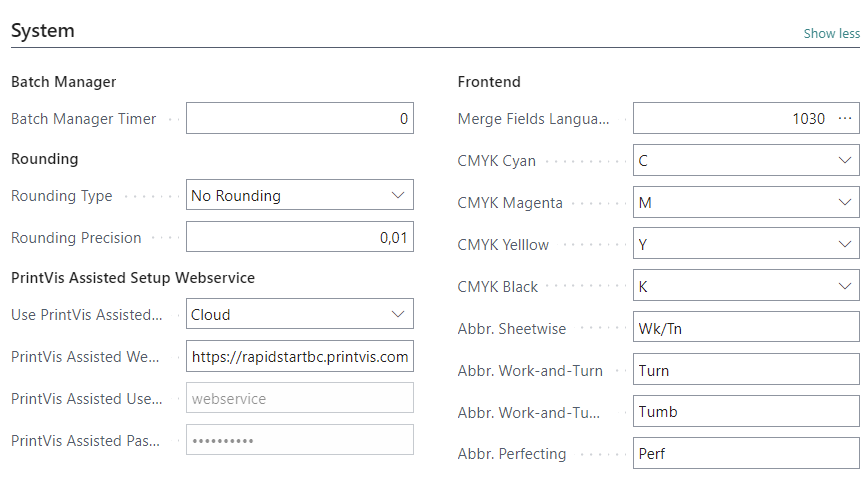

| Field                               | Description                                                                                                                                                                                                 |
|-------------------------------------|-------------------------------------------------------------------------------------------------------------------------------------------------------------------------------------------------------------|
| Batch Manager Timer                 | This field determines the general timer of the Batch Manager. Input is in seconds. The setting here should be the largest acceptable to make sure the batch manager is not disturbing daily use.                                                  The Batch Manager setup may override this value for individual purposes. The Batch Manager is used to run various automated jobs in the background to automate internal processes.                           |
| Rounding Type                       | This field impacts how the Quoted Price field on the Job line is rounded: - No Rounding - Up - Down - Nearest                                                                                             |
| Rounding Precision                  | This field impacts the field Quoted Price on the Job card in cooperation with the field Rounding type (no/up/down/nearest).                                                                               |
| PrintVis Assisted Setup Webservice URL | The URL contains a space. Copy and paste one of the following links: Imperial Units: - http://rapidstart.printvis.com:7040/DynamicsNAV/WS/PRIME%203%20US/Codeunit/RapidStart or - http://rapidstart.printvis.com:7040/DynamicsNAV/WS/PRIME 3 US/Codeunit/RapidStart Metric Units - http://rapidstart.printvis.com:7040/DynamicsNAV/WS/PRIME%203/Codeunit/RapidStart or - http://rapidstart.printvis.com:7040/DynamicsNAV/WS/PRIME 3/Codeunit/RapidStart |
| PrintVis Assisted Username          | Username to log in to PV RapidStart (reference database).                                                                                                                                                  |
| PrintVis Assisted Password          | Password to log in to PV RapidStart (reference database).                                                                                                                                                  |
| Frontend Merge Fields Language      | Merge Fields Language relates to the "Language ID" field in table "Windows Language". The Merge Fields Language can be selected from the Windows Language table. This field is needed for legacy customers upgrading. Moving forward, merge fields will always be generated in English. |
| CMYK Cyan                           | In this field, you can point to the item card for the color generally referred to as CYAN in the CMYK process color distribution. This assists the system in being smarter on the job ticket and order placements: If the items for all 4 process colors are estimated on a job item, the individual names of colors will not be displayed, but it will say CMYK instead. |
| CMYK Magenta                        | In this field, you can point to the item card for the color generally referred to as MAGENTA in the CMYK process color distribution. This assists the system in being smarter on the job ticket and order placements: If the items for all 4 process colors are estimated on a job item, the individual names of colors will not be displayed, but it will say CMYK instead. |
| CMYK Yellow                         | In this field, you can point to the item card for the color generally referred to as YELLOW in the CMYK process color distribution. This assists the system in being smarter on the job ticket and order placements: If the items for all 4 process colors are estimated on a job item, the individual names of colors will not be displayed, but it will say CMYK instead. |
| CMYK Black                          | In this field, you can point to the item card for the color generally referred to as BLACK in the CMYK process color distribution. This assists the system in being smarter on the job ticket and order placements: If the items for all 4 process colors are estimated on a job item, the individual names of colors will not be displayed, but it will say CMYK instead. |
| Abbr. Sheetwise                     | In this field, you can put your own internal abbreviation for the printing process of Sheetwise. This will be visible on the Job Ticket Report.                                                               |
| Abbr. Work-and-Turn                | In this field, you can put your own internal abbreviation for the printing process of Turning. This will be visible on the Job Ticket Report.                                                               |
| Abbr. Work-and-Tumble              | In this field, you can put your own internal abbreviation for the printing process of Tumbling. This will be visible on the Job Ticket Report.                                                              |
| Abbr. Perfecting                   | In this field, you can put your own internal abbreviation for the printing process of Perfecting. This will be visible on the Job Ticket Report.                                                            |

## Job Queues

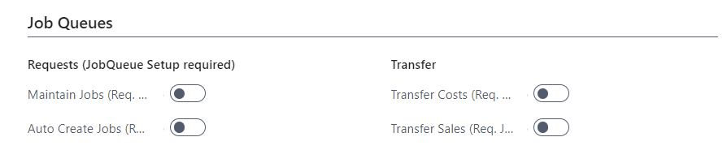

| Field                             | Description |
|-----------------------------------|-------------|
| Maintain Jobs (Req. JobQueue)    |             |
| Auto Create Jobs (Req. JobQueue)  |             |
| Transfer Costs (Req. JobQueue)   |             |
| Transfer Sales (Req. JobQueue)   |             |

## Cloud

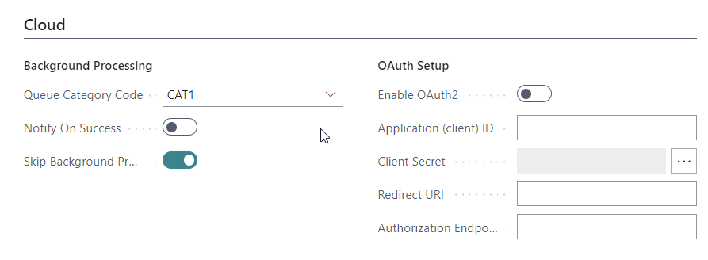

| Field                        | Description |
|------------------------------|-------------|
| Queue Category Code           | Cloud Queue Category Code relates to the "Code" field in table "Job Queue Category". The Cloud Queue Category Code can be selected from the Job Queue Category table. |
| Notify on Success             | Specifies whether a success log line should be created if cloud processing has been executed successfully. |
| Skip Background Processing     | Specifies whether the system should perform some functions as background processings, allowing the user to continue working while, for example, case folders are created with a status code move, or by the user trying to open the case folders. |
| Enable OAuth2                 |             |
| Application (client) ID       |             |
| Client Secret                 |             |
| Redirect URI                  |             |
| Authorization Endpoint         |             |
