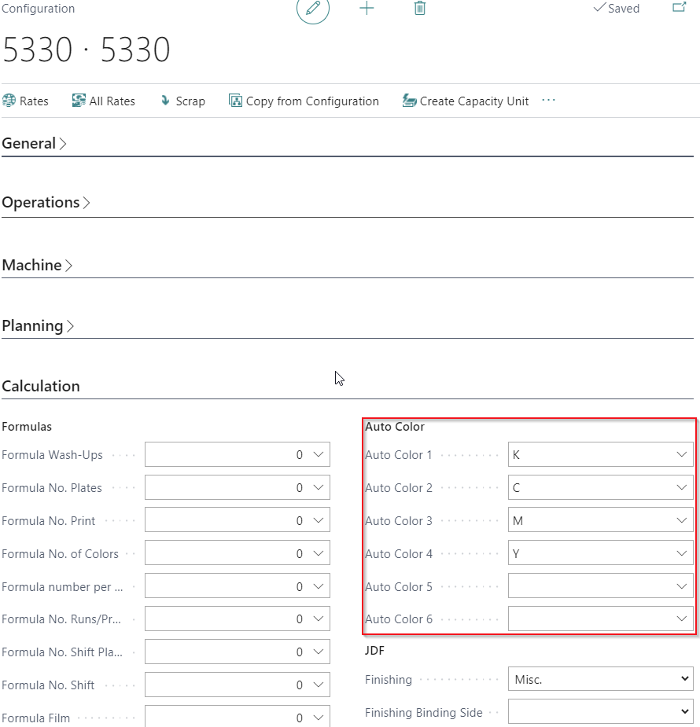
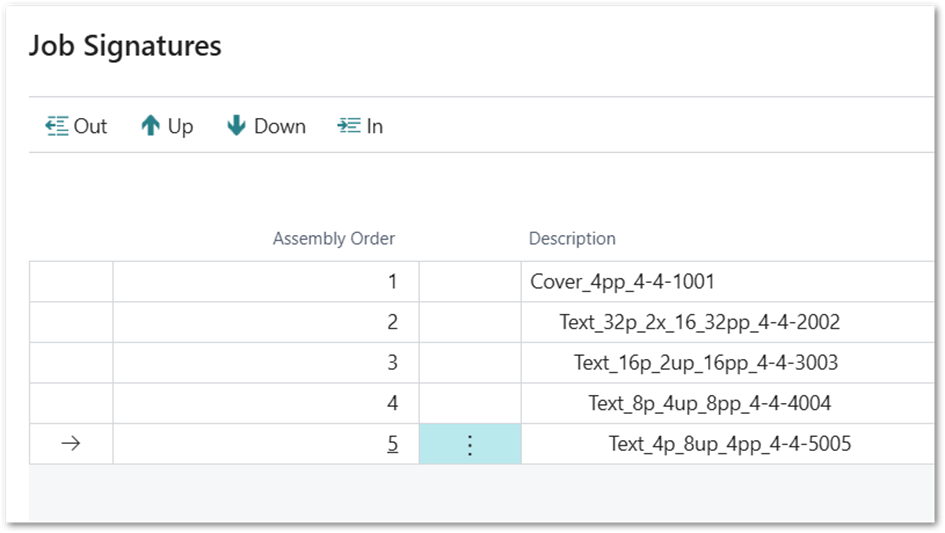

# CIM Setup / JDF Setup - Data Setup for Advanced Integration

## Summary

This setup is required in addition to the other CIM / JDF articles.

To Trigger a JDF and to enrich the JDF and support level 2 and 3 from
the JDF integration levels some setup is required in different areas.

JDF Integration Levels

To classify the needed effort for JDF integration projects, it makes
sense to classify levels of integration. The required setup required for
those levels is listed below.

Level 1: "Basic JDF-Integration" (without Automation)

-   Automatic creation of jobs from MIS in workflow partner system

-   Detailed Product Description

-   Human-readable electronic Job Ticket

-   Repeat Jobs

Level 2: "Advanced JDF-Integration" (with Automation)

-   (partial) automatic Layout preparation (Stripping Parameter)

-   Processing / Process net out of the MIS

-   Presetting data

-   Change Order

-   Scheduling Data

Level 3: "JDF/JMF Feedback from Production"

-   Job Status / Job Tracking

-   Job Costing

Avoid Special Characters

It is recommended to avoid spaces and special characters in codes for
every setup section! For example:

-   Item Numbers

-   Color Codes

-   PrintVis Qualities

-   Imposition types

## Status Code Setup

In the status code setup it is defined with enabling the field "**Send
Job to Workflow Partners**" that the JDF creation is triggered. 

If the status is changed to a status where this field is enabled a
workflow partner command will be create for each Job in this case that
is 

-   Active

-   And of the types

    -   Order

    -   Production Order

Please note: The case is not editable in the status to make sure the JDF
data can be created properly. After changing to this status, the used
should be changing to the next relevant status right away.

The result if this process is an entry in the "Workflow Partner Command"
table for this case.

Possible "Commands" are:

<table>
<colgroup>
<col style="width: 23%" />
<col style="width: 76%" />
</colgroup>
<thead>
<tr>
<th>Send Case</th>
<th><ul>
<li>
This is the initial entry when a command is created
</li>
<li>
After it is processed an new entry of type SubmitQueueEntry is
created..
</li>
</ul></th>
</tr>
</thead>
<tbody>
<tr>
<th>ReSend Case</th>
<td>
This entry is being created if "Send to Workflow Partner" is
triggered and

<ul>
<li>
A "Send Case" entry is existing 
and
</li>
<li>
The controller setup allows a "Resend Case" command.
</li>
</ul></td>
</tr>
<tr>
<th>SubmitQueueEntry</th>
<td><ul>
<li>
The processing of the "Send Case" command will create this type
of command entry for each Device/Controller which is linked to the
calculation trough the cost center.
</li>
<li>
This line contains a full JDF which can be downloaded with the
action "<em>Command -&gt; Open in Editor</em>" (.jdf file type) or "Open
in Viewer" (.xml file type).
</li>
</ul></td>
</tr>
<tr>
<th>ReSubmitQueueEntry</th>
<td><ul>
<li>
The processing of the "ReSend" Case command will create this type
of command entry for each device which is linked to the calculation
trough the cost center if the Controller Setup allows
ReSubmitQueueEntrys.
</li>
<li>
This line contains a full JDF which can be downloaded with the
action "<em>Command -&gt; Open in Editor</em>" (.jdf file type) or "Open
in Viewer" (.xml file type)
</li>
</ul></td>
</tr>
<tr>
<th>Error</th>
<td><ul>
<li>
An Error occurred while processing this command. See field "Error
Message" for more details.
</li>
</ul></td>
</tr>
</tbody>
</table>

Possible "Status" are:

<table>
<colgroup>
<col style="width: 23%" />
<col style="width: 76%" />
</colgroup>
<thead>
<tr>
<th>New</th>
<th>The entry is new and not processed yet</th>
</tr>
</thead>
<tbody>
<tr>
<th>Processed</th>
<td>The entry is processed</td>
</tr>
<tr>
<th>Error</th>
<td>An Error occurred while processing this command. See field "Error
Message" for more details.</td>
</tr>
</tbody>
</table>

## Required setup for Level 2 Integration

Item Setup for Plates

Some workflow partners require details about the plates based on the MIS
to PrePress ICS.

The plate making process in PrintVis provides to the Workflow Partners-

-   The plate Item No. – Media ID  
    

-   The exact plate size  
    

For this reason it every plate item must setup with the plate size and
PrintVis Calculation Units also Must be setup with the plate item that
is links to the plate making device or the press:

There are no special plate size fields on the item card. Just use the
Format 1/2 fields on the FastTab "PrintVis Paper" and ignore the other
field in the section.

Item Setup for Paper

For presetting and color profiling paper items require different
settings and these settings must be properly set. 

The data is used for transferring the dimensions like:

-   Size (Format 1 and Format 2)

-   Weight (GSM/Imperial)

-   Thickness

-   Settings from PrintVis Item Type Codes (Screening Parameter)

-   Settings from PrintVis Qualities (grade/coating information)

For every PrintVis Sheet/Job Item the "Screening Parameters" can/must be
selected. A presetting for this parameter can be set on the PrintVis
Item Type Code setup.  

Paper Coating information

PrintVis provides several fields to setup the coating type. Some fields
can be ignored if default settings have been made. Some of the fields
seem to be duplicated like:

-   Front/Back Coating

-   Grade

-   ISO Paper Substrate

but the available fields have been changed with new upcoming JDF
specifications. The latest parameter is the "ISO Paper Substrate"
setting but some workflow partners are still using the deprecated ones.
We recommend to fill them all for best support.

All coating settings can be preset as default on the PrintVis Quality
setup.

On the item card the "ISO Paper Substrate" can be set either to overrule
the default from the quality setup or just instead of it.

The settings on the quality will be displayed in the Qualities FactBox

Item Setup for Ink

There could be name conventions for the Description of color items. Make
sure this is agreed with the workflow partners.

An important parameter in the item card for a ink item is the Color
Code:

To the JDF workflow that the ink is a process color a Color Code need to
be attached to each process color. Otherwise, it will appear a spot
color. Valid Color codes for process colors are:

-   BLACK

-   CYAN

-   MAGENTA

-   YELLOW

For spot colors different color book settings are possible. This
parameters must we agreed with the workflow partner.

Cost center Setup for Ink defaults

Each Configuration of Cost Centers for printings machines can be preset
which standard/process colors which will be transferred to the estimate
each time the machine is being selected and can be changed if necessary.
If this setting is not done for each Job Item of an estimate the ink
items need to be selected manually. Up to 6 Auto Colors can be set on
each Configuration.

Cost Center Setup for JDF Finishing types

Please make sure there is always a machine selected in the estimate
which provides finishing information even when the final finishing is
subcontracting. This means different configurations for subcontracting
are required!

The example shows the configuration for a perfect binding machine where
the JDF finishing type need to be SoftCover as per definition of the JDF
specification.

Please make sure there is always a machine selected in the estimate
which provides finishing information even when the final finishing is
subcontracting. This means different configurations for subcontracting
are required!

Finishing Type Setup

Instead or on top of the Finsihing setting on the cost center
configuration it is possible to setup and use PrintVis Postpress types.

It is recommended to specify the JDF Finishing only on "PrintVis
Postpress Types" that are used per job (so in fact the final finishing)
and not job item which will then work probably only on jobs with 1 job
item only.

But this all depends on the actual setup, jobs structure and workflow
partners that is in use.

Component Type Setup

The component type for each Job Item in PrintVis needs a JDF Product
Type setting to identify for example if the product part is a cover etc.

Imposition Type Setup

Each PrintVis Job Item in an estimate needs an Imposition Type. The
Imposition Type can be selected automatically by PrintVis if the "Auto
use" setting is done. 

Required settings:

-   Enter a code. Do not use spaces in the code which will cause errors
    while importing the JDF with some Workflow Partners

-   Enter the no. of leafs Width/Depth

-   Select the "Orientation" if the folding type is turned on the
    imposition type

-   Check the "Flip" field if the first page of a sheet does appear on
    the back side of the sheet.

-   Select a Folding Catalogue code from the provided list. The list of
    available folding types is defined by the CIP4 organization

    -   It is possible to setup additional Folding types, which might be
        required for example for web productions or special foldings.

-   The setup and use of imposition types need additional training!

Please check the following articles for further information::

-   PrintVis Imposition Type

    -   <https://learn.printvis.com/Legacy/System/ImpositionTypes/>

-   PrintVis Specification Page

    -   <https://learn.printvis.com/Legacy/Estimation/Spec/>

Fields for special use

These are just some example in which way more detailed integration with
selected Workflow Partners is possible. These settings are not part of
the standard CIP4 JDF specification

-   Description 2

    -   For automation with Prinect Signa Station please use the Field
        "Description 2" for Signa Station Template names. Signa Station
        will use this template if available.

-   External Imposition Template 

    -   For automation with Kodak Preps

    -   Specify full path and name of Kodak template (.tpl file)

-   External Imposition Name

    -   For automation with Kodak Preps 

    -   Signature name in the Kodak template file

PrintVis Job Signatures and JDF Finishing gray box

Besides the JDF gray box information\* that is setup on the PrintVis
configuration, also the assembly must be described: In the example below
for a saddle stitcher finishing gray box.

\*JDF gray box information: 

-   A gray box inside a JDF file is a step or process that’s defined in
    the workflow, but its details aren’t fully described yet.

-   Instead of specifying all the technical instructions, it just says:
    “Something happens here, but I’ll let another system or person fill
    in the details.”

Finishing setting on Cost center Configuration

PrintVis Job Signatures

Some prepress workflow systems e.g. Kodak Prinergy, read the detailed
assembly information and order. And this must be set in the Job
Signatures.

How to use PrintVis Job Signatures?

With the actions on the page, it is possible to change the sequence of
sheets in the assembly. With the actions: 

-   **<u>Out/In</u>**: It is possible to change the indentation. 

    1.  Indentation means from top to bottom, 

        -   If the sheet on above is gathered on top of the current
            one:  
            -&gt; current sheet is not indented.  
            -&gt; Example: A stack of loose bind products or a perfect
            binding of a book block without a cover.  
             or 

        -   The current sheet is put into the one above:  
            -&gt; Sheet is indented and with that collected.  
            -&gt; Typical for saddle stitched products.

-   Up/Down: it is possible to change the sequence of the sheets.

Examples:

**The generic creation looks like the following:**

None of the sheets are indented: 

-&gt; This gives the assembly Order=Gathering which is just a stack of
sheets or loose bind.

**Indentation changed for a perfect bound product:**

By hitting the “In” action 1x for each text sheet, the text sheets are
stacked and then collected into the cover.

-&gt; This gives the assembly Order=List.

**Indentation changed for a saddle stitched product**

By hitting the “In” action each text sheet must appear 1 steps more
indented than the previous one. (For text sheet 1 hit In 1x, for text
sheet 2 hit In 2x, for text sheet 3 hit In 3x etc.)

-&gt; This gives the assembly Order=Collecting.

**Sequence of sheets changed**

By using the actions Up/Down it is possible to change the sequence of
the sheets for the assembly. 

-   A prepress system typically requires the cover to be the sheet on
    top of the list.

    1.  If the cover is not calculated as sheet 1 user the action “Up”
        until the cover sheet is at the top of the list

    2.  For saddle stitching it is common practice that a 4 pages sheet
        is not placed in the middle of the product for more stability
        with the staple. Select the 4 pages sheet and move it up.

    3.  Once you have arranged the sheets in the desired order, set the
        indentation required, again for a saddle-stitched product in the
        following example.

PrintVis Open Source Tool “Build Job Signatures”

On GitHub (<https://github.com/printvis/OpenSource>) PrintVis provided
some useful open source tools which can be installed as is or modified
as required. Therefore, a compiled app file or the source code can be
found in the repository.

In the current README.md you can find information about what
functionality of the current source code provides.  
 At the time when this article was created, it did all above settings
fully automated, based on the finishing setting of the first non-sheet
depended calculation unit in an estimate. The functionality is not
provided as PrintVis standard functionality, because data is managed
differently from different JDF processing workflow systems. Therefore,
it is impossible to provide standard functionality that covers all needs
of all cases and workflow systems and on GitHub you can find in the
repository a compiled app file or the source code to be adapted.

## Required setup for Level 3 Integration

PrintVis Work Code Setup

To covert the status information into PrintVis Job Costing information,
PrintVis needs a WorkCode setup which links the status information from
the production into PrintVis Job Costing Entries for time and material
consumption.

Each time new a status message is sent by the machine the time recording
for a certain PrintVis Unit of Measure (operation) is being started and
the former operation is stopped. The time between start and stop will be
posted as time consumption if it is a time operation.

1.  There are several combinations possible, also to trigger the same
    PrintVis Unit of Measure (Operation). 

    1.  This means a PrintVis Unit of Measure that is started remains in
        progress

    2.  For this setup all possible status messages from the workflow
        partner should be known.

2.  Depending on the message type one or more fields on the "External
    Codes" tab need to be setup to trigger the require PrintVis Unit of
    Measure.

3.  The JMF message type for start and stopp of operations is "Status"
    and response sub type is "JobPhase"

4.  The JMF message type for material/media consumptionis "Resource".

5.  The JMF message type "Audit" is providing production data with total
    time per operation.

    1.  This is probably the best solution but least supported from
        workflow partners.

If the message contains item consumption information the quantity for
the specific item will be posted as consumption.

Counter information on time recordings from JMF Status Messages

If the JMF Response of type "Status" and response sub type is "JobPhase"
and a Job Phase Amount is excisting in the massage, it is possible to
add the quantity from the counter to the time recording. Just an able on
the desired workcode the field "External Counter Import".

Heidelberg Prinect Activity codes 

In case a connection to Heidelberg Prinect and Heidelberg Activity Codes
are in use, please do not setup anyting in the JDF  Status Detail field
and just setup the activity code on the field JDF Device Status.

Material Consumption from JMF responses

For a material consumption posting the following is required. The
example below is for plate consumption which is the most common use.

-   A user that is assigned to to license that can post consumption (or
    create an entry for an advisor to post the consumption)

-   A cost center:

    -   Machine Type = Pre Press

    -   Imaging =
        Platesetter 

    -   Connected to a CIM device

    -   And a Data Capture Journal (PV Job Costing Journal)  
        

If there is no device in the JMF response, PrintVis ties to find the
device in the estimate (cost center Imaging = Platesetter)

Result: Device Monitor

Device setup Required for this

-   Setup the "Name" for the device as the usual and known machine
    description to identify the machines in your company

-   Link the device with the Cost Center in PrintVis

Optional: select a Bitmap image which will be shown for the Cost Center
on the PrintVis Device Monitor

On the device monitor page the following is displayed:

-   Device name

-   Actual status with timestamp for of the last message

-   Actual speed and counter in case a job is in progress

-   The Order No. and customer name of the actual running job

-   A gauge showing the actual speed if a job is in progress

-   The scale of the gauge is set by the Max. Speed setting on the
    device setup

