# CIM Setup / JDF Setup - Technical Communication Setup

## Summary

In this article you can find all information how to setup a JDF
communication with any known workflow partner (vendor for JDF-certified
software). It is a general description and the setup may vary because of
special requirements of one of the workflow partners. 

Unfortunately, a JDF integration is not "Plug and Play" - which means it
needs skills and experience with these kinds of integrations. This need
to be kept in mind as well if an existing setup needs to be changed.
Please contact PrintVis support for help.

Please be aware that you might also need to request some additional
information from the involved vendors to set up the communication and
the controllers/devices correctly!

Additionally calculation data must be linked to specific values from the
JDF CIP4 definition. Please find further information in the [PrintVis
JDF Setup for Data
Integration](https://learn.printvis.com/Legacy/Integrations/CIMSetupData) article.

JDF Vendor Experience Overview

The official CIP4 integration matrix is the best way to get an easy
overview about the integration/workflow partners with for PrintVis. 

Please see:

[JDF Integration Matrix: NovaVision / PrintVis - Filter by =
PrintVis](https://cip4.org/jdfwork/jdf-integration-matrix/jdf-matrix-application.html)

JDF Integration Levels

To classify the needed effort for JDF integration projects, it makes
sense to classify levels of integration. The more levels that need to be
implemented, the more effort for testing and training is required for
the customer. This needs to be calculated in the integration project
cost.

Level 1: "Basic JDF-Integration" (without Automation)

-   Automatic creation of jobs from MIS in workflow partner system

-   Detailed Product Description

-   Human-readable electronic Job Ticket

-   Repeat Jobs

Level 2: "Advanced JDF Integration" (with Automation)

-   (partial) automatic Layout preparation (Stripping Parameter)

-   Processing / Process net out of the MIS

-   Presetting data

-   Change Order

-   Scheduling Data

Level 3: "JDF/JMF Feedback from Production"

-   Job Status / Job Tracking

-   Job Costing

PrintVis System Requirements for JDF/JMF integration

PrintVis requires the following apps and tools for full JDF/JMF support:

-   PrintVis app/extension must be installed

-   PrintVis CIM extension must be installed

-   All full users must have the advanced full user license

-   PrintVis Link installer must be installed  (Windows Installer to be
    installed in the local network)

## JDF Interface Configuration

Required Setup for Level 1 integration and for a basic setup (level 1 is
always needed!)

Service Tier setup

On the service tier make sure the following settings are made:

-   Services Default Company need to be set to the company name that is
    running the JDF/JMF integration

-   Use NTLM Authentication must be enabled

-   SOAP Services need to be enabled

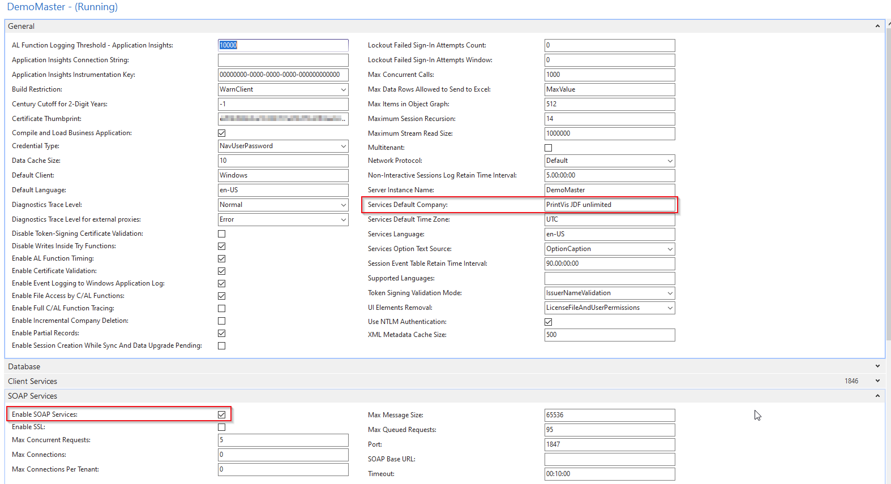

## Web Service Setup

The PrintVis JMF Controller Service/WCF Communication Component uses a
NAV/BC365 Web Service to forward requests to and from JDF/JMF Workflow
Partners.

This Web Service needs to be setup in NAV/BC365 with the following Entry
in the Web Services table:

Required web service field values:

<table>
<colgroup>
<col style="width: 26%" />
<col style="width: 21%" />
<col style="width: 28%" />
<col style="width: 23%" />
</colgroup>
<thead>
<tr>
<th><strong>Object Type</strong></th>
<th><strong>Object ID</strong></th>
<th><strong>Service Name</strong></th>
<th><strong>Published</strong></th>
</tr>
</thead>
<tbody>
<tr>
<th>Codeunit</th>
<td>6010920</td>
<td>PrintVisJMF</td>
<td>Yes</td>
</tr>
</tbody>
</table>

Please note: The service name must be **PrintVisJMF**!

Result:

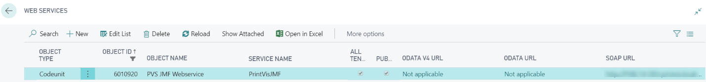

Now the Web Service should be available at (SOAP URL):

http(s)://&lt;server&gt;:&lt;port\_SOAP\_Services&gt;/&lt;Instance&gt;/WS/&lt;CompanyName&gt;/Codeunit/&lt;ServiceName&gt;

Example URL for the JMF Web
Service: [*http://pvbc14-abced.local:9905/PV14-NUP/WS/PRINTVIS/Codeunit/PrintVisJMF*](http://pvbc14-abced.local:9905/PV14-NUP/WS/PRINTVIS/Codeunit/PrintVisJMF)

## CIM/JDF Setup

The JDF/JMF communication works through http and therefore some basic
information is needed which the PrintVis Link sowtware requires to
communicate with it.

PrintVis supports several features and versions related to JDF/JMF
standard.

These cannot be influenced directly by setup, but sometimes it is useful
to know what the current system supports., because they are determined
by the codebase and the system version.

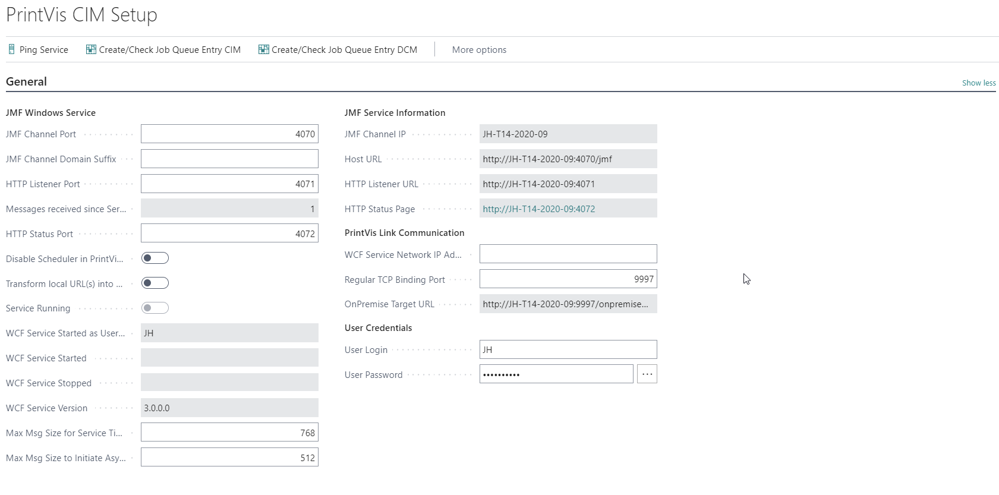

**General TAB required settings**

<table>
<colgroup>
<col style="width: 15%" />
<col style="width: 84%" />
</colgroup>
<thead>
<tr>
<th>JMF Channel Port</th>
<th><ul>
<li>
Default port is 4060 (change if not available and make sure that
ports are open if communication need to be passing the
firewall)
</li>
</ul>
<ul>
<li>
The JMF Channel Port is the Port which will be used to send and
receive JMF messages from PrintVis.
</li>
</ul>
<ul>
<li>
It should be a port which is not used by the operating system
and/or third party products.
</li>
</ul></th>
</tr>
</thead>
<tbody>
<tr>
<th>HTTP Listener Port</th>
<td>Default port is 4061 (change if not available and make sure that
ports are open if communication need to be passing the firewall )</td>
</tr>
<tr>
<th>HTTP Status Port</th>
<td>Default port is 4062 (change if not available and make sure that
ports are open if communication need to be passing the firewall )</td>
</tr>
<tr>
<th>Regular TCP Binding Port</th>
<td>Default port is 9998 (change if not available and make sure that
ports are open if communication need to be passing the firewall )</td>
</tr>
<tr>
<th>WCF Network MAC Address</th>
<td>Enter the MAC address of the server running the WCF service 
This field is being deprecated and not be used anymore from PV Version
17 and onward.</td>
</tr>
<tr>
<th>WCF Service Serial Number </th>
<td>Enter the Serial No. that you have received for this MAC address. A
new serial no. is required if the server MAC address or the NAV/BC
license is changed. 
This field is being deprecated and not be used anymore from PV Version
17 and onward.</td>
</tr>
<tr>
<th>JMF Channel IP</th>
<td>Will be filled automatically if the the Service created by PrintVis
Link is running.</td>
</tr>
<tr>
<th>Host URL</th>
<td>Will be filled automatically if the the Service created by PrintVis
Link is running.</td>
</tr>
<tr>
<th>HTTP Listener URL</th>
<td>Will be filled automatically if the the Service created by PrintVis
Link is running.</td>
</tr>
<tr>
<th>HTTP Status Page</th>
<td>Will be filled automatically if the the Service created by PrintVis
Link is running. 
If you click on the link or paste it into an internet browser address
field after the service (please see below) has been installed and is
running, you'll get the status information: 
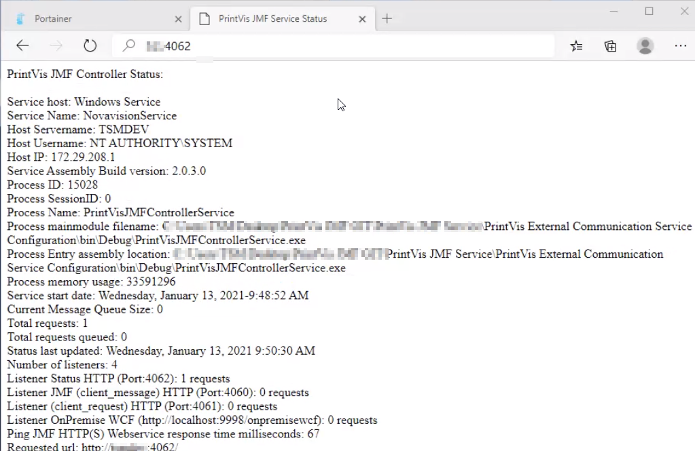</td>
</tr>
</tbody>
</table>

The ports are default ports and need to be setup on the firewall. If
those ports are not available other ports number can be chosen. It
should be a port which is not used by the operating system and/or third
party products.

It is mandatory to check if the system runs an active firewall which may
be setup as well!

The Host URL shows the current complete JMF setup of PrintVis for
incoming JMF's.

Some vendors need this information to setup their systems properly. So
if they require the PrintVis JMF IP, it can easily be found there.

**HTTP Status Page**

If you click on the link or paste it into an internet browser address
field after the PrintVis Service (please see below) has been installed
and is running, you'll get the status information: If you get this
information the connection to the PrintVis server should be working
fine. Problem to reach this page from other servers can be caused by
some blocked ports. Make sure all ports that are setup on the PrintVis
CIM setup are open in the firewall to connect to other JDF servers.

**JDF Details TAB settings**

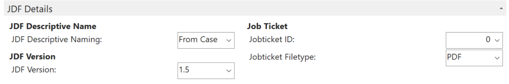

<table>
<colgroup>
<col style="width: 26%" />
<col style="width: 73%" />
</colgroup>
<thead>
<tr>
<th>JDF Descriptive Naming (Job Name)</th>
<th>
In this field you can select where to read the PrintVis Job Name
from:

<ul>
<li>
From Case
</li>
<li>
From Job
</li>
</ul></th>
</tr>
</thead>
<tbody>
<tr>
<th>JDF Version</th>
<td><ul>
<li>
Please select the latest/highest version that can be handled by
all workflow partners.
</li>
</ul></td>
</tr>
<tr>
<th>Job Ticket</th>
<td><ul>
<li>
Select the object ID from the Job Ticket report to use on the
request from the HTTP Listener URL
</li>
<li>
If nothing is setup here standard Job Ticket 6010313 is
chosen
</li>
</ul></td>
</tr>
</tbody>
</table>

## Test Communication TAB settings

It is possible to enable some additional features during setup and test
phases. These settings are typically used if a PrintVis technician is
troubleshooting the integration. If you use it make sure you know what
you are doing. You can create additional traffic, file creation and
options that might not be useful for a standard user.

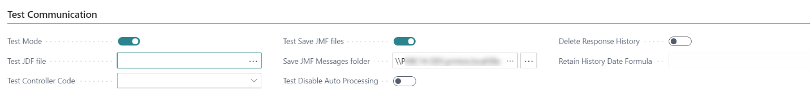

<table>
<colgroup>
<col style="width: 24%" />
<col style="width: 75%" />
</colgroup>
<thead>
<tr>
<th>Test Mode</th>
<th>
If the Test Mode is switched on, it will also influence some
actions on pages.

<ul>
<li>
The Case Card will show a new button to manually send JMF/JDF
messages to a specific device, which enables the operator to send a
quick message while testing. In a "Live Environment" this will be done
automatically by the status code setup. 
</li>
<li>
On page Workflow Partner Commands a new action "Test" is
displayed to manually process and send messages. This enables the
operator to reset any previously sent test jobs after some case data has
be changed - and to resend the job manually (e.g. color renamed,
imposition information changed).
</li>
<li>
Partner Responses are not processed automatically if "Test Mode"
is enabled!
</li>
</ul></th>
</tr>
</thead>
<tbody>
<tr>
<th>Test JDF File</th>
<td><ul>
<li>
Enter the path and file name of a JDF file that should be send to
a workflow partner. 
With this option it is not necessary to have a test case ready.
</li>
</ul></td>
</tr>
<tr>
<th>Test Controller Code</th>
<td><ul>
<li>
Select the controller where to send the "JDF Test File"
to.
</li>
<li>
This can be used if more than one Workflow Partner is integrated,
to be able to send test data to only one specific Workflow
Partner.
</li>
</ul></td>
</tr>
<tr>
<th>Test Save JMF files</th>
<td><ul>
<li>
If enabled outgoing and incoming JMF files will be stored in the
folder that is setup in the field below.
</li>
</ul></td>
</tr>
<tr>
<th>Save JMF Messages folder</th>
<td><ul>
<li>
Path/Folder where to save outgoing and incoming JMF
files
</li>
<li>
Make sure this path can be accessed from the service tier! 
Please not: This will have impact on the system performance and creates
several files on the given path. 
Make sure to disable this setting if not required anymore and clean-up
the folder from files that are no longer needed!
</li>
</ul></td>
</tr>
<tr>
<th>Test Disable Auto Processing</th>
<td><ul>
<li>
If enabled JDFs/JMFs will not be processed automatically, even if
all services and job queues are running.
</li>
<li>
The JDFs/JMFs can be processed manually from the Workfkow Partner
Commands/Responses
</li>
</ul></td>
</tr>
<tr>
<th>Delete Response History</th>
<td><ul>
<li>
If the Workflow Partner Response table need to be maintained this
field can be enabled and a date formula (Retain History Date Formula
field) must be entered. All entries before the calculated date will be
removed.
</li>
<li>
The response history will be deleted when running the job queue
report "PVS CIM Job Queue".
</li>
</ul></td>
</tr>
</tbody>
</table>

The Case Card will show a new action to manually send JMF/JDF messages
to a specific device.

This enables the operator to send a quick message while testing.

In a "Live" system this will be done automatically by the status code
setup and the JDF/JMF client.

The Workflow Partner Commands Page will show a new button "Test" to
manually process and send messages.

This enables the operator to reset any previously sent test jobs after
some case data has be changed - and to resend the job manually (e.g.
color renamed, imposition information changed).

## Azure Service Bus Setup

Please note: The Azure Service Bus Setup is optional and only needed for
WCF Service Mode = Service Bus

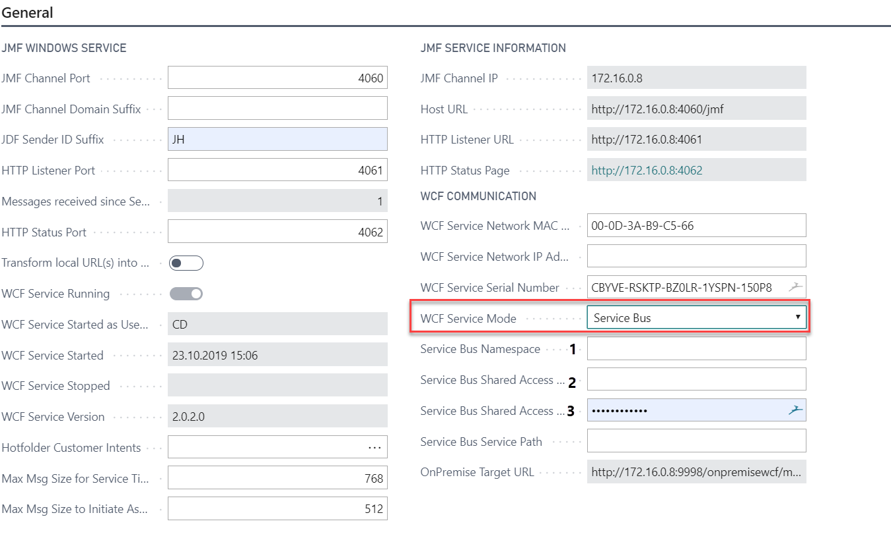

If the WCF Service mode is set to "Service Bus" the following settings
are required:

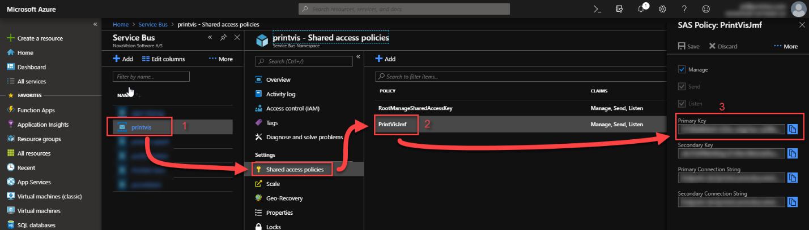

## PrintVis Link (OnPrem Installation)

The PrintVis Link Software is being used to created a service that is
handling the communication between PrintVis and external software
components. It need to be installed in the local network and is required
for Cloud and On Premise installations.

Please ind the setup instructions in this article: [PrintVis
Link](https://learn.printvis.com/Legacy/Integrations/link.md)

Job Queue Setup

A job queue if the JDF/DCM should be processed automatically:

A typical setup with that runs 1x per minute is shown in the screenshot.

The job queue can be setup automatically by clicking the actions:

-   Create/Check Job Queue Entry CIM

    -   Will open the job queue for the JDF/CIM communication

    -   If not existing it will create it

-   Create/Check Job Queue Entry DCM

    -   Will open the job queue for the DCM communication

    -   If not existing it will create it

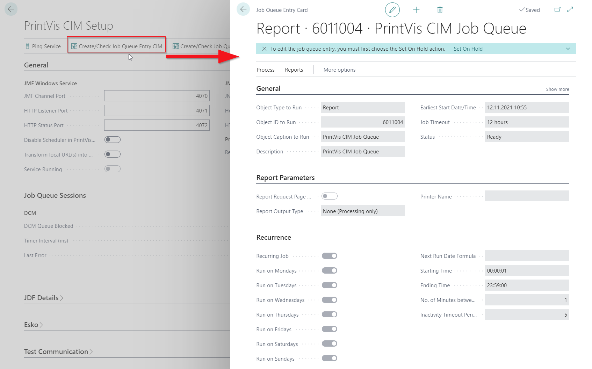

PrintVis CIM Controller Setup

A controller is required for each workflow partner and manages the jobs
for the devices connected to it.

If you are looking for a specific workflow partner setup take a look
into the article: "Default/Special Controller Settings for JDF Workflow
Partners"

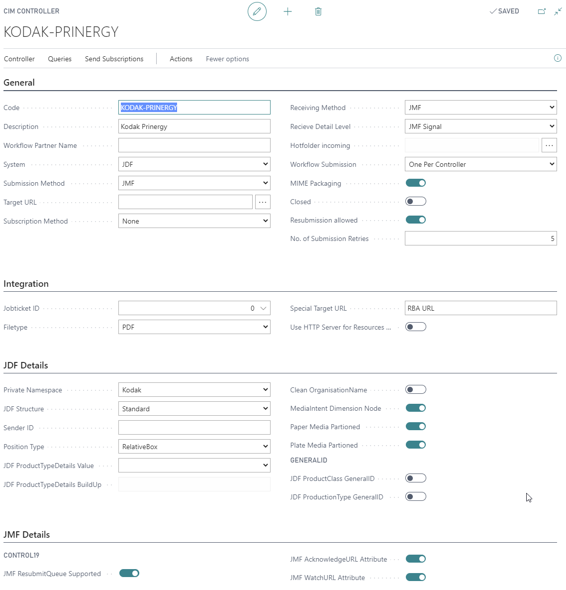

## Fields on TAB General

<table>
<colgroup>
<col style="width: 22%" />
<col style="width: 77%" />
</colgroup>
<thead>
<tr>
<th>Code </th>
<th>Enter a code</th>
</tr>
</thead>
<tbody>
<tr>
<th>Description</th>
<td>Enter a description</td>
</tr>
<tr>
<th>Workflow Partner Name</th>
<td>Enter the descriptive name for this controller which is used in the
JDF/JMF file. 
If due to setup requirements more than 1 cost center is setup in
PrintVis, it is possible to setup also different devices but use the
same Workflow Partner Name on each device.</td>
</tr>
<tr>
<th>System</th>
<td>Just use "JDF" here; All other option are for special use</td>
</tr>
<tr>
<th>Submission Method</th>
<td>To send jobs via JMF the setting must be set to <em>JMF.
Hotfolder </em>is only used in some rare cases.</td>
</tr>
<tr>
<th>Target URL</th>
<td>
The Target URL is the full address of the controller. Typically
you get this information from the vendor you want to connect to, or from
a key user who is operation the Workflow Partner system. The URL must
typed in according this schema:

http://&lt;IP&gt;:&lt;port&gt;/&lt;target&gt; 
Example: 
http://123.1.1.123:8520/jmfdings

Additionally you can add a %1 at the end, then the DeviceID will
added while sending.
</td>
</tr>
<tr>
<th>Subscription Method</th>
<td>Just use "None" here; All other options are for special use</td>
</tr>
<tr>
<th>Receiving Method</th>
<td>
To receive signals and audit information via JMF the Receiving
method must be set to <em>JMF</em>.

<em>Hotfolder </em>is only used in some rare cases.
</td>
</tr>
<tr>
<th>Receive Detail Level</th>
<td>
Options are:

<ul>
<li>
None
</li>
<li>
SubmitQueueEntry Device Globally
</li>
<li>
Query Device (Globally)
</li>
<li>
Job Level JDF Node
</li>
<li>
Query Job Level JDF Node
</li>
<li>
Job Level JDF Node (Device)
</li>
</ul></td>
</tr>
<tr>
<th>Hotfolder Incoming</th>
<td>If Receiving Method is Hotfolder enter the path here.</td>
</tr>
<tr>
<th>Workflow Submission</th>
<td>
Options are: 
The option will be triggered by the sorting order in the calculation by
the cost centers and their assigned devices in a PrintVis.

<ul>
<li>
First only

<ul>
<li>
No matter how many Controllers are available and mapped to a
calculation, only for the first a JDF/JMF will be sent.
</li>
</ul></li>
<li>
Always

<ul>
<li>
JDFs/JMFs will be sent for every device
</li>
</ul></li>
<li>
One per Controller

<ul>
<li>
JDFs/JMFs will be sent for every controller mapped to the
calculation.
</li>
</ul></li>
</ul></td>
</tr>
<tr>
<th>MIME Packaging</th>
<td>
MIME Packaging defines if the JMF contains the JDF according the
MIME standard. This might be filled (if supported from Workflow Partner)
from the Query Known Submission method, which can be called via the
according action on the controller setup card.

If it is disabled, the JMF will contain only a link to the JDF and
the controller has to download the JDF himself from the virtual PrintVis
http server.
</td>
</tr>
<tr>
<th>Closed</th>
<td>If enabled this Controller is disabled</td>
</tr>
<tr>
<th>Resubmission Allowed</th>
<td>Enable this field if the Workflow Partner allows the resubmission of
a JDF.</td>
</tr>
<tr>
<th>No. of Submission Retries</th>
<td>No. of submission retries defines the number of attempts from
PrintVis to send the JMF if the previous attempt was not
successful.</td>
</tr>
</tbody>
</table>

## Fields on TAB Integration

<table>
<colgroup>
<col style="width: 22%" />
<col style="width: 77%" />
</colgroup>
<thead>
<tr>
<th>Job Ticket ID</th>
<th>Select the desired Job Ticket report</th>
</tr>
</thead>
<tbody>
<tr>
<th>Filetype</th>
<td>Select the filetype that should be provided</td>
</tr>
<tr>
<th>Special Target URL</th>
<td>This is used for Kodak RBA (Rule based Automation). 
There is special Report 6011021 which is being used to trigger certain
events in Kodak which is using the “Special Target URL” on Controller.
The report needs development based on what automation is available in
the Kodak Prinergy System.</td>
</tr>
<tr>
<th>Use HTTP Server for Resources and Runlists</th>
<td>If this field is checked the runlist file links are encoded as http
links. This means the Workflow Partner is able to steam the
Production-PDF (Runlist file) from the PrintVis "folder". This is the
only option if PrintVis and the Workflow partner are not part of the ame
network (e.g. Cloud installations) 
 
If the field is unchecked, the runlist files are encoded as file links.
The Workflow Partner must have access to the foiled system!</td>
</tr>
</tbody>
</table>

## Fields on TAB JDF Details

<table>
<colgroup>
<col style="width: 22%" />
<col style="width: 77%" />
</colgroup>
<thead>
<tr>
<th>Private Namespace</th>
<th>If the controller supports a private namespace it may be selected
via the Private Namespace setup. If a private namespace is selected,
additional will be added to the JDF file.</th>
</tr>
</thead>
<tbody>
<tr>
<th>JDF Structure</th>
<td>
The JDF Structure setup supports three different setup
options.

<ul>
<li>
If <em>Standard</em> is selected, the system creates a standard
PrintVis JDF with all data included.
</li>
<li>
If <em>Process Level</em> is selected, the system creates an
optimized JDF for digital printing.
</li>
<li>
If <em>Single Process</em> is selected, the system creates a JDF
which only includes the information for the print process.
</li>
</ul></td>
</tr>
<tr>
<th>Sender ID</th>
<td>This field is used for the JDF/JMF mapping and is flled from the
Workflow Partner when running the Action "Query Known Devices".</td>
</tr>
<tr>
<th>Position Type</th>
<td>AbsoluteBox: 
 
RelativeBox:</td>
</tr>
<tr>
<th>JDF ProductTypeDetails Value</th>
<td>
Options to trigger a workflow in the Workflow Partner system
(e.g. AGFA)

<ul>
<li>
Product Group JDFProductTypeDetails 

<ul>
<li>
Is tranverffing the value from the seletced product
group
</li>
</ul></li>
<li>
Custom

<ul>
<li>
Custom build from the settings in the field below
</li>
</ul></li>
</ul></td>
</tr>
<tr>
<th>JDF ProductTypeDetails BuildUp</th>
<td>
For the above option "Custom" in field "JDF ProductTypeDetails
value" to build the tranferred JDF ProductTypeDetails Value :

Syntax: 

<ul>
<li>
%1=ProductGroup Code
</li>
<li>
%2=ProductGroup Comment
</li>
<li>
%3=ProductGroup "JDF ProductTypeDetails"
</li>
<li>
%4=ProductGroup "Esko Substrate Queue"
</li>
<li>
%5=IntentGroup Code
</li>
<li>
%6=IntentGroup Comment
</li>
<li>
%7=IntentGroup "External Description"
</li>
<li>
%8=Case "Product Group"
</li>
<li>
%9=Case "Product Configuration Code 
</li>
</ul></td>
</tr>
<tr>
<th>Clean OrganisationName</th>
<td>With this field enabled PrintVis will remove special characters from
the customer name in the JDF: i.g. "Müller" will become "Muller". 
This is to avoid problems with Workflow Partners that cannot handle
these characters.</td>
</tr>
<tr>
<th>MediaIntent Dimension Node</th>
<td>
If this field is checked, the plate making grey box within the
JDF will get an additional node for thumbnail generation on separation
level. This is an optional setting.

Note: This will lead to an error in the validation of the JDF with
the CPI4 JDF Editor because this setting is not more supported since JDF
specification V1.1 but still used from some vendors!
</td>
</tr>
<tr>
<th>Paper Media Partioned</th>
<td>
If this field is checked, the Paper media node within the JDF
will get an additional partioned level. This is an optional setting
mainly used within workflows using KODAK prepress systems. 

Note: This is not supported from all vendors!
</td>
</tr>
<tr>
<th>Plate Media Partioned</th>
<td>
If this field is checked, the Plate media node within the JDF
will get an additional partioned level.This is an optional setting
mainly used within workflows using KODAK prepress systems.

Note: This is not supported from all vendors!
</td>
</tr>
<tr>
<th>JDF ProductClass GeneralID</th>
<td>PrintVis writes the Product Group into the Root Node) 
It checks the Product Configuration Code from the case; If empty it
takes the Product Group Code. </td>
</tr>
<tr>
<th>JDF ProductionType GeneralID</th>
<td>This setting is used for Heidelberg Prinect Smart Automation: (i.g.
Triggering basic workflows if JDF/Job data is not very enriched) 
PrintVis writes the Product Configuration Code from the case; If empty
it takes the Product Group. 
If on Controller AGFA Namespace and AGFA Ticket Template is enabled
(Only for AGFA) same value will be written as well into the AGFA
Namespace agfa:TicketTemplateName</td>
</tr>
</tbody>
</table>

## Fields on TAB JMF Details

<table>
<colgroup>
<col style="width: 22%" />
<col style="width: 77%" />
</colgroup>
<thead>
<tr>
<th>JMF ResubmitQueue Supported</th>
<th>Enable this field if the Workflow supports a ResubmitQueue JMF if an
order is resend after a change. 
If disabled always a SubmitQueue JMF will be send.</th>
</tr>
</thead>
<tbody>
<tr>
<th>JMF AcknowledgeURL Attribute</th>
<td></td>
</tr>
<tr>
<th>JMF WatchURL Attribute</th>
<td></td>
</tr>
</tbody>
</table>

## Fields on TAB AGFA Integration

<table>
<colgroup>
<col style="width: 50%" />
<col style="width: 50%" />
</colgroup>
<thead>
<tr>
<th>Use AGFA Ticket template</th>
<th>
For the AGFA Package basic JDF intent setup it is not possible in
an easy way to specify if a WebUpload or WebApproval is agreed with the
customer. But it is possible to select a specific hot or job ticket
template by using AGFA tag/namespace called TicketTemplateName.

PrintVis transfers the Product Group code or If existing/selected,
the Intent Product Configuration code as TicketTemplateName
value.
</th>
</tr>
</thead>
<tbody>
<tr>
<th>Use Agfa JobDescriptiveName</th>
<td></td>
</tr>
</tbody>
</table>

## Run Page Actions

In the example a Controller for AGFA is being used. The steps are the
same for all other Workflow Partners!

After the above setup is made the Workflow Partner can be connected. By
default run all actions under Queries.

## Queries

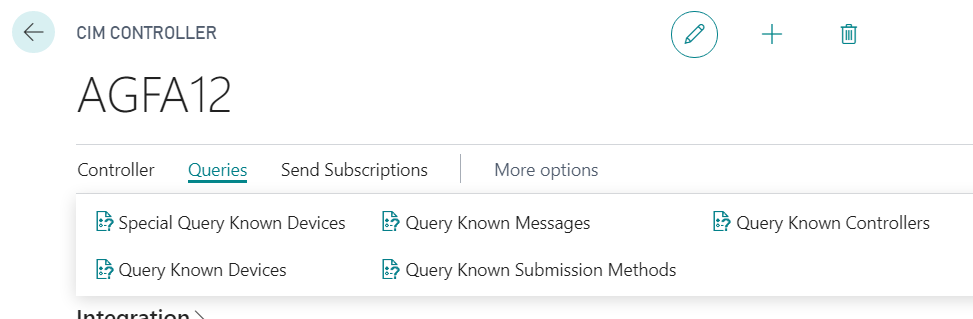

## Subscriptions

By default run all actions under Send Subscriptions. Only if not all
Subsriptions are desired you can speify whick one.

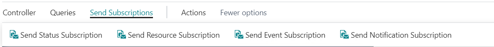

## Result will be displayed on the Factbox:

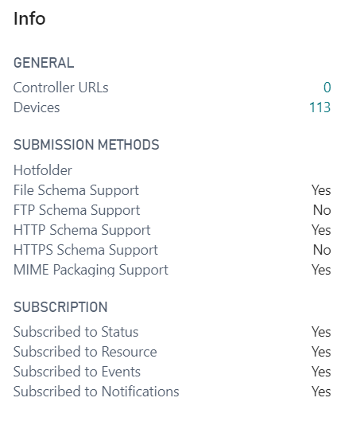

On some of the Queries or Subscriptions and error message might be
displayed if the workflow partner does not support this option.

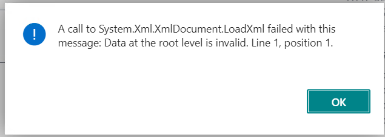

If on all actions an error appears this might be an indicator that the
connection is not working.

Try to paste the "Target URL" into your browser. If the result looks
like this the connection is
working: 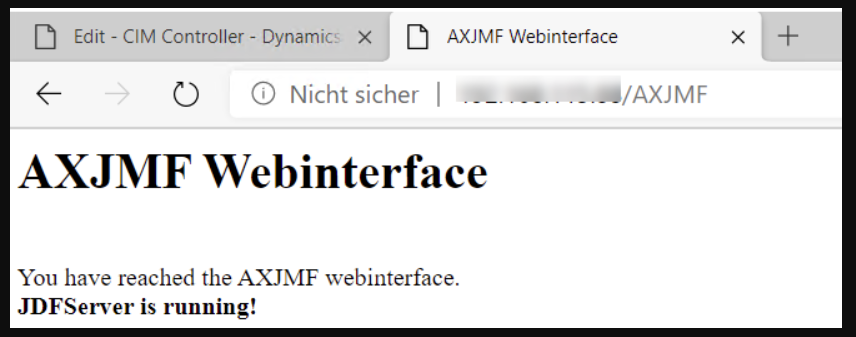

## PrintVis Device Setup

The devices reported by the Workflow Partner can be checked and changed
in the device setup. Please search for the "PrintVis CIM Device" because
there are more entries when just searching for device!

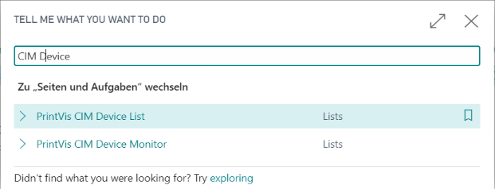

After running the action on the Controller "Query Known Devices" there
might be be a long list of devices that has been created. If it is
unclear which one is for which use, Please contact the vendor for the
given controller code.

In PrintVis a cost center will be linked to each controller which has to
be addressed by the PrintVis calculation!

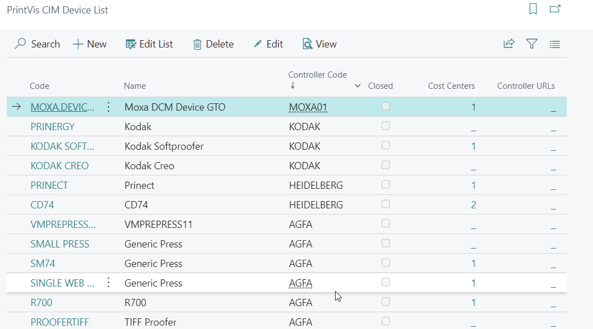

## Device Card

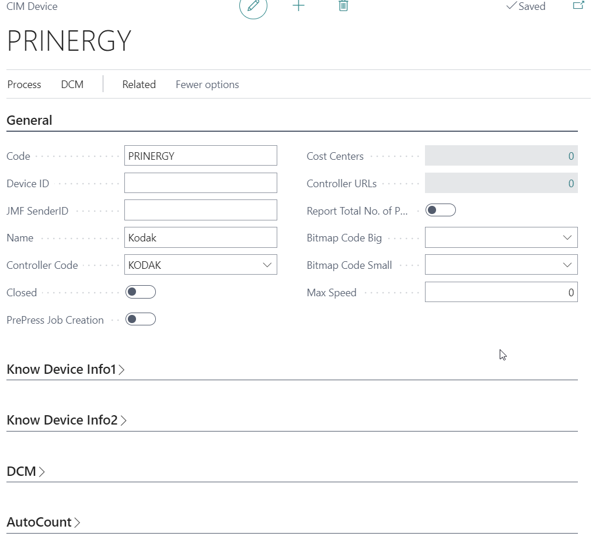

## Fields in Device Card Tab General

<table>
<colgroup>
<col style="width: 31%" />
<col style="width: 68%" />
</colgroup>
<thead>
<tr>
<th>Code</th>
<th>Code for this device</th>
</tr>
</thead>
<tbody>
<tr>
<th>Device ID</th>
<td>Device ID used in JDF/JMF communication</td>
</tr>
<tr>
<th>JMF SenderID</th>
<td>Will be filled on first connection by workflow partner and is being
used to map the received messages to the correct
controller.<strong> 
</strong></td>
</tr>
<tr>
<th>Name</th>
<td>Readable name for this device </td>
</tr>
<tr>
<th>Controller Code</th>
<td>The Manufacturing Integration/CIM Controller this device is
connected to. To change it you can lookup the existing Manufacturing
Integration/CIM Controllers.</td>
</tr>
<tr>
<th>Closed</th>
<td>Enabled if this device is not in use.</td>
</tr>
<tr>
<th>PrePress Job Creation</th>
<td>Enabled if this device can be used for ESKO PrePress orders.</td>
</tr>
<tr>
<th>Cost Centers</th>
<td>Shows the number of cost centers the devices is linked to. 
A cost center can linked with the action <em>Process -&gt; Assign Cost
Centers</em>: Here select in column Manufacturing Integration/"CIM
Device Code" the device. 
 
The cost center can be also mapped directly on the cost center card</td>
</tr>
<tr>
<th>Controller URLs</th>
<td>Will be filled by the Query "Query Known Controllers". Will be used
for example in Xerox Freeflow.</td>
</tr>
<tr>
<th>Report Total No. of Plates</th>
<td>
There are 2 ways to get JMF Responses about the consumption of
plates from Prepress:

<ol type="1">
<li>
The prepress system is sending only the actual consumed plates
for this sheet.

<ul>
<li>
Keep the Boolean = False / Do not switch on
</li>
<li>
PrintVis is posting the comsumpion based on the no. of plates
that is sent
</li>
</ul></li>
<li>
The prepress system is sending always the total of consumed
plates for this sheet. 

<ul>
<li>
Set the Boolean = True / Switch the field on
</li>
<li>
PrintVis is always posted the difference beteeen the no. of
plates sent and plates that have been already posted.
</li>
</ul></li>
</ol></td>
</tr>
<tr>
<th>Bitmap Code Big</th>
<td>Displayed on the Device Monitor List</td>
</tr>
<tr>
<th>Bitmap code Small</th>
<td>Displayed on the Device Monitor Card</td>
</tr>
<tr>
<th>Max Speed</th>
<td>Enter the Max. Speed for this device. It is used for the max. values
on the speed gauge on Device Monitor Card.</td>
</tr>
</tbody>
</table>

The fields on the other tabs are for administrative information and
might not be in use for this controller.

Special Handling of Workflow Partners

You might have noticed that based on the namespace and others settings
the handling of data can differ depending on the Workflow partner brand.
We try to avoid special handling but on some be have learned that it is
hard to work without. In the following some of those topcie are
described.

ChannelID for Subscriptions

PrintVis is creating for every new subscription to a JDF Workflow
partner a unique ChannelID. It seems some systems get confused by that.
We have changed that for the integration of with ESKO Automation Engine
the ChannelID will be stored and used for every new subscription. 
