# Dynaway

Dynaway EAM PrintVis integration is designed to enhance production
tracking, foster collaboration between maintenance and production teams,
and streamline maintenance operations for PrintVis users.  

## Roles

New Roles have been created to go with Dynaway integration.

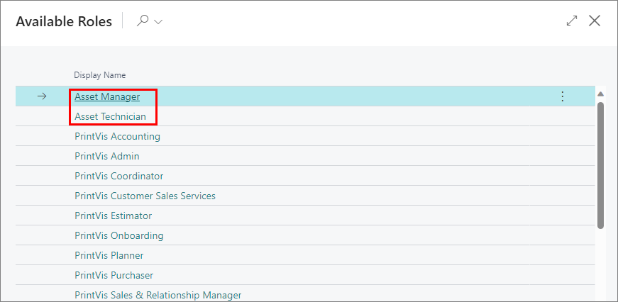

These roles have direct access to Assets, Work Orders, Requests,
Counters, and Measurements. 

## Assets

Asset Card

Assets are created using the Asset Card. In the Asset Card, the machine
is described from a maintenance perspective. 

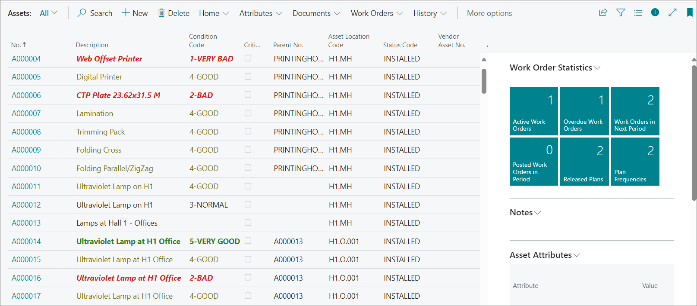

On the Maintenance Asset Card, you can set up the connection between the
Asset and the Cost Center.

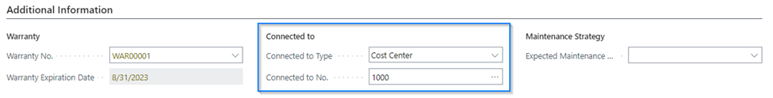

The Maintenance Asset can be connected only to one Cost Center, and one
Cost Center to only one Maintenance Asset. Maintenance assets do not
necessarily need to be connected to a Cost Center. For example, an air
compressor that is used in the shop, but is not used for production
purposes could be added as an asset for maintenance personnel to
manage. 

Asset Card Features

   **Attributes:** You can describe characteristics which make up the
Asset.

   **Documents:** You can upload documents related to this Asset such as
User Manuals or Installation documents.

   **Work Orders:** You can create and manage Work Orders and Work Order
Plans.

   **History:** View logs, counters, posted work orders, and other
statistics. 

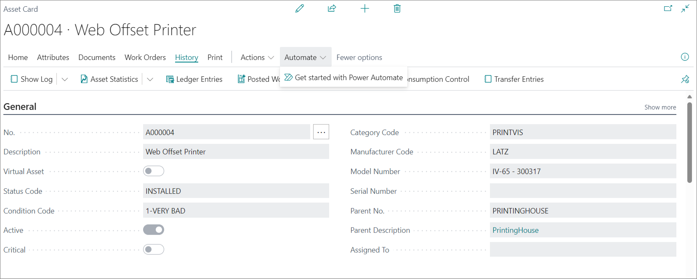

Capacity

Downtime entries can be created for each Asset with Work Orders 

## Cost Center

On the Cost Center card the user can use some actions
related to the Asset that is connected to the Cost Center. Actions are
enabled only when the Asset is connected to the Cost Center and
Registering Counter/Measurement Reading is enabled only when the
connected Maintenance Asset has counter/measurement mounted on it.

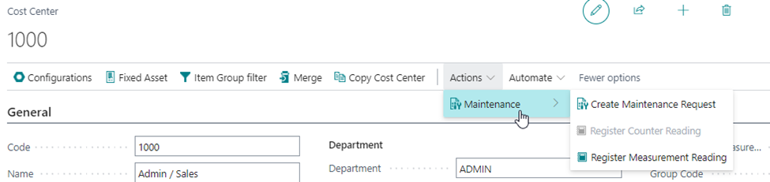

Users that are not defined as maintenance employees but
work with the Cost Center and have needed permissions can create
maintenance request directly from that place in the system. Also
readings can be easily registered without leaving a cost center card.

## Shop Floor Role Center

Role Centers for Shop Floor Manager and Shop Floor Worker have been
extended to include a group of maintenance actions. The features are on
the Role Center and on job screen.

These actions include: 

-   Creating Maintenance Requests

-   Registering Counter Readings

-   Registering Measurement Readings

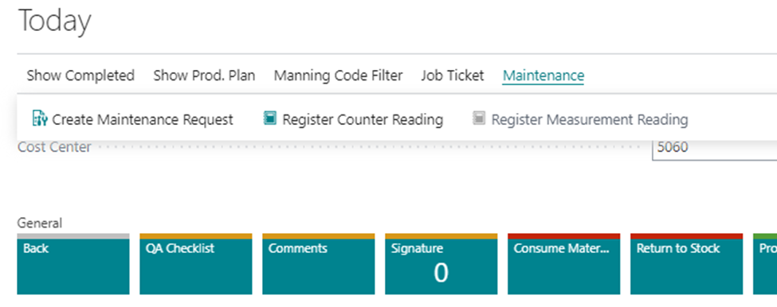

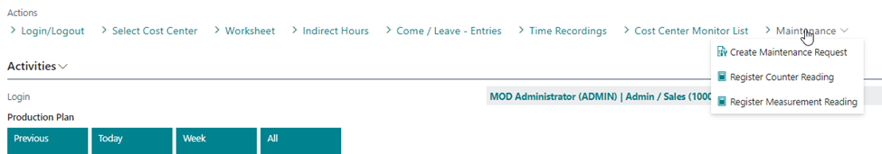

All assets must be connected to a cost center before any actions can be
performed.  Counters can only be read if there are devices mounted on
the machine to read these. 

## Capacity Records

When the Maintenance Asset is connected to the Cost Center – on the Work
Order Plan for this asset you can define if you want to create a
Downtime Entry together with the Work Order created from this Plan. You
can also define if the Capacity Calendar Blocking will be created.

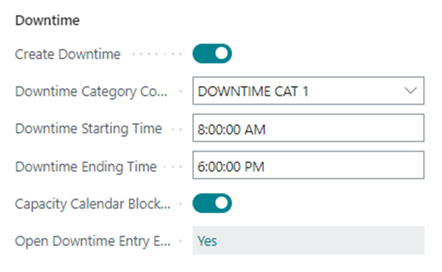

In the Asset Management Setup there is a field where you should define
the Capacity Blocking Code. This code will be used to create Capacity
Blocking records.

Work Order Plan is triggering the creation of the Work Order and
Downtime Entry. With such setup to the Capacity Blockings records are
added. Only when the created work order is connected with the specific
Cost Center with the specified Capacity Unit. For this unit blockings
are created.

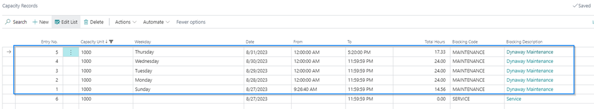

What is important – capacity records can be controlled (modified or
deleted) only from the downtime entry record. This is because the person
responsible for the downtime should only be one who can modify blocking
records. From the actions tab you can open the Downtime Entry card. 

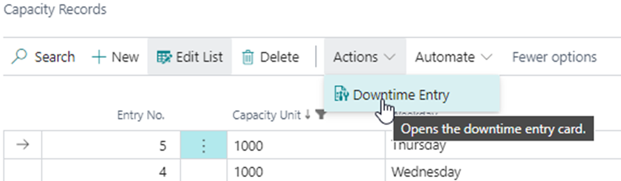

Please note: When the downtime entry is being edited, it will remove all
previously created blocking records and create a new one. 

## Counters on Cost Center

On the Counters list you can connect the counter with the specific Cost
Center in your company. In such case you must define counter with the
type **Relative**. 

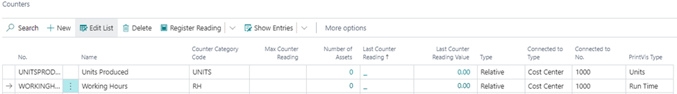

In the Asset Management Setup you must specify the Counter Journal
Template and Counter Journal Batch.

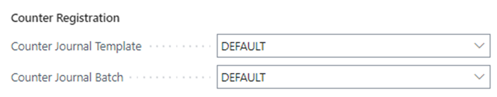

With this setup every time when the hours or units produced will be
posted for the selected Cost Center – related values will be added to
this journal. Thanks to that it will be easy to track how many units
were produced or how many the cost center was working. If the cost
center is connected to the maintenance asset – you can create related
work order plans based on the specific counters.

## Asset Activity Board

The Asset Activity Board is similar to the planning board, but for
Assets instead of Capacity Units. On the Asset Activity Board (AAB) you
can show objects representing capacity blockings and planned cases
related to the Cost Center connected with the specific maintenance
asset. These objects on the board might be visible but cannot be edited
from the AAB so they are only information for the maintenance planner
that something is happening on the asset.

Global Setup

On the ABB you can display predefined labels and tooltips for specific
objects using the Asset Activity Board Setup page. Default setup is
installed when the app is being installed, these values can be changed,
and restored with the **Restore Default **action.

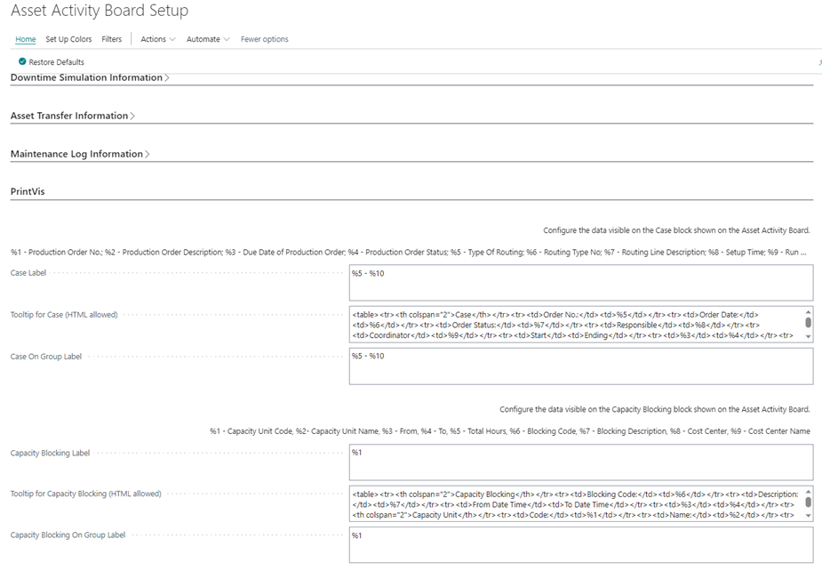

You can also define colors for Cases and Capacity blockings.

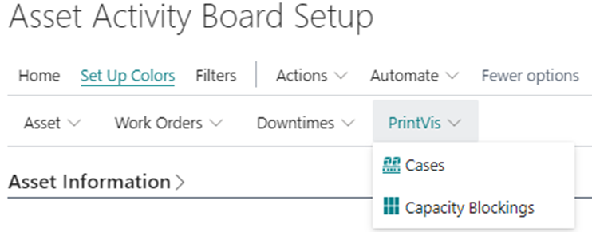

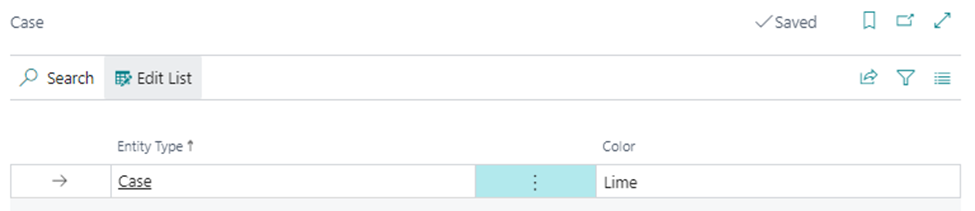

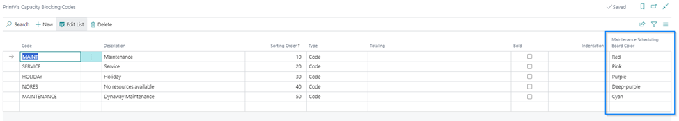

There is also an option to install other colors. 

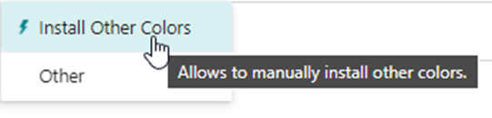

Asset Activity Board Usage

On the AAB you can choose if objects representing capacity blockings or
cases are visible by selecting the relevant action. In these action
groups you can also decide if you want to see relevant objects on the
group. 

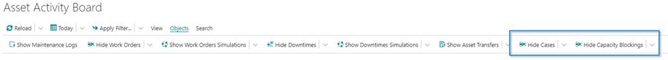

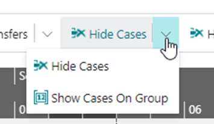

From each object you can open some relevant pages.

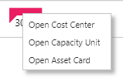
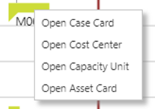

Other filters can also be set:

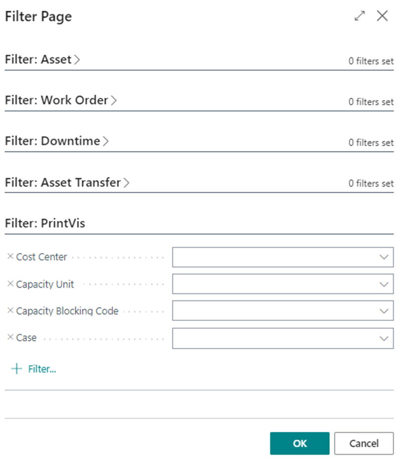
