# PrintVis/ESKO PrePress Integration for Folding Carton

## Introduction

This documentation is about a standardized JDF integration with
predefined goals and results. 

This integration provides two types of JDFs:

1.  Prepress JDF

    -   For the basic creation of an approved, single-product PDF
        without step and repeat information.

2.  Production JDF

    -   Full production PDF and dies layout creation for a full
        production cycle.  
        This article is not about this functionality, as this is a
        'normal' JDF transfer.

The integration can be used to communicate between the PrintVis
administrator and the prepress department when new product comes in and
work is needed in the prepress production.

PrintVis communicates with the ESKO Automation Engine via JDF and JMF
files.

Sometimes this is for new products, and sometimes it is with updates on
existing products, for example new artwork, changes of color. For more
significant changes, a new product may be a better solution.

In PrintVis, product information is kept on the Item card, as products
in PrintVis are referred to as Finished Goods items.

It means that the Item number is the equivalent of the Product number in
ESKO.

There are certain settings on the Item card which keep information that
ESKO will need to operate, and settings which help the PrintVis user
navigate in the system to find out the current status of an item
(product).

There are prerequisite setups on:

-   Basic JDF setup

-   General PrintVis Setup

-   CIM setup

-   The CIM Controller

-   A product group for Prepress jobs

-   Product group setup generally, setting a workflow

-   Order Type for Prepress jobs

When the prerequisite setup has been done, daily use of the integration
can begin. 

For basic JDF communication, please look at the dedicated article for
this. [CIM setup / JDF
setup](https://learn.printvis.com/Legacy/Integrations/CIMSetupData) 

The functionality of the standard workflow setup will contain:

-   JDF/JMF communication between PrintVis and Automation Engine 

-   Status exchange via JMF in real time

-   Customer companies creation in WebCenter initiated from within
    PrintVis via JDF

-   User creation in WebCenter initiated from within PrintVis via JDF

-   Feedback from AutomationEngine to PrintVIS about inks, coverage,
    thumbnail, etc. (in preparation!)

-   Upload of customer files from PrintVis to AutomationEngine

-   Automated preflight of customer files and report

-   Creation of proof reports

-   Customer approval via WebCenter or email

-   Automated Step & Repeat from Layout JDF

-   Upload to plate suppliers FTP servers

-   WebCenter as approval tool and for exchanging products between sites

Two types of orders can be issued

In commercial printing, a typical standard JDF workflow is made for a
fully integrated production order, where all production processes - from
layout work in prepress to the packing of the final product - are
included. 

The workflows for the label, flexible packaging and box-producing
industries differ here, because the workflow starts with a separate
prepress order. The prepress order is used because these industries work
with so-called Finished Good items.  
A Finished Good item is a defined product which could be reordered and
produced in the same way again and again. This means the prepress flow
and preparation is a generic process - and not related to a production
order.

## ESKO Prepress Orders

The prepress order contains all information including the customer
approval for the final product without step and repeat information. This
kind of order is triggered from the PrintVis Item Card. There can be 1
or more prepress order for each item. Typically, if there is a layout or
data change for a specific item, a new item will be created to make sure
the production is not producing from an outdated layout.

The PrintVis Case is used for communication between PrintVis and AE. The
data and status information are stored in the Item Card.

A Prepress order can also be used for "sampling" - so that costs from
materials and modeling/sampling time can be recorded on a Case and
included in our cost analysis of a product or a customer's activities.

## ESKO Production Orders

The production order contains all information for the printing and die
cutting processes, specifically for a certain press in production, where
the product is placed with 2 or more apps in the printing section of the
press with inline or offline die cutting. This layout for the printing
section is called step and repeat.

The PrintVis Case is used for the communication and all technical
information comes from the calculation structure in PrintVis.

PrintVis System Requirements for JDF/JMF integration

PrintVis requires the following Granules and tools for full JDF/JMF
support:

-   PrintVis Manufacturing Integration License

-   PrintVis External WCF Communication Component (Windows Installer)

-   WCF Service Serial No.

Prerequisite Settings 

PrintVis General Setup

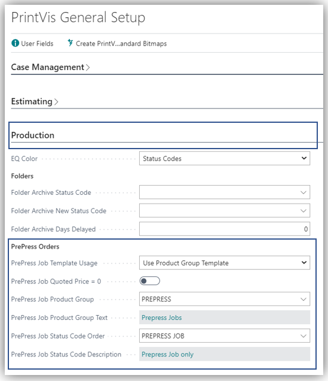

In the PrintVis General Setup we have the option for generically adding a
certain order type and product group to the Case Card for the Prepress
order.  
In this case, a product group called PREPRESS has been created, and an
Order Type as well.

These values can be used for searching, filtering and reporting later
on. 

Prepress setup fields: (for other fields please find additional
information on the "PrintVis General Setup" article)

<table>
<colgroup>
<col style="width: 18%" />
<col style="width: 81%" />
</colgroup>
<thead>
<tr>
<th>PrePress Job Template Usage</th>
<th>
Options are:

<ul>
<li>
Use Product Group Template

<ul>
<li>
If a prepress case (prepress job) is being created with a
Finished Goods item attached, the template attached to the prepress
Product Group is copied for the new case/job, <u>instead</u> of the
template that is attached to the Finished Goods item.
</li>
</ul></li>
<li>
Use Item Template

<ul>
<li>
If a prepress case (prepress job) is created with a Finished
Goods item attached, the template that is attached to the Finished Goods
item is copied for the new case/job.
</li>
</ul></li>
</ul>

When selecting the Finished Good item on the case card, there is the
option to choose a formerly created job instead of a template for the
new prepress case.
</th>
</tr>
</thead>
<tbody>
<tr>
<th>Prepress Job Quoted Price =0</th>
<td>In case you don't want to charge your customer for the initial
Prepress PDF creation and other prepress work you can set this field to
"True". The quoted price on the new prepress case will then be by
default =0 and not calculated from the estimating parameters.</td>
</tr>
<tr>
<th>PrePress Product Group</th>
<td>Select the product group that is applied to the prepress
cases/jobs.</td>
</tr>
<tr>
<th>Product Group Text</th>
<td>Description of the selected product group will be displayed.</td>
</tr>
<tr>
<th>PrePress Status Code Order</th>
<td>Select the status code that is applied to the prepress
cases/jobs.</td>
</tr>
<tr>
<th>PrePress Status Code Description</th>
<td>Description of the selected status code will be displayed.</td>
</tr>
</tbody>
</table>

CIM setup

The specific setup for this AE Integration begins on the PrintVis CIM
Setup

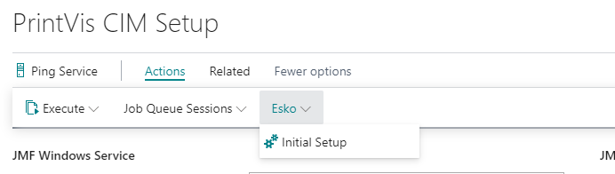

This setup will create the initial Esko-related Item categories and make
them available on Item cards. 

Activate ESKO JDF Integration 

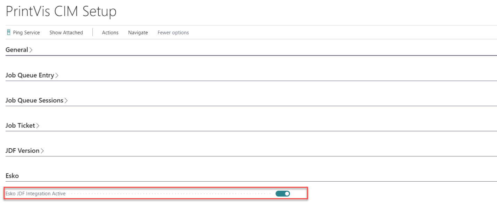

The field Esko JDF Integration Active needs to be enabled.

CIM Controller Setup

Create and adapt a CIM controller for your ESKO environment:

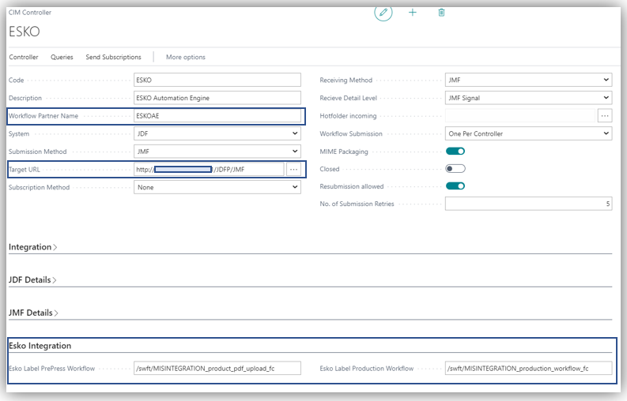

 

<table>
<colgroup>
<col style="width: 28%" />
<col style="width: 71%" />
</colgroup>
<thead>
<tr>
<th><strong>Field</strong></th>
<th><strong>Description</strong></th>
</tr>
</thead>
<tbody>
<tr>
<th>
Target URL

 
</th>
<td>
Set up the IP address and port for the ESKO Automation Engine
Server in your network

 
</td>
</tr>
<tr>
<th>Esko Prepress Workflow</th>
<td>
If you have a default Prepress workflow, you enter the name of it
here. 

It must match the exact name of the Esko workflow.

What you see here is the standard workflow.

If you have more bespoke workflows in your Esko AE system, you can
specify this on each item when they are created. This is done through
the Item attribute.
</td>
</tr>
<tr>
<th>Esko Production workflow</th>
<td>
If you have a default Production workflow, you enter the name of
it here. 

It must match the exact name of the Esko workflow.

What you see here is the standard workflow

If you have more bespoke workflows in your Esko AE system, you can
specify this on each item when they are created. This is done through
the Item attribute.
</td>
</tr>
</tbody>
</table>

CIM Device Setup

On the device that is used to process the Prepress Job, the
setting **PrePress Job Creation **needs to be switched on.

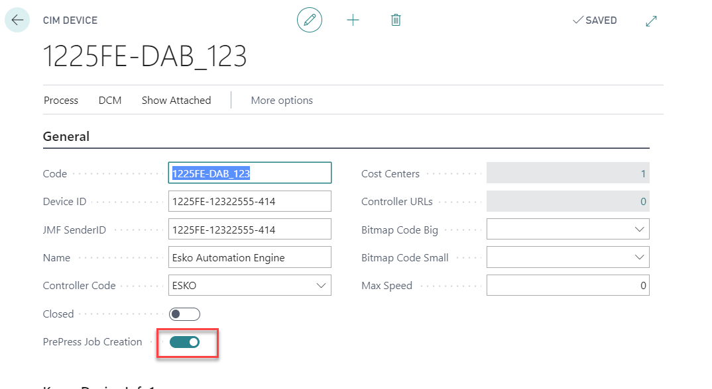

Product Group Setup

A Workflow Partner Command of a Case/Job with this Product Group
attached will be of the type "PrePress." 

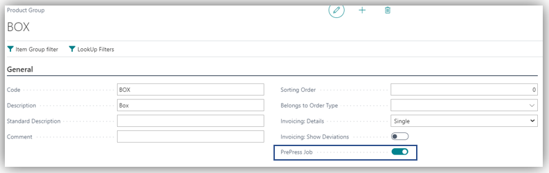

Set the field PrePress job.

This can be used if there are different workflows in ESKO per PrintVis
Product Group.

PrintVis checks the Product Group workflows first - and if empty it will
choose the workflow setup on the controller.
 

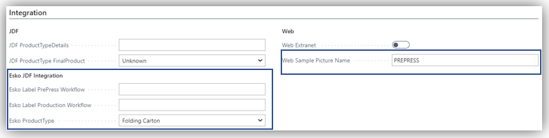

Result:

Lines of type Prepress in the Workflow Partner Commands.

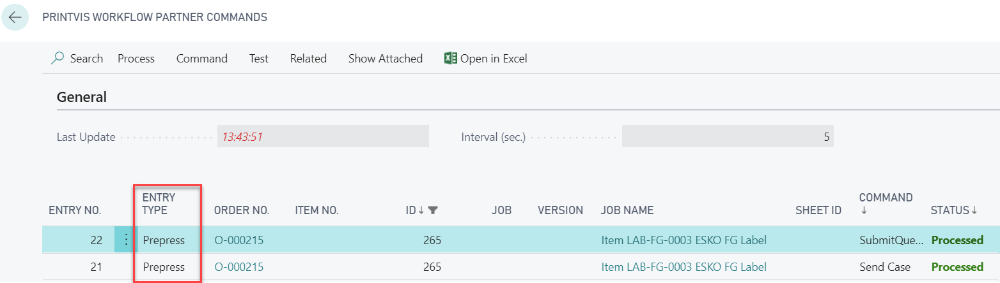

Status Code Setup

Set "Send Job to Workflow Partner" = TRUE (Switched on)

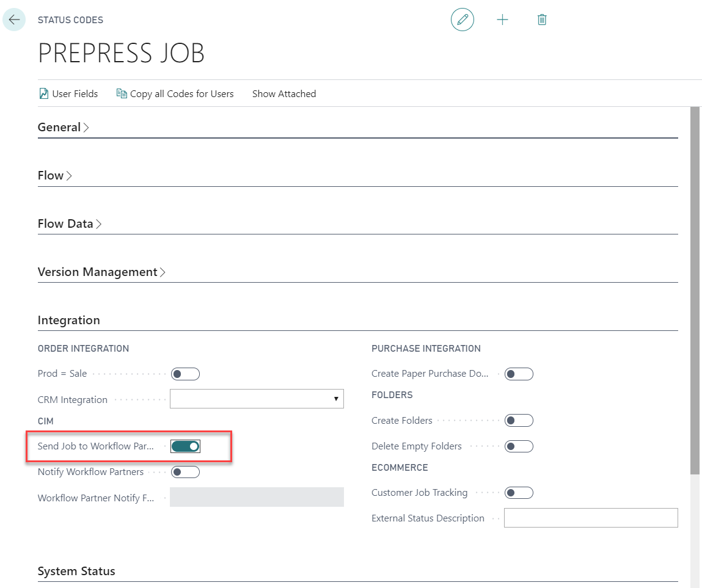

If a Case Card is switched to this status, a Prepress Job command JDF
will be sent to Esko.  
Esko will create a new Product with the information PrintVis has sent.

Cost Center / Configuration Setup

The ESKO AE needs information about the press brand and "ink set," in
case it is a digital press. 

On the Cost Center card, 2 fields are available for input:

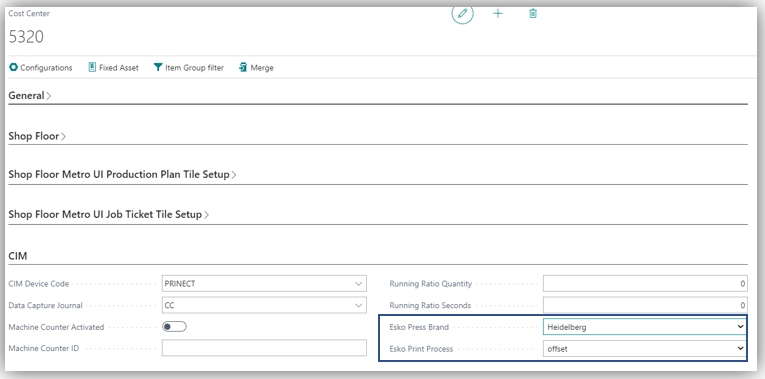

These fields will be used and transported for production jobs. 

<table>
<colgroup>
<col style="width: 28%" />
<col style="width: 71%" />
</colgroup>
<thead>
<tr>
<th><strong>Field</strong></th>
<th><strong>Description</strong></th>
</tr>
</thead>
<tbody>
<tr>
<th>Esko Press Brand</th>
<td>
If the actual Press brand is not on the list, then leave the
field blank.

Esko uses this information to slightly alter its workflow to cater to
specific press brand requirements in the JDF which is output to the
press from Esko. A blank value will simply not have any alterations and
be perfectly normal.
</td>
</tr>
<tr>
<th>Esko Print Process</th>
<td>If applicable to the current printer, pick either offset or digital.
If none of these options apply, leave blank.</td>
</tr>
</tbody>
</table>

On the Cost Center Configuration, the Esko Ink Set can be chosen:

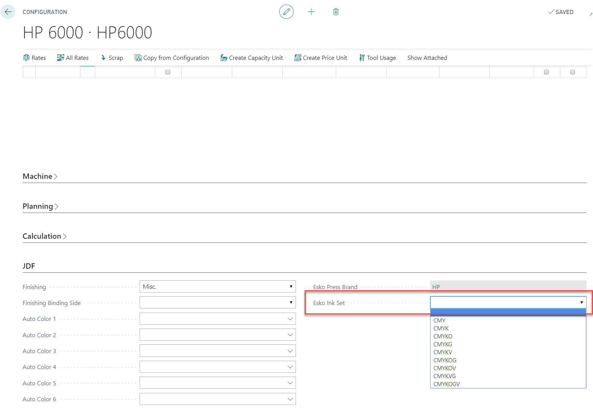

Ink Set options are:

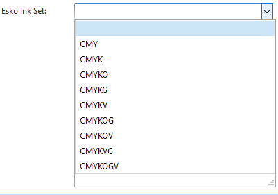

These choices are aligned with the setting in your current Esko system -
they will know what to select.

Item Card

The Item Card is a placeholder for the most recent information about
this product.

Information is kept in the existing Item Card fields, but also in the
Item Attributes.

It is OK when not all information is available, we will transport what
we have.

Of course, the more complete our information is, the better for the
automation of the job processing. See more of the procedures below.

Fields on the Item card:

In the Item Card, information is kept in the following fields:

<table>
<colgroup>
<col style="width: 12%" />
<col style="width: 87%" />
</colgroup>
<thead>
<tr>
<th><strong>Field</strong></th>
<th><strong>Description</strong></th>
</tr>
</thead>
<tbody>
<tr>
<th><strong>Item Category Code</strong></th>
<td>
If you have added the extension for ESKO integration, you will
have a couple of options here.

You may be printing labels, folding carton boxes or even both. For
each new product/item you will give them an Item category. This is not
for raw materials or any type other than ESKO products. For a box
product, pick Folding Carton

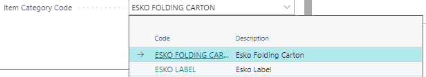
</td>
</tr>
<tr>
<th>Item Type</th>
<td>Finished Good</td>
</tr>
<tr>
<th>Item Description</th>
<td>Product description</td>
</tr>
<tr>
<th>Format 1</th>
<td>The gross <strong>width </strong>of the flat 1-up layout, in the
unit which is used in the PrintVis database setup (if you are working in
imperial units, then this measure is in inches, if you are working in
metrics this is in cm or mm, depending on your Standard Unit choice).
This must match the artwork PDF which is made for this product.</td>
</tr>
<tr>
<th>Format 2</th>
<td>The gross <strong>length</strong> of the flat 1-up layout, in the
unit which is used in the PrintVis database setup (if you are working in
imperial units, then this measure is in inches, if you are working in
metrics this is in cm or mm, depending on your Standard Unit choice).
This must match the artwork PDF which is made for this product.</td>
</tr>
<tr>
<th>Paper Item no.</th>
<td>The paper Item number on which we intend to print the product.</td>
</tr>
<tr>
<th>Colors front</th>
<td>The number of colors printed on the front side of the flat unfolded
box. </td>
</tr>
<tr>
<th>Colors back</th>
<td>The number of colors printed on the back side of the flat unfolded
box.</td>
</tr>
<tr>
<th>Sell-to no.</th>
<td>The customer number for whom you are making this product/item. If
this is an internal job (our own house boxes) then create a ‘house’
customer. It will be useful in filtering later.</td>
</tr>
</tbody>
</table>

Example item setup:

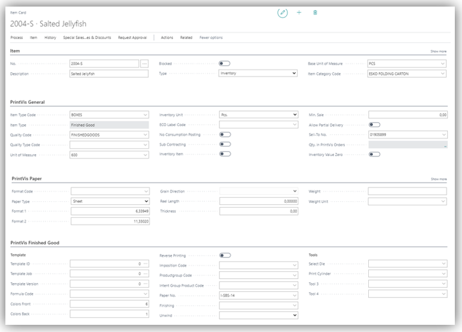

Creating a Prepress Case 

This chapter only describes the prepress order creation and the related
JDF which is ESKO-specific.

From Case Card

-   Create a Case as usual and select a Product Group that is set up for
    PrePress jobs. 

-   Select a Finished Goods item

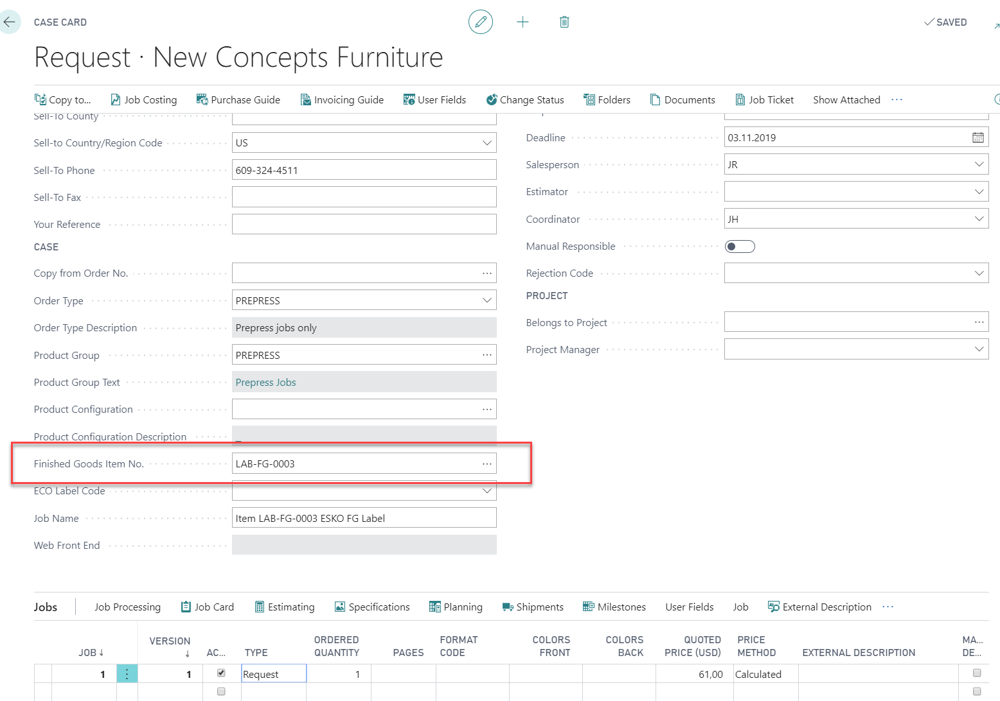

-   A dialog pops up

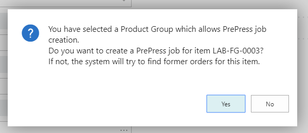

-   Yes: The template from the Item or Product Group will be copied and
    created as a new job on this case.

    -   See PrintVis General Setup

-   No: Existing jobs that have been created for this Item no. will be
    listed to copy and create as an existing job for  prepress case.

<!-- -->

-   A JDF will be created and sent to the Esko Automation Engine when
    changing to the ESKO prepress Status code

-   The Item Attributes will be exchanged and updated by the JMF respond
    from ESKO.

A new job (the copy of the selection above) is now added to the case,
enter a job name and the case is now ready for further use.

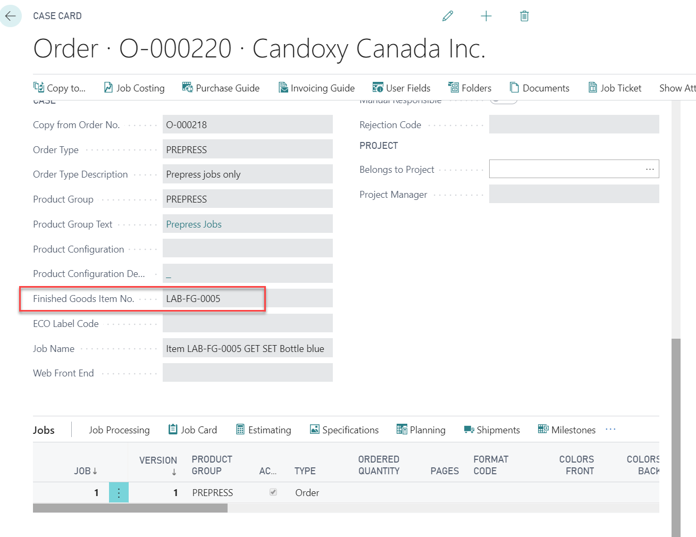

The attributes FactBox of the finished goods item can be selected to be
displayed as FactBox on the Case Card as well. It mainly stores
information relevant to a JDF integration.

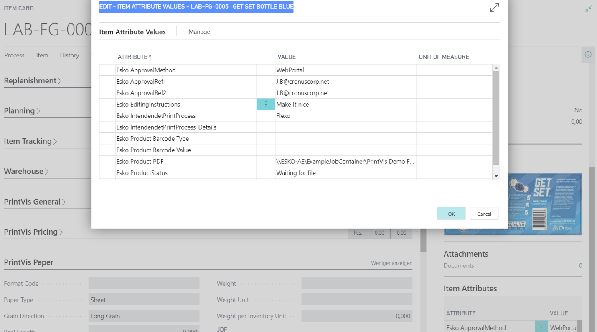

The Item Card of the selected item can be directly opened by the case
card action: "Finished Goods Item."

From Item Card

In the Item Card there are Actions to create a new PrePress case, as
well as the option to view existing PrePress cases for the Item.

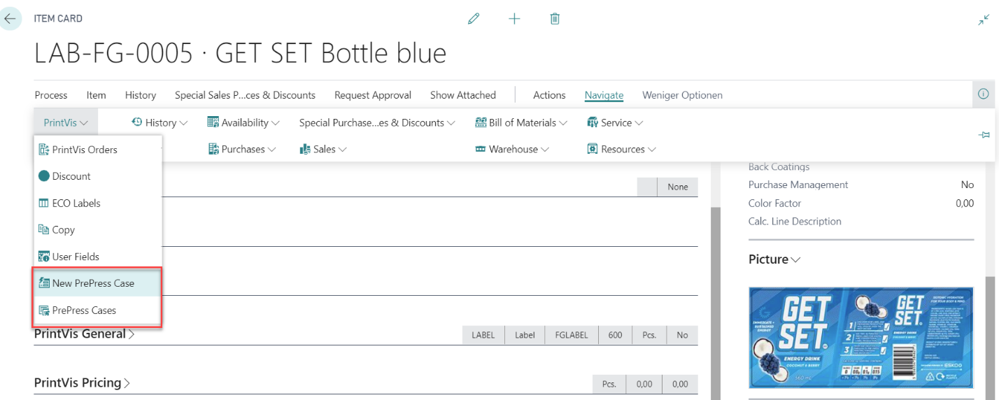

Send a JDF

Just change the status to the PrePress Status Code that has the setup
"Send Job to Workflow Partners = "TRUE""

Result in PrintVis

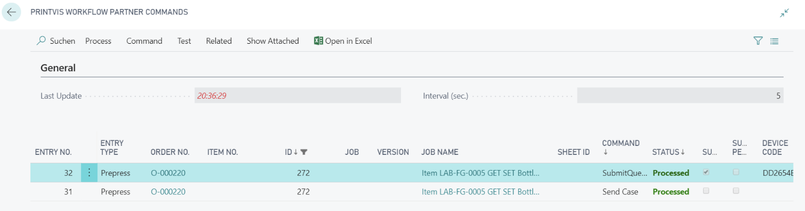

Result in ESKO

Product

Jobs

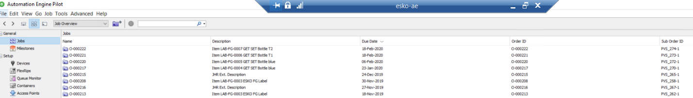

Prepress job Scenarios:

Within the Prepress job creation, we are operating with a small list of
different scenarios, which could be anticipated and with which we know
how to communicate to ESKO Automation Engine.  
Esko Automation Engine has a range of predefined, automated workflows
which we are triggering as we are sending JDF files with information.

1.  **Create New AE product and initiate a new Prepress Job for
    thi**s.  
    This is the minimum level.  
    A Finished Goods item is created in PrintVis by a PrintVis user.  
    Information are entered (what is known) by the PV user.  
    User creates a Prepress Job in PrintVis, changes to a status code
    which creates the JDF file and sends to ESKO Automation Engine.

2.  **Update of created AE Product and/or Prepress Job with more
    information**  
    If more information comes to the PV User, this is entered on the FG
    item card.  
    User can now create a new Prepress job (if the old one has now been
    closed) and put in relevant status doe.  
    This will update the product in ESKO AE and initiate an additional
    workflow.

3.  **Upload a 1-up CAD file from external source to existing product.  
    **The PrintVis User has received a CAD (1-up) file from an external
    source.  
    PV User manually places this in a folder, reachable from the AE
    server.  
    PV User creates a new prepress job or picks the existing one. In
    both cases, moves to relevant status code.  
    The will cause AE to find and import the CAD file from where it was
    placed.  
    AE workflows will check and error out if the information in the CAD
    file is not matching up to previously given information, or if it
    did not find the file in the destination given by PrintVis.

4.  **Upload a PDF art file from external source to existing product.  
    **The PrintVis User has received a PDF art file from an external
    source.  
    PV User manually places this in a folder, reachable from the AE
    server.  
    PV User creates a new prepress job or picks the existing one. In
    both cases, moves to relevant status code.  
    The will cause AE to find and import the PDF file from where it was
    placed.  
    AE workflows will check and error out if the information in the PDF
    file is not matching up to previously given information, or if it
    did not find the file in the destination given by PrintVis.

5.  **Combinations: Various combinations where the Item details and
    attributes in PrintVis are filled, including file placements, and a
    prepress job is created.**  
    At any point after the product has been created in Automation
    Engine, more information can be added to the Finished Goods items
    and be updated through the prepress job JDF launch.
