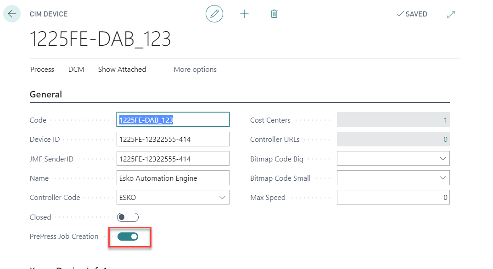

# JDF Integration: ESKO AE Integration for Narrow Web Label Production

## Introduction

This documentation is about a standardized JDF integration with
predefined goals and results. 

This integration provides two types of JDFs:

1.  Prepress JDF

    -   For the basic creation of an approved, single-product PDF
        without step and repeat information

2.  Production JDF

    -   Full production PDF and die layout creation for a full
        production cycle.

***Please note: ***

1.  Prepress Orders can be also used for regular cases that only cover
    the prepress work. Prepress cases handled as all cases and can be
    used to plan, track (Job costing) and invoice prepress work. See
    article [PrintVis Prepress
    Orders](https://learn.printvis.com/Legacy/Estimation/Prepressorders/).

2.  For the standard JDF setup, please find additional information on
    the [CIM setup / JDF
    setup](http://learn.printvis.com/Legacy/Integrations/CIMTechComm)article!

The standardized JMF/JDF connection between PrintVis and the ESKO
Automation Engine (AE) provides a predefined and tested solution for
companies in the Narrow Web Label business. 

These are typically companies that produce:

-   Adhesive Labels

-   Shrink Wrap Labels

-   Food Labels

-   Flexible packaging solutions

For

-   Cosmetics

-   Pharmaceuticals

-   Home & personal care

-   Logistics

-   Chemical industries

-   others

The production technologies of those companies are mainly:

-   Flexo narrow web presses

-   Digital web presses

-   Inline and offline die cutting and finishing (re-winding, packing)

The functionality of the standard workflow setup will contain:

-   JDF/JMF communication between PrintVis and Automation Engine 

-   Status exchange via JMF in real time

-   Customer companies creation in WebCenter initiated from within
    PrintVIS via JDF

-   User creation in WebCenter initiated from within PrintVIS via JDF

-   Feedback from AutomationEngine to PrintViS about inks, coverage,
    thumbnail, etc. (in preparation!)

-   Upload of customer files from PrintVIS to AutomationEngine

-   Automated preflight of customer files and report

-   Creation of proof reports

-   Customer approval via WebCenter or email

-   Automated Step & Repeat from Layout JDF

-   Upload to plate suppliers FTP servers

-   WebCenter as approval tool and for exchanging products between sites

Order Types

In commercial printing, a typical, known standard JDF workflow is made
for a fully-integrated production order, where all production
processes - from layout work in prepress to the packing of the final
product - are included. 

The workflow for the label industry differs here, because the workflow
starts with a separate prepress order. The prepress order is used
because the label production industry works with so-called finished good
items. A finished good item is a defined product/label that could be
reordered and produced in the same way. This means the prepress flow and
preparation is a generic process and not related to a label production
order.

## ESKO Prepress Order

The prepress order contains all information including the customer
approval for the final product without step and repeat information. This
kind of order is triggered from the PrintVis Item Card. There can be 1
or more prepress orders for each item. Typically, if there is a layout
or data change for a specific item, a new item will be created to make
sure the production is not producing an outdated layout.

The PrintVis case is used for the communication between PrintVis and AE.
The data and status information are stored in the Item Card.

## ESKO Production Order

The production order contains all information for the printing and die
cutting processes, specifically for a certain press in production, where
the product is placed with 2 or more apps in the printing section of the
press with inline or offline die cutting. This layout for the printing
section is called step and repeat.

The PrintVis case is used for the communication and all technical
information comes from the calculation structure in PrintVis.

PrintVis System Requirements for JDF/JMF integration

PrintVis requires the following Granules and tools for full JDF/JMF
support:

-   PrintVis Manufacturing Integration License

-   PrintVis External WCF Communication Component (Windows Installer)

-   An ESKO Automation Engine that can be accessed from the PrintVis
    server

Required settings 

Load ESKO Attributes on Manufacturing Integration/CIM setup

The specific setup for this AE Integration begins on the PrintVis
Manufacturing Integration/CIM Setup

This setup will create the Item Category "ESKO LABEL": 

with the following attributes and attribute values:

These attributes will be available on each item with the Item Category
ESKO LABEL. These attributes are required for the communication with AE.
In case other Item Categories will be setup and used for finished good
items, please make sure to create exactly the same attributes and
attribute values for all Item Categories. There can be more attributes
than the ones that are displayed.

ESKO JDF Integration Active

Field Esko JDF Integration Active need to be enabled.

Manufacturing Integration/CIM setup

On the Manufacturing Integration/CIM setup ESKO JDF Integration Active
must be switched on

***Please note: ***For the standard JDF setup please find additional
information on the "JDF Setup" article!

Manufacturing Integration/CIM Controller Setup

Please find the default setup in the screenshot below.

Pay attention on the fields:

-   Target URL

    -   Setup the IP address and port for the ESKO Automation Engine
        Server in your network

-   JMF ResubmitQueueEntry Supported

    -   ESKO AE does not support a ResubmitQueueEntry

    -   If this field is set to "false" (not active/switched off)
        PrintVis always sends a SubmitQueueEntry when a job is "Resend"
        on changes

-   ESKO Integration

    -   Setup the default ESKO workflows 

        -   For Prepress orders

        -   For Production orders

    -   There is such setup on the product group as well

        -   This can be used if there are different workflows in ESKO
            per PrintVis Product Group

        -   PrintVis is checking the product group workflows first and
            if this is empty it will choose the workflow setup on the
            controller

            -   If product group workflow is being used priority is:

                1.  Product Group from Job

                2.  Product Group from Case

Manufacturing Integration/CIM Device Setup

On the device that is used to process the Prepress Job, the
setting **PrePress Job Creation **need to be switched on.

***Please note: ***For the standard JDF setup please find additional
information on the "JDF Setup" article! This article only describes the
ESKO specific settings.

Product Group Setup

A Workflow Partner Command of a Case/Job with this Product Group
attached will be of the type "Prepress."

Result:

If the type in the Workflow Partner Commands is different, check the
setup above!

ESKO workflows

-   ESKO Label Integration

    -   Setup the default ESKO workflows 

        -   For Prepress orders

        -   For Production orders

    -   This can be used if there are different workflows in ESKO per
        PrintVis Product Group

        -   PrintVis is checking the product group workflows first and
            if this is empty it will choose the workflow setup on the
            controller

Status Code Setup

Set "Send Job to Workflow Partner" = TRUE (Switched
on)

PrintVis General Setup

Setup/Choose the Template Usage, Product Group and Status Code for the
prepress order:

Prepress setup fields: (for other fields please find additional
information on the "PrintVis General Setup" article!)

<table>
<colgroup>
<col style="width: 17%" />
<col style="width: 82%" />
</colgroup>
<thead>
<tr>
<th>PrePress Job Template Usage</th>
<th>
Options are:

<ul>
<li>
Use Product Group Template

<ul>
<li>
If a prepress case (prepress job) is being created with a
finished goods item attached, the template attached to the prepress
status code is being copied for the new case/job, instead of the
template that is attached to the finished goods item.
</li>
</ul></li>
<li>
Use Item Template

<ul>
<li>
If a prepress case (prepress job) is being created with a
finished goods item attached, the template that is attached to the
finished goods item is being copied for the new case/job.
</li>
</ul></li>
</ul>

When selection the finished good item on the case card, there is the
option to chose a former create job instead of a template for the new
prepress case.
</th>
</tr>
</thead>
<tbody>
<tr>
<th>Prepress Job Quoted Price =0</th>
<td>In case you don't want to charge your customer for the initial
Prepress pdf creation and other prepress work you can set this field to
"True". The quoted price on the new prepress case will then be by
default =0 and not calculated from the estimating parameters.</td>
</tr>
<tr>
<th>PrePress Product Group</th>
<td>Select the product group that is setup for prepress cases/jobs.</td>
</tr>
<tr>
<th>Product Group Text</th>
<td>Description of the selected product group will be displayed.</td>
</tr>
<tr>
<th>PrePress Status Code Order</th>
<td>Select the status code that is setup for prepress cases/jobs.</td>
</tr>
<tr>
<th>PrePress Status Code Description</th>
<td>Description of the selected status code will be displayed.</td>
</tr>
</tbody>
</table>

***Please note: ***The Prepress Orders setup cannot be exclusively used
in combination with JDF. I can be also used for regular cases that only
cover the prepress work. Prepress cases handled as all cases and can be
used to plan, track (Job costing) and invoice prepress work. See
article [PrintVis Prepress
Orders](https://learn.printvis.com/Legacy/Estimation/Prepressorders/).

Cost Center / Configuration Setup

The ESKOCAE needs information about the press brand and "ink set," in
case it is a digital press. 

Cost Center

Configuration

Ink Set options are:

Item Card

Make sure the item includes the following:

-   A template ID/Job/Version with a production calculation for this
    item.

-   Assign an Item Category with ESKO attributes 

    -   The default Group is called: ESKO LABEL

    -   If you create your own categories, make sure the attribute
        values are correct as in the default group

FastTab Finished Goods

Tick the field "Reverse Printing" if the item is printed on the back
side (reversed) on a transparent substrate.

Creating a Prepress Case 

This chapter only describes the prepress order creation and the related
JDF which is ESKO specific.

From Case Card

-   Create a case as usual and select a product group that is setup for
    prepress jobs. 

-   Select a finished goods item  
    

-   A dialog pops up  
    

    -   Yes: The template from the item or product group will be copied
        and a created as new job on this case.

        -   See PrintVis General Setup

    -   No: Existing jobs that have been created for this item no. will
        be listed to copy and existing job as prepress case.

-   A JDF will be created and send to the Esko Automation Engine when
    changing to the ESKO prepress Status code

-   The Item Attributes will be exchanged and updated by the JMF respond
    from ESKO.

A new job (the copy of the selection above) is now added to the case,
enter a job name and the case is now ready for further use.

The attributes FactBox of the finished goods item can be selected to be
displayed as FactBox on the case card as well. It mainly stores
information that is relevant with a JDF integration.

The item card of the selected item can be directly opened by the case
card action: "Finished Goods Item".

From Item Card

In the item card there are Actions to create a new prepress case as well
as the option to view existing prepress cases for the item.

Send a JDF

Just change the status to the Prepress Status Code that has the setup
"Send Job to Workflow Partners = "TRUE""

Result in PrintVis

Result in ESKO

Product

Jobs

