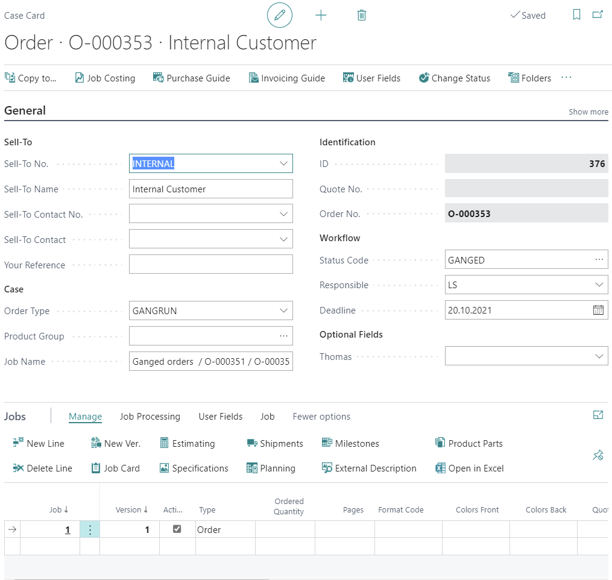
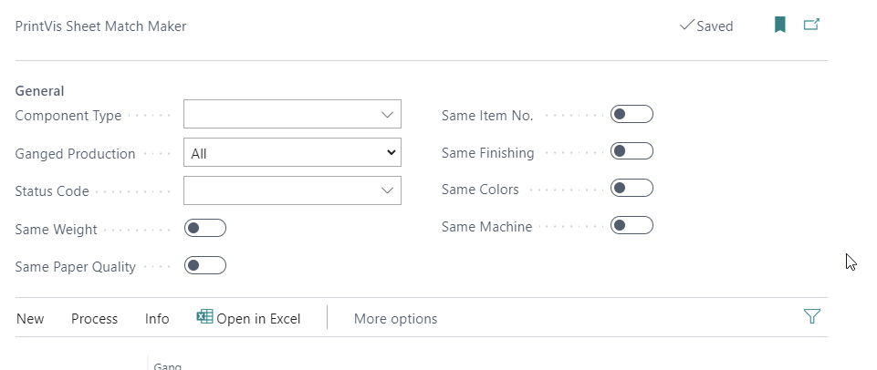

# PrintVis Integration with Kodak Dynamic Print Planning - DPP

## Introduction

PrintVis provides a smooth integration with Kodak's Dynamic Print
Planning ("DPP") software.  If certain components of a PrintVis
case/order can be ganged with components of other orders, the
integration is to automate and optimize the PrintVis Sheet ganging
functionality.  See article "[Sheet Ganging in
PrintVis](https://learn.printvis.com/Legacy/Planning/SheetGanging/)."

This can be useful for a production where different book covers could be
better combined on one sheet, or different business cards with low
quantities must be combined for a more efficient production.

Kodak DPP provides automation for ganging and print planning in offset
and digital printing.  It enables ganging, sheet optimization, and how
print jobs are produced on which device at the same time.  Please find
more details in the documentation from Kodak.  All Copyrights for DPP
are owned by the Eastman Kodak Company.

## Required setup

The setup must be made in the sequence of the following topics!

Setup for Sheet Ganging in PrintVis

See article "[Sheet Ganging in
PrintVis](https://learn.printvis.com/Legacy/Planning/SheetGanging/)."

Workspace Setup in Kodak DPP

A workspace in DPP is required to transfer data between PrintVis and
DPP.  For every Business Central/PrintVis company, 1 DPP workspace can
be handled.

Login to the DPP Console and click the "Pen" sign next to the selected
Workspace.

Create a new workspace or remember the ID of the existing one that
should be connected to PrintVis

For more details, please refer to the Kodak Workflow Documentation of
DPP.

Connection Setup in Business Central/PrintVis

Search for "Service Connections" and click the link "Dynamic Print
Planning - Kodak".

-   Enter the API URL, Tenant, and Workspace ID above.

-   Enter the Username and Password for the Tenant.  These are the same
    credentials when logging on to DPP directly.

-   Set Enabled = TRUE (Switched on)

-   Select (and create before!) a BC number series.  The number is being
    used for every Layout Task that is sent to DPP.  Do not use spaces
    or underscore characters!

Click "Verify Connection" to see if the connection is established:

Default URLs for the Kodak DPP services are:

-   North America

    -   <https://dpp.eastus2.prinergyondemand.com/>

-   Europe

    -   <https://dpp.westeurope.prinergyondemand.com/>

    -   This is the default when setting up PrintVis

Resources Setup in Kodak DPP

DPP is able to choose the optimal paper and printing machine for the
ganged sheet from the components that have been sent from PrintVis.

For more details about the Resources setup, please refer to the Kodak
Workflow Documentation of DPP.

The following must be set up:

Presses

Enter a Label, choose the Method and press model, and set up the
parameters for format and weight.

For a cost-specific optimization, it is possible to set up further
details on the tabs "Performance and Cost" and "Working Styles and
Layout".

**Please note**: The "Label" must be equal to the List of Units that can
be selected on the Sheet/Job Item in PrintVis.

Paper Stock

Typically, the "house papers" should be setup in DPP.  DPP is only able
to handle the given paper stock setup and is returning an internal Id to
PrintVis that must match with the item setup in PrintVis.  For that is
required after the paper stock setup to add the DPP Id to the PrintVis
paper item.

Mapping of fields in DPP and PrintVis

<table>
<colgroup>
<col style="width: 50%" />
<col style="width: 50%" />
</colgroup>
<thead>
<tr>
<th><strong>Field on DP Paper Stock setup</strong></th>
<th><strong>PrintVis Item field</strong></th>
</tr>
</thead>
<tbody>
<tr>
<th>Label</th>
<td>PrintVis Quality Code</td>
</tr>
<tr>
<th>Weight</th>
<td>PrintVis Weight</td>
</tr>
<tr>
<th>Width and Height</th>
<td>Format 1/2</td>
</tr>
<tr>
<th>Grain Direction</th>
<td>PrintVis Grain Direction</td>
</tr>
</tbody>
</table>

Item list in PrintVis equivalent to the paper stock in DPP for GLOSSY:

DPP Paper Id to be mapped with PV Paper Item

The DDP system creates an internal Id for every paper item.  If it is
desired in PrintVis for the ganged order to get a specific paper item
no. assigned to the new ganged order, it is required after the Paper
Stock creation in DPP, to add the DPP paper Id to the specific paper
item in BC/PrintVis.

For that, just copy and paste the Id from DPP into the paper item card
by using the following steps:

-   To open/edit the paper stock in DPP, double click the format you
    want to map.  The "Edit format" window opens (See above).

-   Triple click the value in the field "Id" to mark the full value from
    first to last character.

-   Press CTRL+C to copy the value to the clipboard.

-   Open the related paper item in BC/PV with the same quality code and
    weight.

-   Set the cursor into the Additional (Integrated User Field) field 1
    and press CTRL+V to paste the value from the clipboard to the item
    card field.  
    

To create/enable the Integrated User Field (Shown as Additional field on
the item card):

-   Search for "PrintVis Integrated User Fields"

-   Select "Item"

-   In the first line enter an appropriate name

-   Close the setup and press CTRL+F5 to reload the browser.  The field
    with the given name will appear in the item card.

Create a ganged order from the PrintVis Sheet Match Maker

Open the sheet match maker page.  Detailed descriptions about all fields
and functions can be found in the article "[Sheet Ganging in
PrintVis](https://learn.printvis.com/Legacy/Planning/SheetGanging/)".

Select the desired filters on the Sheet Match Maker page (these values
will be also requested back from the DPP) and Choose the lines that
should be ganged.

Please note: It is possible to choose more sheets than possible for 1
ganged order.  All sheets will be sent and the DPP system tries to gang
them in the best way and sends back more than one response, which means
the chosen sheets could end up in more than 1 ganged order - 1 sheet
will not be part of more than 1 ganged order.

Create a layout task in DPP

When hitting the action "Create Layout Task", the chosen sheet will
pick-up a DPP no. from the no. series set up and will be displayed in
field Layout Task Id (just for internal use) and send the data to DPP.

If the data was successfully transferred to the DPP system, the
following message appears.  This does not mean that DPP has successfully
created the ganged sheet already!  This only means the send-process was
successful.

Creating the ganged PrintVis production case

To create the new ganged order(s) for the selected sheets, choose the
action "New DPP Ganged Production Case".

PrintVis is requesting a response with that action.  To get a successful
response:

-   DPP needs a little time to optimize the ganged sheets

-   The data that is requested (Paper stock, printing machine, and
    mounting in DPP) must be properly set up and mapped between PrintVis
    and DPP.  See Setup chapter above!

Successful Ganged order creation

PrintVis is requesting a response by that action

The result could look like the following:

New ganged order:

Case Card

Job Card

How to process can be found

Ganged order creations fails - Trouble shooting

If paper and press cannot be found, or the paper is not mounted on a
given machine DPP will return a message like this:

In this case, please check the selected paper and the press if existing
and mapped (mounted) in DPP.

There is a logging of all files that are transferred if you cannot
figure out the problem the XML sent/received could help

-   Search for "Service Connection" and click on "Dynamic Print
    Planning - Kodak"

-   Click on Actions -&gt; Activity Log

The Action "Activity Log" shows the list of log entries with the XML
file attached that has been exchanged to

-   Create Layout Task

    -   These are the components sent to DPP

-   Read Layout Task Response

    -   This is the response from DPP that includes the new ganged sheet
        information

If you click on "View Details", the XML file is being downloaded from
your browser and can be reviewed.  This can be necessary if there are
problems with the new ganged order or error messages when processing the
files.

Content of the file:

Tips for usage and handling

Avoid the usage of "\_" and " " characters

DPP is creating internal code combinations by using "\_" (underscore). 
If this character is being used, unexpected errors could be provoked.

Example for code combination of DPP

Settings that will impact the processing in DPP

Respect grain direction

Impact of field "Placement of Job Item"

-   Width Drection

    -   This will request to DPP to respect the grain direction and not
        turn the job items (or just some ups of the same job item to
        fill up the sheet)

-   Max. No. on Sheet

    -   DPP will try to fill up the sheet as good as possible, also by
        turning some ups of the same job item to fill up the sheet

    -   The result could look like this  
        

Request certain paper settings and printing machine from Sheet Match
Maker page

The following impact will be provoked by the setting when creating the
Layout Task (sending sheets to DPP)

If

-   "Same Weight" is set

    -   DPP will be requested to use the same paper weight / GSM that is
        used in the sheet that is sent

-   "Same Paper Quality"

    -   DPP will be requested to use the same paper quality that is used
        in the sheet that is sent

    -   It is recommended to set "Same Weight" and "Same Paper Quality"

        -   It is unusual to ask DPP just to choose the cheapest paper
            (lowest quality and weight)

-   "Same Item No."

    -   DPP will be requested to use the paper item no. that is used in
        the sheet that is sent

        -   Same paper item no. means same quality, weight, and size

-   Same machine

    -   DPP will be requested to use the press that was used in the
        sheet that is sent
