# PrintVis Link

## Introduction

PrintVis Link is a separate software tool that is used for communication
outside the BC environment. It must be installed on top of BC and is
handling for example:

-   Communication between PrintVis and JDF Workflow partners

-   Communication between PrintVis and the PrintVis DCM/Moxa integration

PrintVis Link was formerly known as PrintVis External Communication
Service

The CIM Setup should be done first before even starting to setup the
PrintVis Link.

Important fields to setup:  
JMF Channel Port  
HTTP Listener Port  
HTTP Status Port  
  
In case when the field **Disable Scheduler in PrintVis Link** is enabled
then the field:  
Regular TCP Binding Port

is also mandatory

On Premise versus Cloud Installations

There are 2 modes for PrintVis Link to work.

The way of working is defined by the PrintVis CIM setup, Field: "Disable
Scheduler in PrintVis Link":

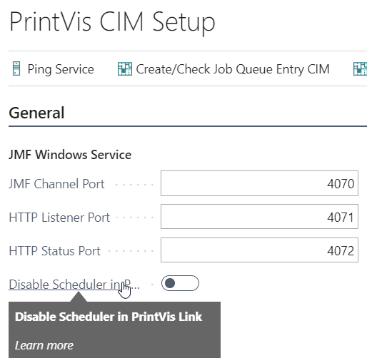

1.  "Disable Scheduler in PrintVis Link" = FALSE / Switched off

    -   PrintVis Link pulls and pushes information from/to BC/PrintVis

    -   The is the most secure communication and 

    -   The only possible mode when running on a MS Cloud version

2.  "Disable Scheduler in PrintVis Link" = TRUE / Switched on 

    -   BC/PrintVis pushes information to PrintVis Link

    -   This is only recommended in On Premises installations 

    -   Recommended to be protected by a firewall or a VPN

Credential types:

**1.Windows - **Windows user name and password

**2.NAV UserPassword**

**3.OAuth2 -**requires Azure setup in order for this credential type to
be used (we strongly advise that this setup should be done by a
developer/IT support)

** OAuth2**

**Cloud: This is the only credential type that will work in Business
Central 20 (new installations) from Business Central 21 it's mandatory
for all installations**

**OnPrem installations can use this Authentication type if they want**

 

The following requires Azure access, potentially also permissions needed
to activate the App Registration Setup, which can be read more about in
the following documentation by Microsoft. (We strongly advise that this
setup should be done by a developer/IT support) 

 

**Please read the following documentation provided by Microsoft before
going further,**

[Quickstart: Register an app in the Microsoft identity platform |
Microsoft
Docs](https://docs.microsoft.com/en-us/azure/active-directory/develop/quickstart-register-app)

 

Setting up the PrintVis Link to work correctly with OAuthentication
needs some additional setup to be able to work properly. 

Access to Azure App Registration is needed, mapping to the PrintVis Link
fields will be done after, lastly Setup is needed in BC before starting
PrintVis Link is possible.

 

Fill in the Webservice URL and make sure the OAuthentication has been
chosen.

The following fields information requires to be filled out to get the
connection to work.

Azure Setup is now needed.

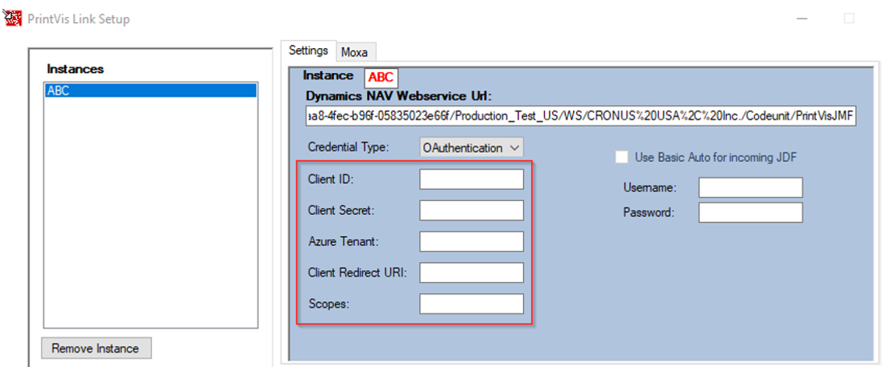

 

## Setup of Azure App Registration

Creation of an App registration an name needs to be added, along with
who should have access to it.

2 fields in the Overview needs to be filled into PrintVis Link

“Application (client) ID” from the Overview should be filled into the
“Client ID” in PrintVis Link.

“Directory (tenant) ID” from the Overview should be filled into the
“Azure Tenant” in PrintVis Link.

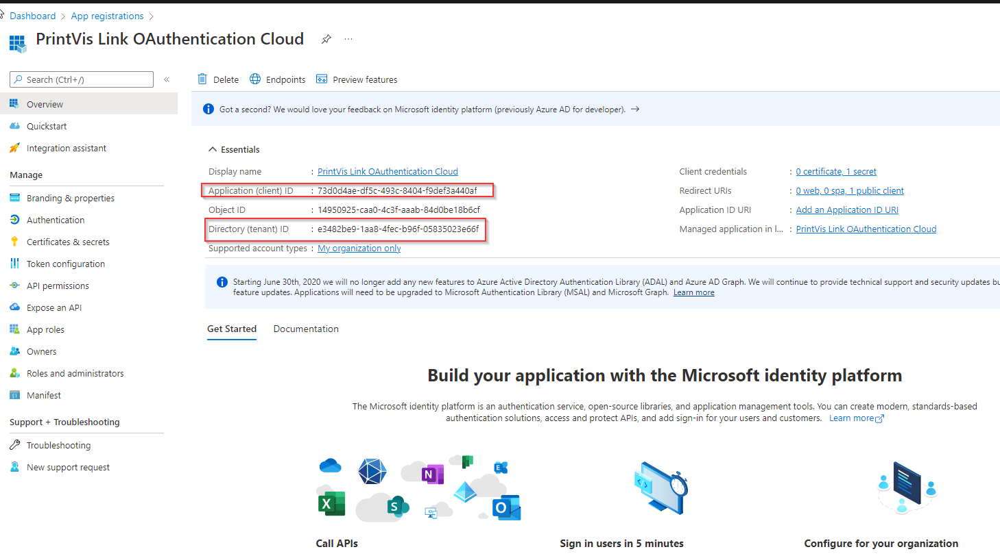

Setting up the proper Authentication is the next step

Navigate to the “Authentication” tab

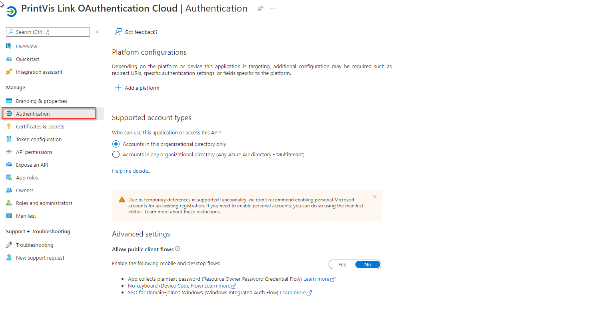

Press the “Add a platform”** **and select the “Mobile and desktop
applications”

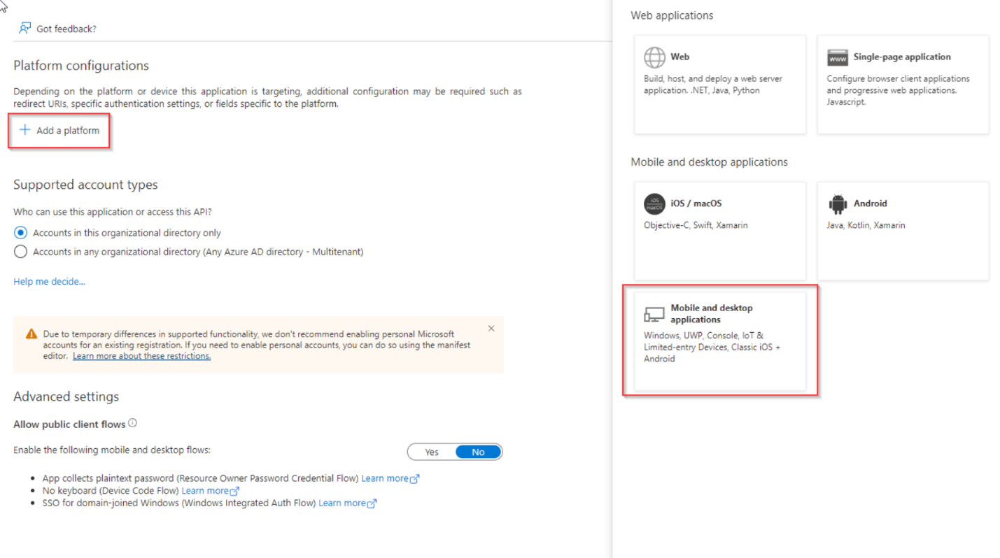

From there a Redirect URIs setup will pop up,

Select the proper one for your needs, the first one should work fine for
general usage,

When an option has been selected, press “confirm”

**This can be changed later.**

The chosen Redirect URIs should be filled into “Client Redirect URI” in
PrintVis Link.

 

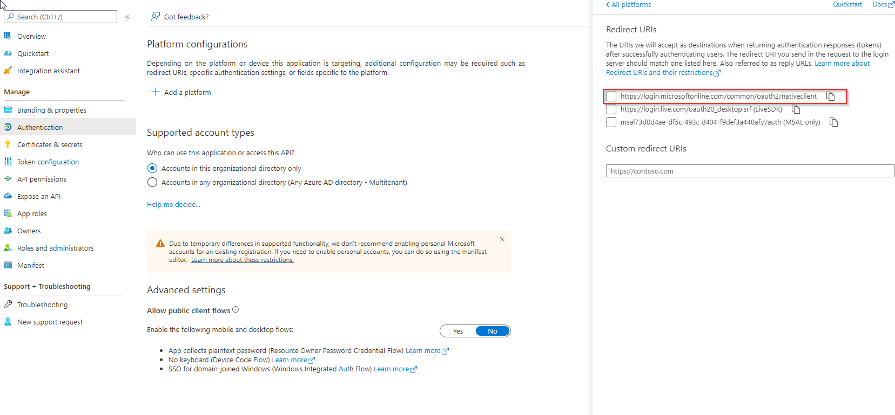

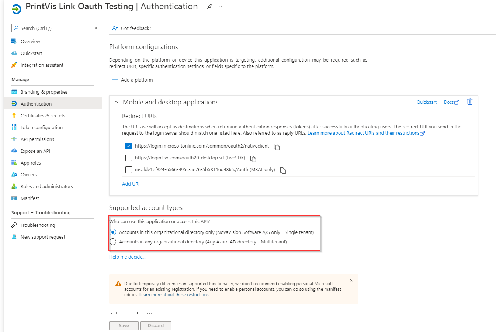

Now the “Client secret**”** needs to be added,

Navigate to the “Certificates & secrets” tab and press “New client
secret”

Upon adding a “Client secret”, copy/write down what is in the “Value”
column before leaving this page, since it will be hidden after and not
possible to get again. 

This “Client Secret” shown/copied should be filled into the “Client
Secret” in PrintVis Link.

 

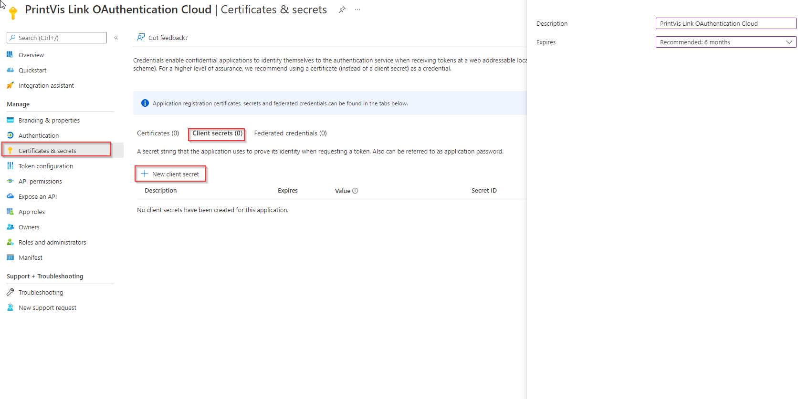

To finalize the setup of the App Registration, some permissions needs to
be allocated,

Go to the “API permissions”,

Press the “Add a permission” and find the Dynamics 365 Business Central 

“Grant admin consent for x” will be referenced last in the Azure Setup

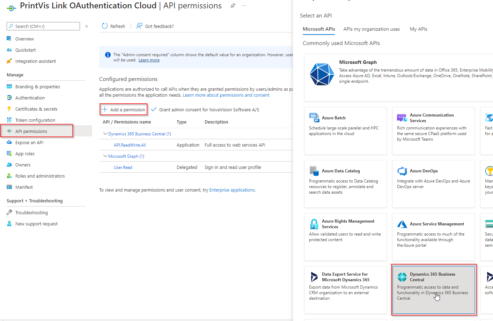

 

select the “Application permissions”, 

select the permission “API.ReadWrite.All” under API

 

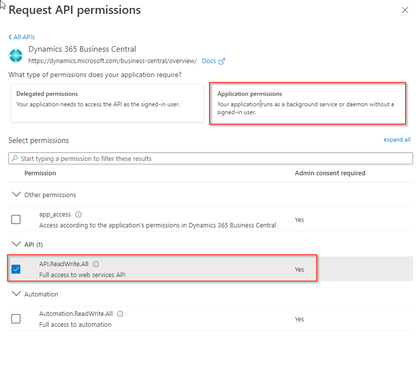

 

To wrap up the App Registration, the App needs to be granted consent by
someone who has appropriate permissions in accordance with the
Documentation from Microsoft,

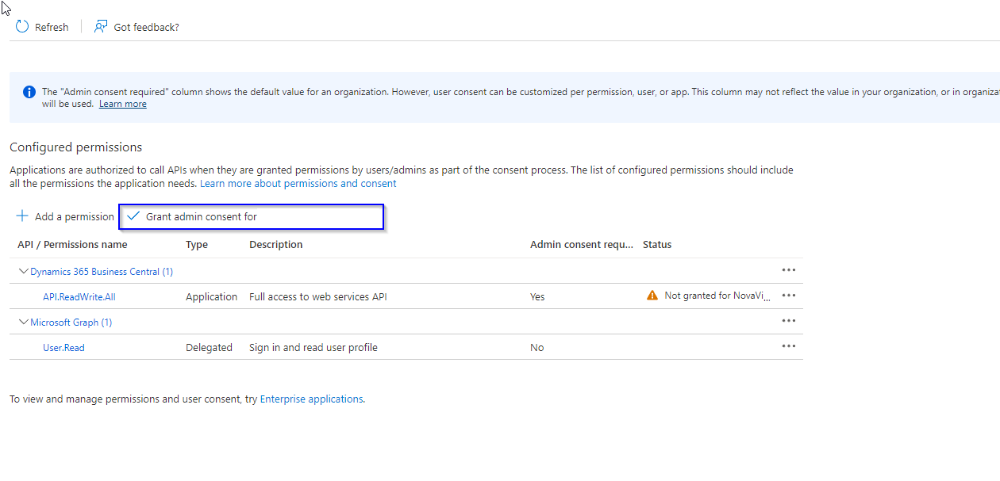

## PrintVis Link Setup 

 
All fields except the “Scopes” should have been filled out.

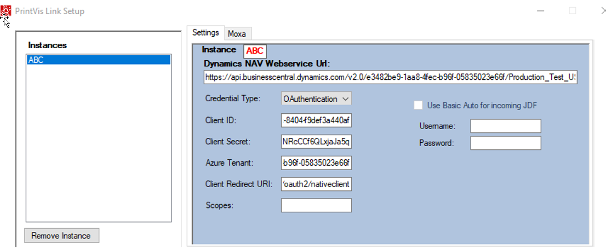

 

Scopes for Cloud could be something like
this <https://api.businesscentral.dynamics.com/.default(example)>

PrintVis Link Setup should now have all fields like below filled out.

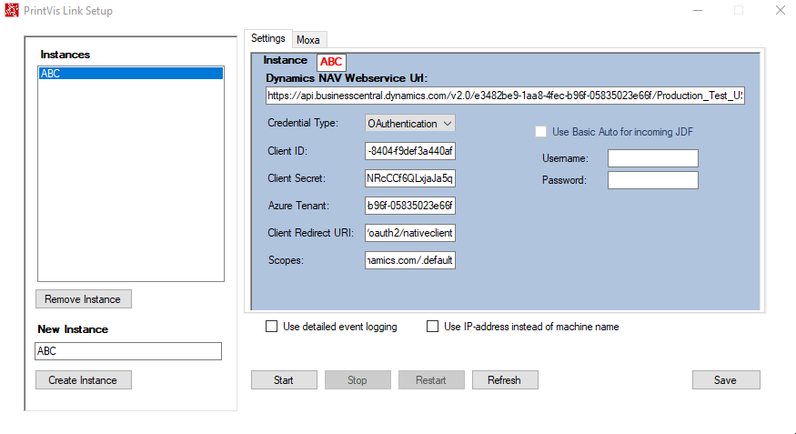

 

Before the Service can be Started,

Setup in BC is now required so the communication can be mapped with
proper permissions,

this will be a new user of type ‘Application’.

Search for “Azure Active Directory Applications” in BC

 
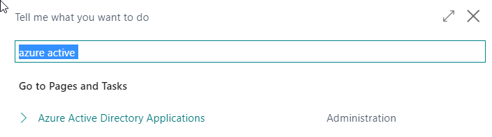

Create a new entry and the Client ID from PrintVis Link can be put into
the Client ID,

Description + Contact information can be filled in with some naming (has
no impact on the communication.

 
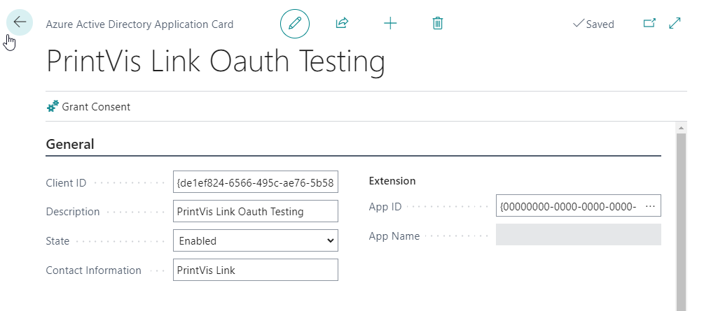

That in the background creates a new User that is mapped to this entry,

The following permission sets needs to be added for PrintVis Link to be
able to communicate / start without giving a permission error.

Permission set that needs to be added

- D365 BASIC

- PVSPV-BC Link

- PVS-BC BASIC

- PVSPV-BC CIM-DEVICE

so it looks similar to below

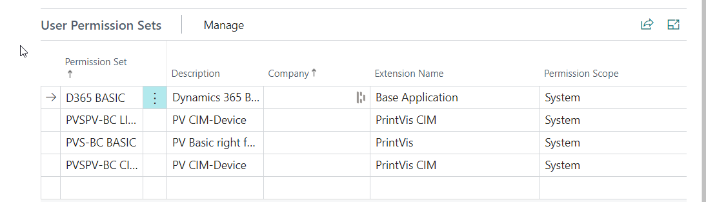

Setup is now done and PrintVis Link should be able to start up.

Installation of PrintVis Link

1. Download the "PrintVis Link Setup" installer from the JMF-Download
page; To be found on the PrintVis Partner Portal under menu "Product
Download"--&gt; . (please contact your vendor)

After the installation, open the application.

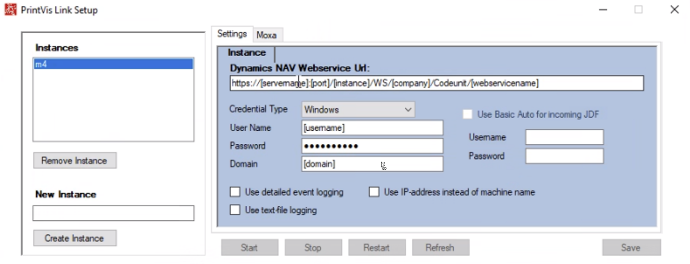

2. Under "New Instance", type in a name like "JMF-&lt;Company Name&gt;"
then click "Create Instance"

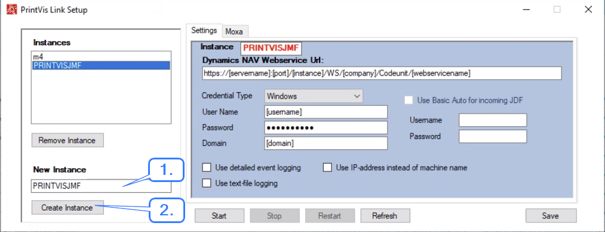

 
3. Find the Web Services in the BC365 client and copy the SOAP URL of
Object name: PV JMF webservices.

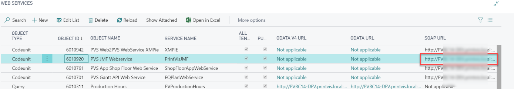

The Object ID of the CodeUnit for this web service depends the BC365
type that is used. The reason for this is that the PrintVis CIM
Extension/App is a "Per-Tenant Extension (PTE)" for Cloud

-   Object ID for "OnPremise" and "Private Cloud" installations: 

    -   CodeUnit 6010920

-   Object ID for Cloud installations: 

    -   CodeUnit 75920 

 
4. Copy the SOAP URL to the "Dynamics NAV Webservice URL"

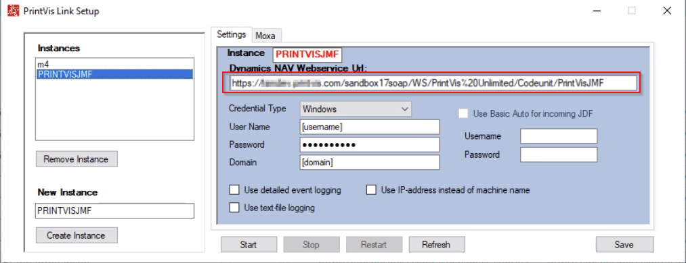

 
5. Try to connect to the URL by pasting the URL link into an internet
browser address field. You will be asked for User/Password. If you get a
screen like below, all is fine. If not ask your admin to check the
credentials or to make sure that you can connect to the URL through a
firewall.

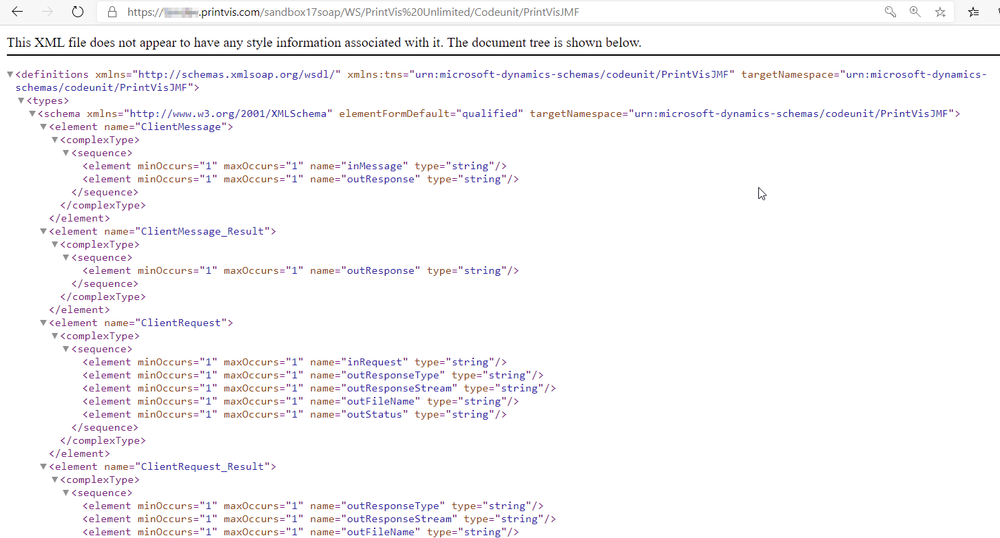

 
6. Select Credential Type (typically NavUserPassword) and enter the
user/password/domain(if required) from BC to access the web service.

For the credential type ask you admin.

For cloud installations it is required to create a Webservice Access Key
for the BC
User

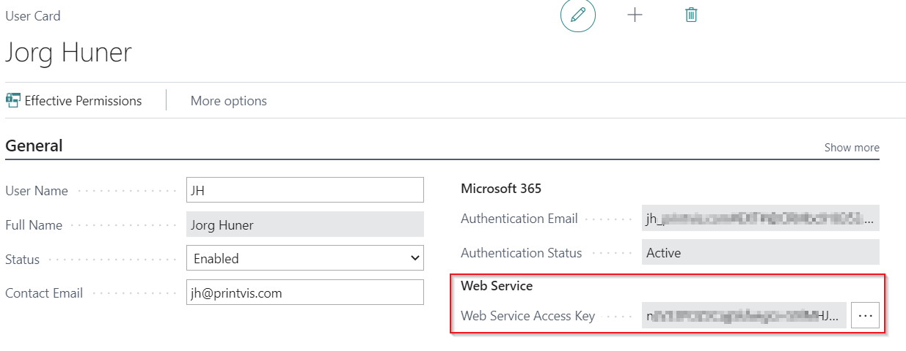

Enter Credentials

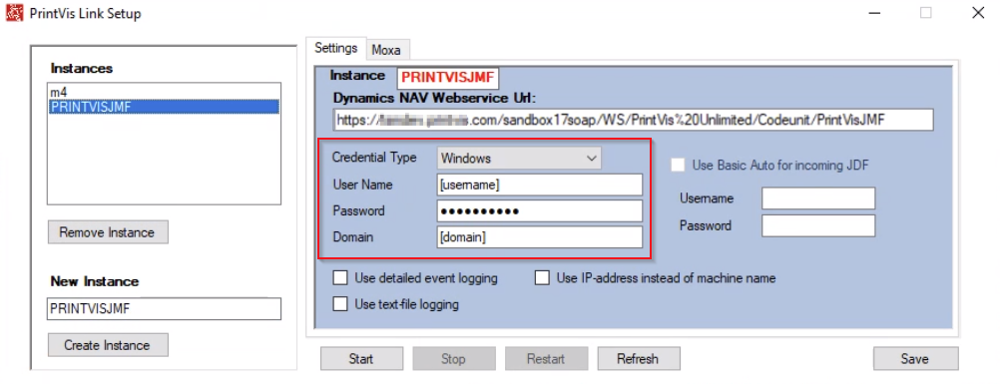

 
7. For On Premise installations it is possible to use the IP address
instead of the server name. The IP address is the from the BC server.

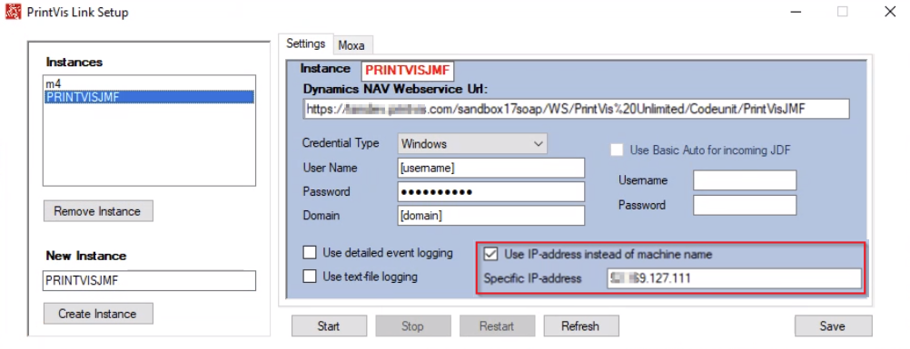

 
8. Click on "Save," before click "Start". Do not forget to click "Save"
after every change!

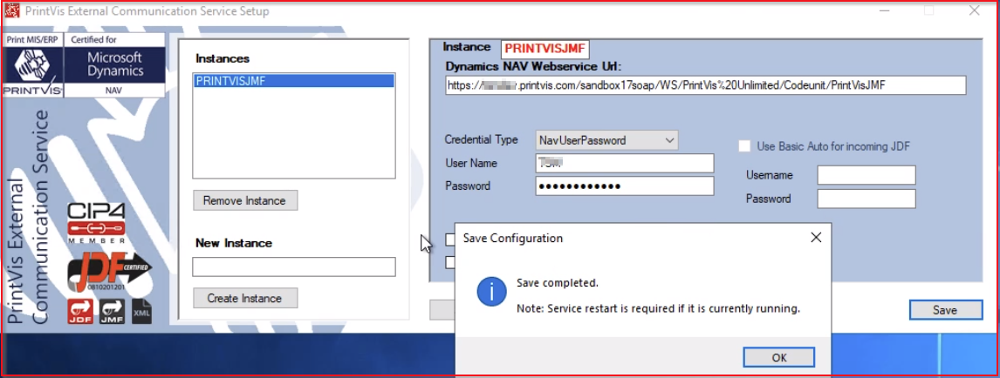

Then click "Start".

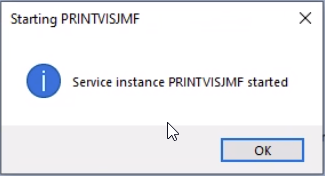

 
9. Go to Windows "Service" and check if the Service "PrintVis Link
\[&lt;instance name&gt;\]" is running. If it was running before you
saved you need to restart it to apply the new
settings. 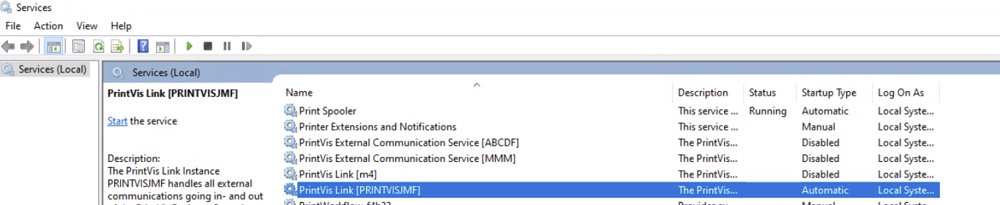 **Note:
Typically when the service cannot be started the Manufacturing
Integration/ CIM setup is incorrect or more than one service is running
on the same ports. Please check the Application Log in the Event Viewer
for details.**

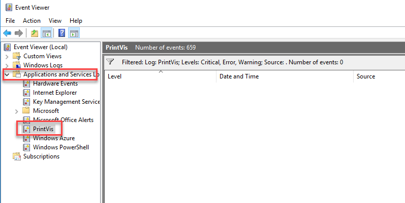

 
Moxa Setup Tab for DCM Integration

On the "Moxa" Tab you have to create a setup for every Moxa device in
case the CIM setup is set to "Disable Scheduler in PrintVis Link" =
False (Switched off). If it is set to "True" this Moxa Tab will be
ignored and the communication is handled in BC/PrintVis (this is not
allowed on Cloud and insecure).

Moxa Tab on PrintVis Link Setup

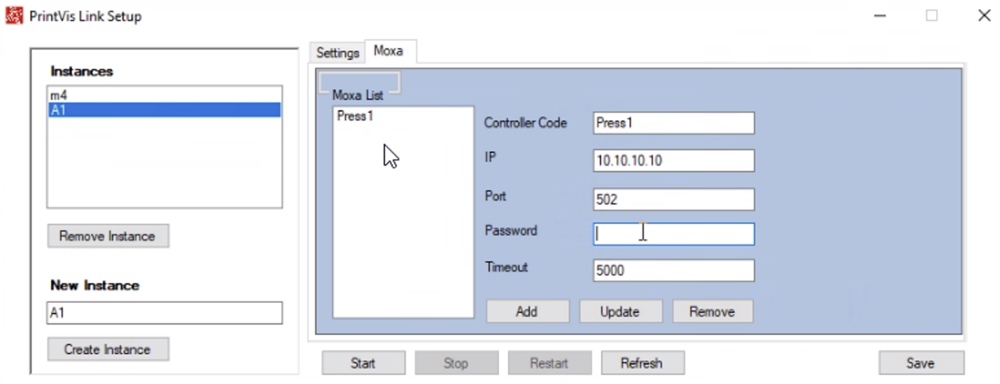

**Available Fields**

<table>
<colgroup>
<col style="width: 26%" />
<col style="width: 73%" />
</colgroup>
<thead>
<tr>
<th><strong>Field</strong></th>
<th><strong>Description</strong></th>
</tr>
</thead>
<tbody>
<tr>
<th>Moxa List</th>
<td>This field displays the list of Controller Codes that have been
setup.</td>
</tr>
<tr>
<th>Controller Code</th>
<td>Unique code for every device that is connected. This code must be
the same code as setup in the PrintVis CIM Controller for the same Moxa
device. 
If there are no Moxa Entries on the PrintVis Controller please check
thet the code is spelled right. There is no validation between PrintVis
and PrintVis Link when setting up PrintVis Link!</td>
</tr>
<tr>
<th>IP</th>
<td>IP address of the Moxa device.</td>
</tr>
<tr>
<th>Port</th>
<td>Port for as setup in the PrintVis CIM Controller for the same Moxa
device</td>
</tr>
<tr>
<th>Password</th>
<td>Password if setup in the Moxa configuration. Blank by default</td>
</tr>
<tr>
<th>Timeout</th>
<td>Time in milliseconds if connection is lost.</td>
</tr>
</tbody>
</table>
