# Web2PV REST API Structure and Usage

## Setup

In order to use the REST API with Web2PV it is required to setup a
Web2PrintVis Frontend.

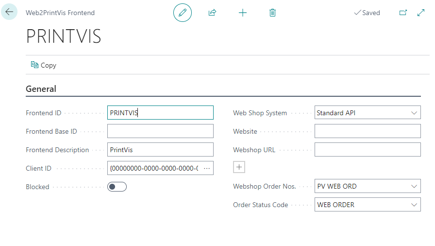

<table>
<colgroup>
<col style="width: 50%" />
<col style="width: 50%" />
</colgroup>
<thead>
<tr>
<th><strong>Field</strong></th>
<th><strong>Description</strong></th>
</tr>
</thead>
<tbody>
<tr>
<th>Frontend ID</th>
<td>The ID used for the web connection</td>
</tr>
<tr>
<th>Frontend Description</th>
<td>A description of the Frontend</td>
</tr>
<tr>
<th>Web Shop System</th>
<td>This field is used to determine how the Frontend will be used. 
- Standard API: Use the standard PrintVis REST API to interact with
Web2PV 
- Additional options are added by custom or integration apps for
specific webshops</td>
</tr>
<tr>
<th>Website</th>
<td>Optional identifier for the website used with the frontend</td>
</tr>
<tr>
<th>Website URL</th>
<td>Optional identifier for the website URL. It is possible this could
be used to set the webshops API URL.</td>
</tr>
<tr>
<th>Webshop Order Nos.</th>
<td>A number series that will be used to set the PrintVis order number
for web orders created by this Frontend</td>
</tr>
<tr>
<th>Order Status Code</th>
<td>The PrintVis Status Code that will used when the Frontend creates a
PrintVis case.</td>
</tr>
</tbody>
</table>

On the Web2PrintVis Frontends list it is possible to automatically
create a job queue entry if the Frontend is set to Standard API. That
job queue can be used to automatically create PrintVis Cases from
imported Web2PV orders on a schedule.

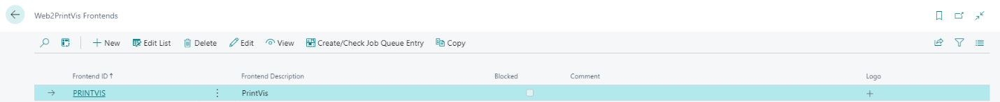

It is not required to use a job queue to create PrintVis cases from
Web2PV orders. On the Web2PV Header list, there is an action to Process
Web2PV orders to cases.

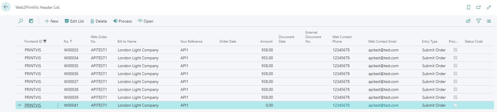

Product Group, Format Code, and Finishing Type pages all have a field
called "Web Extranet" or "External Web". If the desired specific product
group, format code, and/or finishing type, then the Boolean field needs
to be checked on.

Product Group

Field can be found on the specific Product Group setup page under the
Integration fast tab.

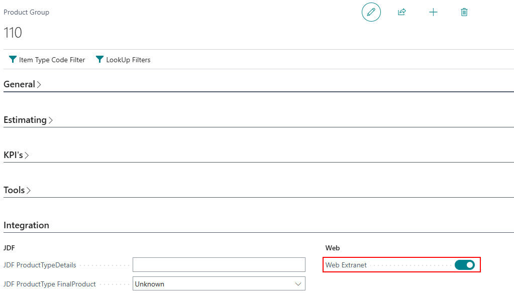

Format Code

Field can be found on the specific format code line. If the list is not
editable already, make sure to click "Edit List" function in the top
menu.

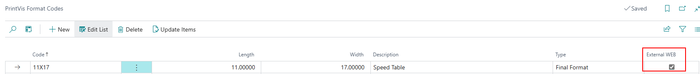

Finishing Type

Field can be found on the specific finishing type line. If the list is
not editable already, make sure to click "Edit List" function in the top
menu.

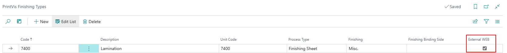

## Usage

The Web2PV structure allows for Header, Line, Component, and Shipment
details to be sent into PrintVis for webshop or customer portal orders.

The Header is structured similar to the PrintVis Case with sell-to,
bill-to, contact, and other case level details. 

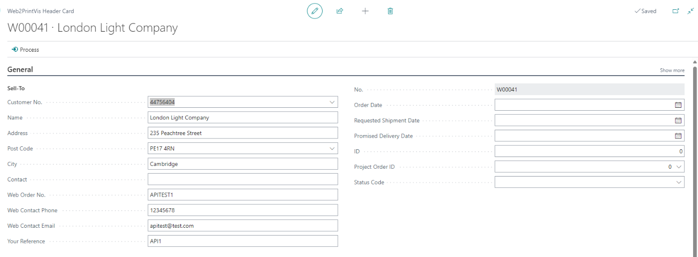

The Lines are structured similar to the PrintVis Job with job details
such as quantity, product group, format, colors, and other job level
details.

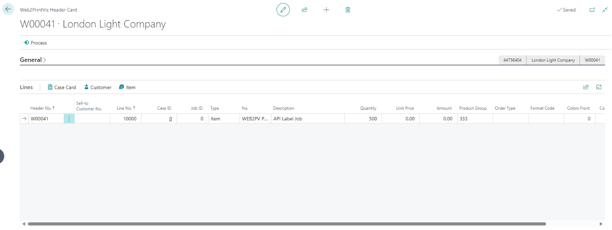

The Components are structured similar to the PrintVis Job Item with
details such as component type, imposition, tools, colors front, and
other job item level details

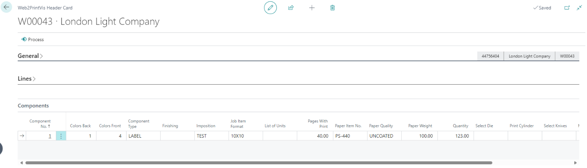

The Shipments are structured similar to the PrintVis Shipments with
shipment details such as address, shipping agent, requested delivery
date, and other shipment level details.

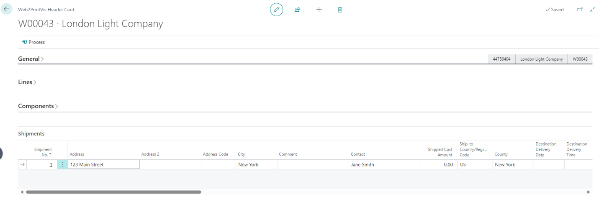

An API is available for sending data into these Web2PV structures. This
API allows for Posting new orders into Web2PV, Patching or updating
Web2PV orders that have not yet been processed into PrintVis Cases, and
deleting Web2PV orders that have not yet been processed into PrintVis
Cases. There are also GET options available to retrieve Web2PV order
information and to get Shipment updates/status.

A Postman collection is attached to this support article to provide
connection setup advice and examples for the different API calls.

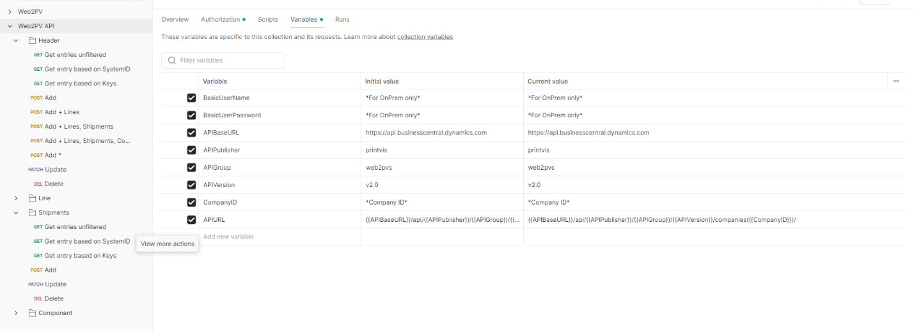

For cloud customers the only field you will need to get from the BC
environment is the Company ID. The company ID can be found inspecting
the Companies page with the Company needed highlighted. It will be the
Id field in the page inspector.

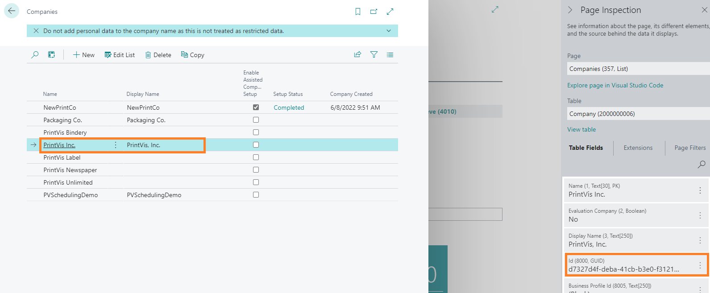

OAuth2.0 is required for Business Central API connections. Here is
the [Microsoft article on using OAuth with Business
Central.](https://learn.microsoft.com/en-us/dynamics365/business-central/dev-itpro/webservices/authenticate-web-services-using-oauth)

Download the Postman collection below for example connections:

[OAuth 2.0 Postman Collection](https://learn.printvis.com/Legacy/Integrations/assets/Web2PVOAUTH2postman_collection.json)
